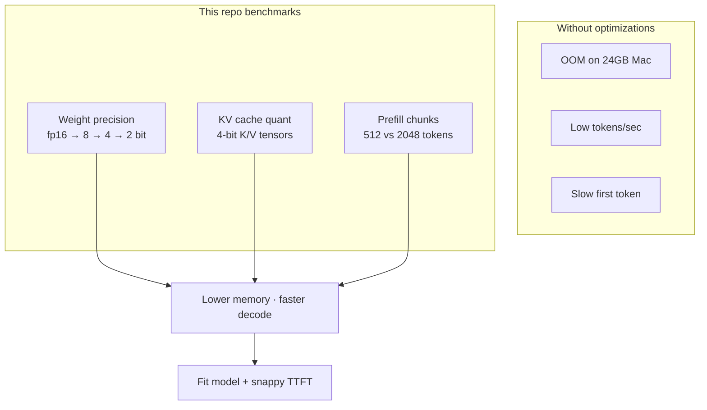
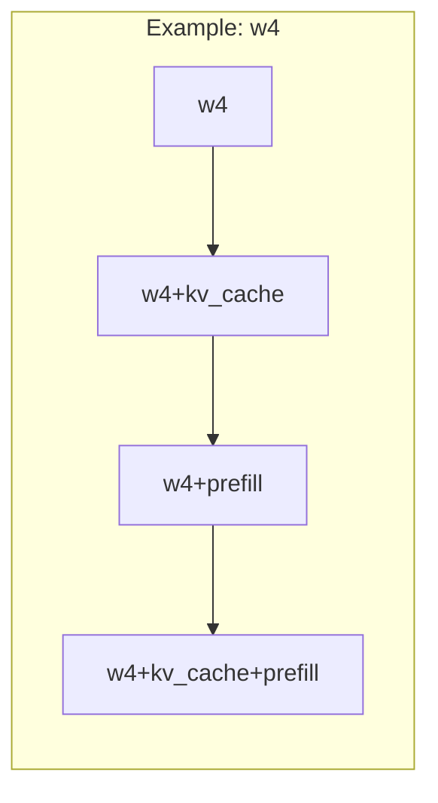

# LLM-Inference

Reproducible benchmarking of **open-source LLM inference on Apple Silicon** using [MLX](https://github.com/ml-explore/mlx). Measures how **weight precision**, **KV cache quantization**, and **prefill chunking** affect memory, time-to-first-token (TTFT), and decode throughput—across a structured sweep you can version in Git.

**Articles:** [notes.md](notes.md) (capstone draft) · [**12-article index**](docs/ARTICLES_INDEX.md) · [sweeps](docs/ARTICLE_SERIES.md)

**Documentation:**

| | Document |
|---|----------|
| **Articles (12)** | [docs/ARTICLES_INDEX.md](docs/ARTICLES_INDEX.md) — one per optimization or set |
| **Technique catalog** | [docs/INFERENCE_OPTIMIZATIONS_CATALOG.md](docs/INFERENCE_OPTIMIZATIONS_CATALOG.md) |
| **Outlines** | [docs/articles/](docs/articles/) |
| **Run an article** | `./scripts/run_article.sh <0-11> "Mac M3"` |
| **Each technique** | [Weight quant](docs/optimizations/weight-quantization.md) · [KV cache](docs/optimizations/kv-cache-quantization.md) · [Prefill / Flash](docs/optimizations/prefill-and-flash-attention.md) |
| **All together** | [docs/optimizations/all-optimizations.md](docs/optimizations/all-optimizations.md) |
| **How to run** | [docs/BENCHMARK_WORKFLOW.md](docs/BENCHMARK_WORKFLOW.md) |
| **Index** | [docs/optimizations/README.md](docs/optimizations/README.md) |

---

## Why these optimizations?

Local LLMs are limited by **unified memory** on Macs—not just raw GPU speed. Three levers dominate:



| Optimization | Problem it solves | In this repo |
|--------------|-------------------|--------------|
| **Weight quantization** | 8B fp16 ≈ 16 GB; won’t leave room for KV on 24 GB | Separate HF repos per bit width (`fp16`, `w8`, `w4`, `w2`) |
| **KV cache quant** | KV grows with every token; blows memory on long chats | `kv_bits=4` in `stream_generate` |
| **Prefill tiling** | Long prompts are slow (attention ∝ context) | `prefill_step_size` 512 vs 2048 (Flash-style kernels in MLX) |

Read the guides: [weight quant](docs/optimizations/weight-quantization.md) · [KV cache](docs/optimizations/kv-cache-quantization.md) · [prefill](docs/optimizations/prefill-and-flash-attention.md) · [all combined](docs/optimizations/all-optimizations.md).

---

## Quick start

```bash
./scripts/setup_env.sh
source .venv/bin/activate

# Optional: Hugging Face (rate limits + custom gated models)
./scripts/hf_login.sh

python scripts/run_benchmark.py --hf-check
./scripts/run_full_sweep.sh "Mac M3"
```

**24 GB M3:** skips 12B+ models by default. **64 GB+:** use `--include-large` for the full lineup.

---

## Sweep at a glance

**16 configurations per model** — for each weight level (`fp16` → `w8` → `w4` → `w2`), run:

1. weight only → 2. `+kv_cache` → 3. `+prefill` → 4. `+kv_cache+prefill`



| Machine | Models (default) | Total runs |
|---------|------------------|------------|
| M3 24 GB | 0.5B → 9B (**14** presets) | **224** (14 × 16 configs) |
| 64 GB+ (`--include-large`) | all **21** presets | **336** (21 × 16) |

---

## Weight precisions

| Label | Bits | Role |
|-------|------|------|
| `fp16` | 16 | Baseline (bf16 MLX weights) |
| `w8` | 8 | High quality, smaller than fp16 |
| `w4` | 4 | Article “optimized” weight level |
| `w2` | 2 | Smallest; repo-dependent |

## Runtime flags (combine with any weight)

| Flag | Off | On |
|------|-----|-----|
| `kv_cache` | full-precision KV | 4-bit KV |
| `prefill` | 512-token prefill steps | 2048-token steps |

---

## Models (Hugging Face)

Sorted **smallest → largest** during `--all-models` sweeps. **21 presets** total.

| Tier | Preset | Params | 24GB M3 default |
|------|--------|--------|-----------------|
| Tiny | `qwen-0.5b` | ~0.5B | ✓ |
| Very small | `llama-3.2-1b` | ~1B | ✓ |
| Very small | `qwen-1.5b` | ~1.5B | ✓ |
| Very small | `gemma-2-2b` | ~2B | ✓* |
| Small | `llama-3.2-3b` | ~3B | ✓ |
| Small | `qwen-3b` | ~3B | ✓ |
| Small | `phi-3-mini` | ~3.8B | ✓* |
| Small | `phi-3.5-mini` | ~3.8B | ✓ |
| Medium | `qwen-7b` | ~7B | ✓ |
| Medium | `mistral-7b` | ~7B | ✓ |
| Medium | `deepseek-r1-qwen-7b` | ~7B R1 | ✓ |
| Medium | `llama3-8b` | ~8B | ✓ |
| Medium | `deepseek-r1-llama-8b` | ~8B R1 | ✓ |
| Medium | `gemma-9b` | ~9B | ✓* |
| Large | `mistral-nemo-12b` | ~12B | large |
| Large | `qwen-14b` | ~14B | large |
| Large | `mistral-small-22b` | ~22B | large |
| Large | `gemma-27b` | ~27B | large |
| XL | `qwen-35b` | ~32B | large |
| XXL | `llama-70b` | ~70B | large |
| XXL | `qwen-72b` | ~72B | large |

\*`fp16` uses 8-bit repo when no public bf16 build exists. **large** = needs `--include-large` on 24GB Macs.

List all presets: `python scripts/list_models.py`

Override any repo in [models.json](models.json).

---

## Results

```text
results/Mac_M3/llama3-8b/fp16.json
results/Mac_M3/llama3-8b/w4+kv_cache+prefill.json
results/sweep_Mac_M3_<timestamp>.json
```

Metrics: `ttft_ms`, `throughput_tps`, `memory_gb`, `status`.

---

## Common commands

```bash
# Full sweep (M3)
./scripts/run_full_sweep.sh "Mac M3"

# All models on large Mac
python scripts/run_benchmark.py --sweep --all-models --include-large --hardware "Mac M5 Max"

# Weight levels only
python scripts/run_benchmark.py --sweep --weights-only --preset llama3-8b --hardware "Mac M3"

# Single config
python scripts/run_benchmark.py --preset llama3-8b --config w4+kv_cache+prefill --hardware "Mac M3"

# Retry failed fp16 / w8 runs
./scripts/retry_failed.sh "Mac M3"
```

---

## Repository layout

```text
LLM-Inference/
├── docs/
│   ├── optimizations/
│   │   ├── weight-quantization.md
│   │   ├── kv-cache-quantization.md
│   │   ├── prefill-and-flash-attention.md
│   │   └── all-optimizations.md
│   └── BENCHMARK_WORKFLOW.md
├── scripts/
│   ├── optimizations.py      # Config matrix, repos, memory estimates
│   ├── run_benchmark.py      # Runner + sweep
│   ├── run_full_sweep.sh
│   ├── hf_login.sh
│   └── retry_failed.sh
├── results/                  # Per-config JSON tracked; sweep_*.json at repo root ignored
├── notes.md                  # Article draft
└── models.json               # HF repo overrides
```

---

## Troubleshooting

| Issue | Fix |
|-------|-----|
| `404` on `*-bf16` | Use latest repos (see [weight quant doc](docs/optimizations/weight-quantization.md)) |
| Qwen OOM on M3 | Expected; use M5 Max or `--weight-bits 4` only |
| Sweep killed mid-run | Update scripts (subprocess isolation) |

---

## Requirements

- macOS, Apple Silicon, Python 3.10+
- ~20 GB free unified memory for 8B fp16; ~24 GB+ for 8B at 4-bit; 64 GB+ for Qwen 32B sweep
