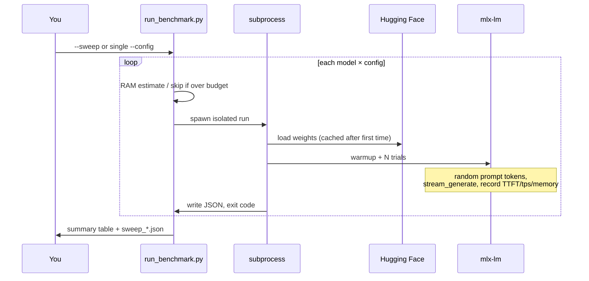
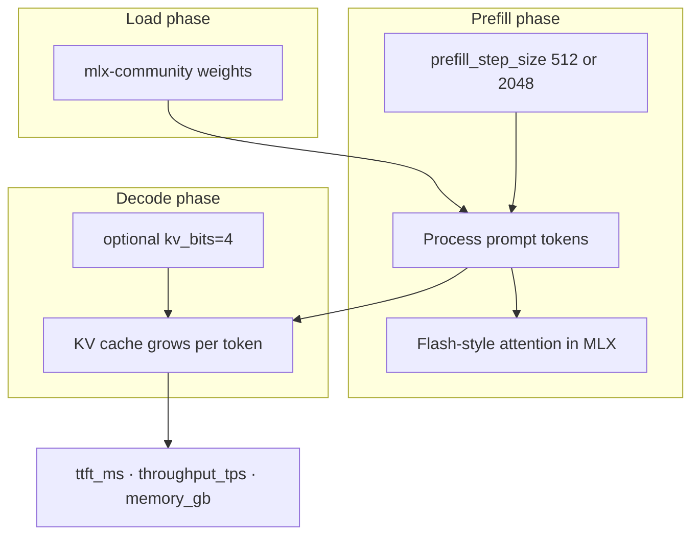
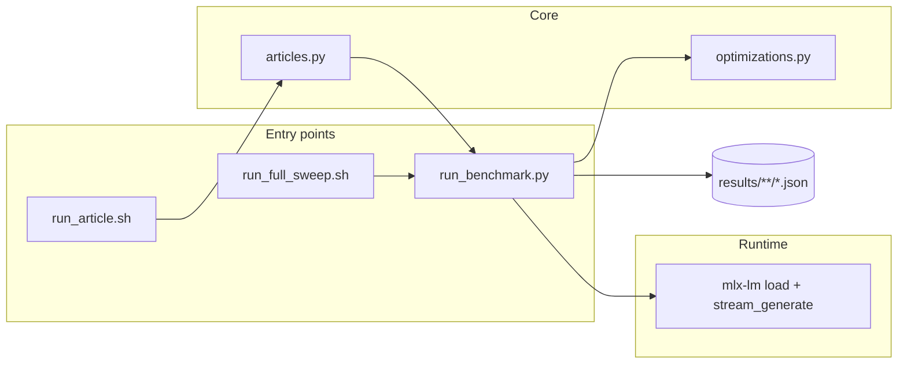

# LLM-Inference

Reproducible benchmarks for **open-source LLM inference on Apple Silicon**, built on [MLX](https://github.com/ml-explore/mlx) and [mlx-lm](https://github.com/ml-explore/mlx-lm). Measure how weight quantization, KV-cache compression, and prefill tuning change **memory**, **time-to-first-token (TTFT)**, and **decode throughput**—then version the numbers in Git.

Designed for a hands-on article series comparing **Mac M3** (24 GB) and **Mac M5 Max** (64–128 GB), but works as a general MLX benchmark harness on any Apple Silicon Mac.

---

## Table of contents

- [What you get](#what-you-get)
- [Why Apple Silicon for local LLMs](#why-apple-silicon-for-local-llms)
- [Requirements](#requirements)
- [Quick start](#quick-start)
- [Two ways to run benchmarks](#two-ways-to-run-benchmarks)
- [Article series (12 posts)](#article-series-12-posts)
- [How a benchmark run works](#how-a-benchmark-run-works)
- [Optimizations under test](#optimizations-under-test)
- [Configuration matrix](#configuration-matrix)
- [Sweep size and runtime](#sweep-size-and-runtime)
- [Models](#models)
- [Results and example JSON](#results-and-example-json)
- [Comparing machines in Git](#comparing-machines-in-git)
- [Architecture](#architecture)
- [Command reference](#command-reference)
- [Extending the repo](#extending-the-repo)
- [Project layout](#project-layout)
- [Documentation](#documentation)
- [FAQ](#faq)
- [Troubleshooting](#troubleshooting)
- [License](#license)

---

## What you get

- **Structured sweeps** — 16 configs per model (`fp16` / `w8` / `w4` / `w2` × optional `kv_cache` + `prefill`)
- **21 model presets** — ~0.5B through 72B from `mlx-community` on Hugging Face
- **Article-driven runs** — one command per blog post (`./scripts/run_article.sh 1 "Mac M3"`)
- **Isolated subprocesses** — a Metal OOM on one config does not kill the whole sweep
- **JSON results** — stable schema for tables, charts, and diffs across hardware
- **Extra modes** — speculative decoding, prefix KV cache, context/generation length sweeps

---

## Why Apple Silicon for local LLMs

Unlike discrete-GPU PCs, Macs use **unified memory**: CPU and GPU share one pool. That simplifies loading large models (no explicit CPU↔GPU copies), but caps how big a model can be by **total RAM**, not VRAM alone.

| Factor | Effect on inference |
|--------|---------------------|
| **Unified memory size** | Hard ceiling for weights + KV cache + runtime |
| **Memory bandwidth** | Often limits decode tok/s once the model fits |
| **MLX / Metal** | Optimized matmul and attention kernels for M-series chips |
| **Quantization** | Shrinks weights and KV so 8B–32B models fit on laptops |

This repo measures those tradeoffs directly: same prompts, same token counts, same config labels—so **M3 vs M5** comparisons are apples-to-apples.

---

## Requirements

| | |
|---|---|
| **OS** | macOS on Apple Silicon (M1 or newer) |
| **Python** | 3.10+ (3.11–3.13 tested via venv) |
| **RAM** | ~20 GB+ for 8B fp16; ~24 GB comfortable for 8B at 4-bit; 64 GB+ for 32B+ sweeps |
| **Disk** | ~5–40 GB per model family (HF cache); first download is slow |
| **Network** | Hugging Face access on first run per repo |
| **Account** | Optional HF token for rate limits and gated models |

---

## Quick start

```bash
git clone <your-repo-url> LLM-Inference && cd LLM-Inference

./scripts/setup_env.sh
source .venv/bin/activate

# Hugging Face (required for fp16 / gated models — fixes most "Invalid username" errors)
./scripts/hf_login.sh
# Accept model licenses at huggingface.co for Meta-Llama-3.1, Mistral, etc.

# Verify token + repo access
python scripts/run_benchmark.py --hf-check

# Validate / migrate existing results (schema v1)
python scripts/validate_results.py --hardware "Mac M3"
python scripts/migrate_results.py --dry-run --hardware "Mac M3"   # preview
# python scripts/migrate_results.py --apply --hardware "Mac M3" --delete-legacy-files

# Single smoke test (~1–5 min first time; includes model download)
python scripts/run_benchmark.py --preset llama3-8b --config fp16 --hardware "Mac M3" -n 1
```

Expected console output ends with `Saved: results/Mac_M3/llama3-8b/fp16.json` and `status: ok` in that file.

### Complete Mac M3 pass (all articles)

```bash
./scripts/hf_login.sh
./scripts/run_m3_all.sh              # standard: articles 0–7, 10 + hero capstone (~2–8 h)
./scripts/run_m3_all.sh --from-checkpoint   # resume after interrupt
```

See **[docs/M3_RUNBOOK.md](docs/M3_RUNBOOK.md)** for per-article run counts and `full` vs `quick` modes. M5 Max is a separate step: `./scripts/run_m5_ladder.sh`.

---

## Two ways to run benchmarks

| Goal | Use | Output location |
|------|-----|-----------------|
| Writing the **12-article series** | `./scripts/run_article.sh <id> "Mac M3"` | `results/<hw>/article_XX_<slug>/` |
| **Full matrix** for one machine | `./scripts/run_full_sweep.sh "Mac M3"` | `results/<hw>/<preset>/<config>.json` |
| **One-off experiment** | `run_benchmark.py --preset … --config …` | Same as full matrix layout |
| **Compare M3 vs M5** | Run same article or sweep on both; same `--hardware` label per machine | Two trees under `results/` |

### 1. Article series (recommended for writing)

Twelve posts: one optimization (or small related set) each.

```bash
python scripts/run_article.py --list

./scripts/run_article.sh 0 "Mac M3"    # intro demo
./scripts/run_article.sh 1 "Mac M3"    # weight quantization (all models, w8/w4/w2)
./scripts/run_article.sh 2 "Mac M3"    # KV cache on/off
./scripts/run_article.sh 6 "Mac M3"    # speculative decoding
./scripts/run_article.sh 7 "Mac M3"    # context length, generation length, prefix cache

# All MLX-backed articles (0–7)
./scripts/run_article.sh all "Mac M3"

# Preview planned runs without executing
python scripts/run_article.py --article 5 --dry-run --hardware "Mac M3"

# Build markdown tables from JSON
python scripts/generate_article_tables.py --hardware "Mac M3" --article 2
```

Article-specific flags: `--runs-only` (skip sweep), `--sweep-only`, `--include-large`, `-n 1` for quick tests.

Details: [docs/ARTICLES_INDEX.md](docs/ARTICLES_INDEX.md) · [docs/ARTICLE_SERIES.md](docs/ARTICLE_SERIES.md)

### 2. Full optimization matrix

Every weight level × runtime combo for many models (224 runs on a 24 GB M3 by default).

```bash
# M3: 14 small/medium models (skips 12B+)
./scripts/run_full_sweep.sh "Mac M3"

# Workstation: all 21 presets
python scripts/run_benchmark.py \
  --sweep --all-models --include-large \
  --hardware "Mac M5 Max"
```

Step-by-step: [docs/BENCHMARK_WORKFLOW.md](docs/BENCHMARK_WORKFLOW.md)

---

## Article series (12 posts)

One article per optimization (or one small set). Concept posts (8–9, 11) write a `manifest.json`; **Article 10** benchmarks **MLX vs llama.cpp**.

| # | Title | What it measures | Run |
|---|-------|------------------|-----|
| 0 | Introduction | Methodology, demo | `./scripts/run_article.sh 0 "Mac M3"` |
| 1 | Weight quantization | fp16, w8, w4, w2 | `./scripts/run_article.sh 1 "Mac M3"` |
| 2 | KV cache quantization | `w4` vs `w4+kv_cache` | `./scripts/run_article.sh 2 "Mac M3"` |
| 3 | Prefill & TTFT | `w4` vs `w4+prefill`, long `-p` | `./scripts/run_article.sh 3 "Mac M3"` |
| 4 | Model size ladder | All presets at w4 | `./scripts/run_article.sh 4 "Mac M3"` |
| 5 | Full stack | 16-config sweep + hero pairs | `./scripts/run_article.sh 5 "Mac M3"` |
| 6 | Speculative decoding | Draft + target tok/s | `./scripts/run_article.sh 6 "Mac M3"` |
| 7 | Context & cache | `-p` / `-g` sweeps, prefix KV | `./scripts/run_article.sh 7 "Mac M3"` |
| 8 | Production serving | Batching, PagedAttention (concept) | manifest only |
| 9 | Parallelism | TP / PP / MoE (concept) | manifest only |
| 10 | Runtimes | MLX vs **llama.cpp** (`llama-bench`); Ollama notes | `./scripts/run_article.sh 10 "Mac M3"` |
| 11 | Tradeoffs | Quality, cost, checklist (concept) | manifest only |

**Suggested publish order:** `0 → 1 → 2 → 3 → 4 → 5`, then `6 → 7`, then `8–11`. Capstone prose draft: [notes.md](notes.md).

---

## How a benchmark run works

Each config is a **separate process** so Metal OOM does not terminate the sweep.



**Per trial (after one warmup):**

1. Build a random integer prompt of length `-p` (default 512).
2. Call `mlx_lm.stream_generate` with config-specific `kv_bits`, `prefill_step_size`, optional `draft_model`.
3. Record **TTFT** when the first generated token appears.
4. Record **throughput** and **peak memory** from the generator response metadata.
5. Average metrics over `-n` trials (default 3).

Defaults are fixed across articles so comparisons stay fair: `-p 512`, `-g 128`, `-n 3`, 5 s cooldown between sweep configs.

---

## Diagrams and references in docs

Every optimization guide includes **mermaid figures** (flowcharts, sequence diagrams, memory charts) and **numbered citations** [1]–[27].

| Resource | Content |
|----------|---------|
| [math-and-implementation.md](docs/optimizations/math-and-implementation.md) | Figures 1–4: pipeline, memory stack, article flow |
| [REFERENCES.md](docs/REFERENCES.md) | Papers: Attention [1], FlashAttention [4][5], GPTQ [8], GQA [11], speculative [14], MLX [21][22] |
| Per-topic guides | Weight packing, KV growth curves, speculative timeline, capstone M3 vs M5 |

**Citing in articles:** e.g. “FlashAttention [4, 5]” — full links in [REFERENCES.md](docs/REFERENCES.md).

---

## Optimizations under test

Three independent axes. They stack; the article “fully optimized” row is **`w4+kv_cache+prefill`**.



| Axis | Problem it solves | In this repo |
|------|-------------------|--------------|
| **Weight quantization** | 8B fp16 ≈ 16 GB weights alone | Separate HF repos: `fp16`, `w8`, `w4`, `w2` |
| **KV cache quantization** | KV RAM grows with conversation length | `kv_bits=4` in `stream_generate` |
| **Prefill tuning** | Long prompts → high TTFT | `prefill_step_size` 512 (off) vs 2048 (on) |

**Additional modes (articles 6–7):**

| Mode | CLI | What you learn |
|------|-----|----------------|
| Speculative decoding | `--speculative` | Draft model proposes tokens; target verifies; `draft_accept_rate` in JSON |
| Prefix KV cache | `--prefix-cache` | TTFT with full prompt vs reused system-prefix cache |
| Length sweeps | `-p` / `-g` in article 7 | How context and output length move TTFT and memory |

Guides: [math & implementation](docs/optimizations/math-and-implementation.md) · [weight quant](docs/optimizations/weight-quantization.md) · [KV cache](docs/optimizations/kv-cache-quantization.md) · [prefill](docs/optimizations/prefill-and-flash-attention.md) · [speculative](docs/optimizations/speculative-decoding.md) · [full stack](docs/optimizations/all-optimizations.md)

Each guide includes **mermaid diagrams**, **equations** (memory, complexity, quantization), **programming** notes (bit packing, MLX flags), and **numbered references** [1]–[27] to papers and MLX/llama.cpp docs ([bibliography](docs/REFERENCES.md)).

---

## Configuration matrix

For **each** weight level, four runtime combinations (order preserved in sweeps):

```text
fp16          →  fp16+kv_cache  →  fp16+prefill  →  fp16+kv_cache+prefill
w8            →  w8+kv_cache    →  …
w4            →  …
w2            →  …
```

| Label | `weight_bits` | `kv_cache` | `prefill` | Typical use in articles |
|-------|---------------|------------|-----------|-------------------------|
| `fp16` | 16 | off | off | “Native” baseline |
| `w8` | 8 | off | off | High quality, smaller than fp16 |
| `w4` | 4 | off | off | Default “quantized weights” row |
| `w2` | 2 | off | off | Smallest; quality varies by model |
| `w4+kv_cache` | 4 | on | off | Article 2 |
| `w4+prefill` | 4 | off | on | Article 3 |
| `w4+kv_cache+prefill` | 4 | on | on | Article 5 capstone |

Legacy labels like `baseline` and `quantization` still parse for old result files.

---

## Sweep size and runtime

| Machine | Models (default) | Configs / model | Total runs |
|---------|------------------|-----------------|------------|
| 24 GB M3 | 14 (0.5B–9B) | 16 | **224** |
| 64 GB+ (`--include-large`) | 21 (up to 72B) | 16 | **336** |

**Rough wall-clock (M3, after models are cached):**

| Task | Order of magnitude |
|------|-------------------|
| Single config, 3 trials, 8B | ~2–8 minutes |
| Article 1 (weights-only, 14 models × 4) | ~4–12 hours |
| Full sweep 224 runs | ~1–3 days unattended |

Use `-n 1` and one preset while developing. Use `./scripts/retry_failed.sh` after fixing HF auth or OOM skips.

```bash
python scripts/list_models.py    # presets, min RAM, fp16 repo per preset
```

---

## Models

Presets run **smallest → largest** in `--all-models` sweeps. Entries with `min RAM > 0` need `--include-large` on 24 GB Macs.

| Tier | Presets | ~Params | 24 GB M3 |
|------|---------|---------|----------|
| Tiny | `qwen-0.5b` | 0.5B | ✓ |
| Very small | `llama-3.2-1b`, `qwen-1.5b`, `gemma-2-2b` | 1–2B | ✓ |
| Small | `llama-3.2-3b`, `qwen-3b`, `phi-3-mini`, `phi-3.5-mini` | 3–4B | ✓ |
| Medium | `mistral-7b`, `llama3-8b`, `qwen-7b`, `deepseek-r1-qwen-7b`, `deepseek-r1-llama-8b`, `gemma-9b` | 7–9B | ✓ |
| Large | `mistral-nemo-12b`, `qwen-14b`, `mistral-small-22b`, `gemma-27b` | 12–27B | `--include-large` |
| XL / XXL | `qwen-35b`, `llama-70b`, `qwen-72b` | 32–72B | `--include-large` |

\* Some presets use an 8-bit repo for the `fp16` label when no public bf16 MLX build exists (`list_models.py` shows the actual repo).

**Override repos** without editing Python — [models.json](models.json):

```json
{
  "overrides": {
    "llama3-8b": {
      "16": "mlx-community/Meta-Llama-3.1-8B-Instruct-bf16",
      "4": "mlx-community/Meta-Llama-3.1-8B-Instruct-4bit"
    }
  }
}
```

---

## Results and example JSON

```text
results/Mac_M3/llama3-8b/w4+kv_cache+prefill.json
results/Mac_M5_Max/llama3-8b/w4+kv_cache+prefill.json
results/Mac_M3/article_01_weight-quant/qwen-7b/w4.json
results/Mac_M3/article_06_speculative-decoding/llama3-8b/llama3-8b_w4_speculative.json
```

**Successful run (abridged):**

```json
{
  "hardware": "Mac M3",
  "model_preset": "llama3-8b",
  "configuration": "w4",
  "weight_bits": 4,
  "optimizations": { "weight_bits": 4, "kv_cache": false, "prefill": false },
  "model_repo": "mlx-community/Meta-Llama-3.1-8B-Instruct-4bit",
  "prompt_tokens": 512,
  "generation_tokens": 128,
  "num_trials": 3,
  "memory_gb": 5.06,
  "ttft_ms": 2576.8,
  "throughput_tps": 20.1,
  "status": "ok"
}
```

**Field reference**

| Field | Meaning |
|-------|---------|
| `ttft_ms` | Time to first generated token (prefill-dominated) |
| `throughput_tps` | Decode tokens per second after first token |
| `prompt_tps` | Prompt processing speed during prefill |
| `memory_gb` | Peak memory during the run |
| `configuration` | Config label; matches filename stem |
| `status` | `ok`, `oom`, `skipped`, `error` |
| `error` | Human-readable failure (HF auth, memory budget, etc.) |
| `draft_accept_rate` | Fraction of tokens from draft model (speculative) |
| `prefix_cache_cold_ttft_ms` | Full-prompt TTFT (prefix-cache mode) |
| `prefix_cache_warm_ttft_ms` | TTFT with reused prefix cache |
| `article_id` / `run_label` | Set when run via `run_article.py` |

Sweep rollups: `results/sweep_<hardware>_<timestamp>.json` (gitignored). Per-config JSON under `results/<hardware>/` is intended for Git tracking.

---

## Results policy (Git)

| Commit | Skip |
|--------|------|
| Per-config JSON under `results/<hardware>/<preset>/` | `results/sweep_*.json` (gitignored) |
| Article summaries, `*_compare.json` | Multi-GB GGUF in `~/.cache/llama-cpp-models/` |
| Generated tables in `docs/articles/_generated/` | `.venv/` |

Run `python scripts/validate_results.py` before committing new numbers.

---

## Comparing machines in Git

Typical workflow for the M3 vs M5 Max article:

```bash
# On each machine (same repo commit)
git checkout -b benchmark/m3-v1
./scripts/run_article.sh 5 "Mac M3"
git add results/Mac_M3/
git commit -m "Benchmark: article 5 full stack on M3"

# On M5 Max
git checkout -b benchmark/m5max-v1
./scripts/run_article.sh 5 "Mac M5 Max"
git add results/Mac_M5_Max/
git commit -m "Benchmark: article 5 full stack on M5 Max"
```

Build a comparison table from matching paths:

```bash
python scripts/generate_article_tables.py --hardware "Mac M3" --article 5
python scripts/generate_article_tables.py --hardware "Mac M5 Max" --article 5
```

Use the **same** `--hardware` string on a given machine every time so paths stay consistent.

---

## Architecture



| Module | Role |
|--------|------|
| `optimizations.py` | Config labels, HF repos, RAM estimates, draft presets |
| `articles.py` | Defines 12 articles and their run lists |
| `run_benchmark.py` | Single run, sweep, speculative, prefix cache |
| `run_article.py` | Dispatches article plans to `run_benchmark.py` |
| `list_models.py` | Print preset table |
| `generate_article_tables.py` | Markdown tables from JSON |
| `llamacpp_models.py` | GGUF paths for llama.cpp (Article 10) |
| `compare_runtimes.py` | MLX vs llama.cpp side-by-side JSON |
| `workloads.py` | Task / data / pressure profiles (`--workload`, `--workload-sweep`) |
| `benchmark_schema.py` | Schema v1, trial stats, validation helpers |
| `validate_results.py` | Lint JSON under `results/` |
| `migrate_results.py` | Legacy labels → fp16/w4, Llama 3→3.1 repos |
| `report.py` | validate → tables → freshness report |

**Article 10 guide:** [docs/optimizations/llama-cpp-vs-mlx.md](docs/optimizations/llama-cpp-vs-mlx.md)

---

## Command reference

```bash
# --- Single run ---
python scripts/run_benchmark.py \
  --preset llama3-8b --config w4+kv_cache+prefill \
  --hardware "Mac M3" -p 512 -g 128 -n 3

# --- Partial sweeps ---
python scripts/run_benchmark.py --sweep --weights-only --all-models --hardware "Mac M3"
python scripts/run_benchmark.py --sweep --preset llama3-8b --max-combo-size 1 --hardware "Mac M3"

# --- Workload stress (task × data × pressure) ---
python scripts/workloads.py
python scripts/run_benchmark.py --preset llama3-8b --config w4+kv_cache+prefill \
  --workload summarize_long --hardware "Mac M3"
python scripts/run_benchmark.py --preset llama3-8b --workload-sweep --hardware "Mac M3"

# --- Advanced ---
python scripts/run_benchmark.py --preset llama3-8b --config w4 --speculative --hardware "Mac M3"
python scripts/run_benchmark.py --preset llama3-8b --config w4 --prefix-cache --hardware "Mac M3"

# --- Output to article folder ---
python scripts/run_benchmark.py --preset llama3-8b --config w4 \
  --output-root results/Mac_M3/article_01_weight-quant --hardware "Mac M3"

# --- Article 10: MLX vs llama.cpp ---
brew install llama.cpp   # provides llama-bench on PATH
python scripts/compare_runtimes.py --dry-run --hardware "Mac M3"
./scripts/run_article.sh 10 "Mac M3"
# Results: results/Mac_M3/article_10_runtimes/<preset>/<config>_compare.json

# --- Recovery ---
./scripts/retry_failed.sh "Mac M3"
```

| Flag | Purpose |
|------|---------|
| `--sweep` | Full or partial config matrix |
| `--all-models` | All presets (smallest first) |
| `--include-large` | Include 12B+ on low-RAM Macs |
| `--weights-only` | fp16 / w8 / w4 / w2 only |
| `--config` | Single label, e.g. `w4+kv_cache` |
| `--hardware` | Label stored in JSON (e.g. `Mac M3`) |
| `--output-root` | Base dir for results (article folders) |
| `--speculative` | Enable draft-model decoding |
| `--prefix-cache` | Cold vs warm prefix TTFT benchmark |
| `-p` / `-g` | Prompt and generation token counts |
| `-n` | Trials after warmup |
| `--memory-fraction` | RAM budget fraction (default 0.75) |

---

## Extending the repo

**Add a model preset**

1. Add repos in `DEFAULT_MODEL_REPOS` in `scripts/optimizations.py` (or `models.json` overrides).
2. Set `MIN_RAM_GB_BY_PRESET` and `ESTIMATED_PEAK_GB` if you want memory skips.
3. Run `python scripts/list_models.py` and `python scripts/run_benchmark.py --hf-check`.

**Add a new optimization axis**

1. Extend `OptimizationConfig` in `optimizations.py`.
2. Wire kwargs in `run_benchmark.py` → `stream_generate`.
3. Add a doc under `docs/optimizations/` and one row in [ARTICLES_INDEX.md](docs/ARTICLES_INDEX.md).

**Add a custom article run**

Edit `ARTICLES` in `scripts/articles.py`, then `python scripts/run_article.py --article <id> --dry-run`.

---

## Project layout

```text
LLM-Inference/
├── docs/
│   ├── ARTICLES_INDEX.md
│   ├── ARTICLE_SERIES.md
│   ├── BENCHMARK_WORKFLOW.md
│   ├── INFERENCE_OPTIMIZATIONS_CATALOG.md
│   ├── articles/                 # Per-post outlines
│   └── optimizations/            # Technique deep dives
├── scripts/
│   ├── run_article.py / run_article.sh
│   ├── run_benchmark.py
│   ├── optimizations.py
│   ├── articles.py
│   ├── list_models.py
│   ├── generate_article_tables.py
│   ├── run_full_sweep.sh
│   ├── setup_env.sh
│   ├── hf_login.sh / hf_env.sh
│   └── retry_failed.sh
├── results/                      # Benchmark JSON
├── models.json                   # HF overrides
├── notes.md                      # Capstone article draft
└── requirements.txt              # mlx, mlx-lm, psutil
```

---

## Makefile shortcuts

```bash
make setup
make validate HW="Mac M3"
make migrate-dry HW="Mac M3"
make test
make tables ARTICLE=1 HW="Mac M3"
make report HW="Mac M3"
make article ARTICLE=5 HW="Mac M3"
make m5   # on M5 Max machine only
make lint
make plot HW="Mac M3"
```

### Sweep resume (checkpoint)

Long sweeps write `results/<hardware>/sweep_state.json`. Resume after interrupt:

```bash
python scripts/run_benchmark.py --sweep --preset llama3-8b --from-checkpoint --hardware "Mac M3"
python scripts/run_benchmark.py --sweep --all-models --retry-failed --hardware "Mac M3"
python scripts/run_benchmark.py --sweep --reset-checkpoint --hardware "Mac M3"  # start fresh
```

### llama-server HTTP benchmark (Article 10)

```bash
python scripts/benchmark_server.py --hardware "Mac M3" --preset llama3-8b --config w4
# Or attach to a server you started manually:
python scripts/benchmark_server.py --url http://127.0.0.1:8080 --preset llama3-8b --config w4
```

### Plots

```bash
pip install -r requirements-dev.txt
make plot HW="Mac M3"
# charts → plots/Mac_M3/
```

### Package layout

Benchmark code lives under `scripts/benchmark/` (`cli`, `runner`, `sweep`, `schema`, `llama_server`). `scripts/run_benchmark.py` is a thin entrypoint.
```

---

## Documentation

| Topic | Link |
|-------|------|
| **Math + diagrams + equations** | [docs/optimizations/math-and-implementation.md](docs/optimizations/math-and-implementation.md) |
| **References (papers & docs)** | [docs/REFERENCES.md](docs/REFERENCES.md) |
| Article index (12 posts) | [docs/ARTICLES_INDEX.md](docs/ARTICLES_INDEX.md) |
| Run articles | [docs/ARTICLE_SERIES.md](docs/ARTICLE_SERIES.md) |
| Benchmark workflow | [docs/BENCHMARK_WORKFLOW.md](docs/BENCHMARK_WORKFLOW.md) |
| All inference techniques (reference) | [docs/INFERENCE_OPTIMIZATIONS_CATALOG.md](docs/INFERENCE_OPTIMIZATIONS_CATALOG.md) |
| Optimization index | [docs/optimizations/README.md](docs/optimizations/README.md) |
| Capstone draft | [notes.md](notes.md) |

---

## FAQ

**Why separate Hugging Face repos per bit width?**  
MLX loads pre-quantized weights. There is no single checkpoint that switches between fp16 and 4-bit at runtime in this harness—each level is a different download.

**Does `prefill` turn on Flash Attention?**  
MLX uses efficient attention kernels internally. We only toggle `prefill_step_size` (512 vs 2048) as a measurable proxy for prefill behavior in `mlx-lm`.

**Can I run on Intel Mac or Linux?**  
This project targets Apple Silicon + MLX. For cross-platform GGUF serving, use **llama.cpp**; compare both on the same Mac with Article 10 — [llama-cpp-vs-mlx.md](docs/optimizations/llama-cpp-vs-mlx.md).

**Why random prompt tokens?**  
The `random_baseline` workload still uses uniform random IDs for pure config A/B tests. For realistic stress, use **`--workload`** profiles (prose, JSON, code, long RAG) — see [workload-stress-matrix.md](docs/optimizations/workload-stress-matrix.md).

**What is a “skipped” result?**  
The runner estimated peak RAM above the budget (`--memory-fraction` × system RAM) or the preset needs more RAM than the machine has. Not a crash—check `error` in the JSON.

---

## Troubleshooting

| Symptom | What to do |
|---------|----------------|
| `401` / `403` on Hugging Face | `./scripts/hf_login.sh`; accept model license on huggingface.co |
| `404` on `*-bf16` repo | Pull latest repo; see [weight-quantization.md](docs/optimizations/weight-quantization.md) |
| `Invalid username or password` in JSON | HF token missing or expired — re-login |
| Many `skipped` rows | Lower memory pressure: `--weight-bits 4`, fewer models, or bigger Mac |
| Sweep stops after OOM | Update to current scripts (subprocess per config); re-run failed configs only |
| Speculative: vocab mismatch | Draft and target must share tokenizer; edit `DRAFT_PRESET_BY_TARGET` |
| Qwen 32B OOM on 24 GB | Expected; use M5 Max + `--include-large` |
| Downloads every run | Normal first time; HF cache persists under `~/.cache/huggingface` |
| `llama-bench not found` | `brew install llama.cpp` or build from [ggml-org/llama.cpp](https://github.com/ggml-org/llama.cpp); use `--mlx-only` to skip |
| Article 10 GGUF download | First run downloads large `.gguf` to `~/.cache/llama-cpp-models/` |

---

## License

See [LICENSE](LICENSE).
