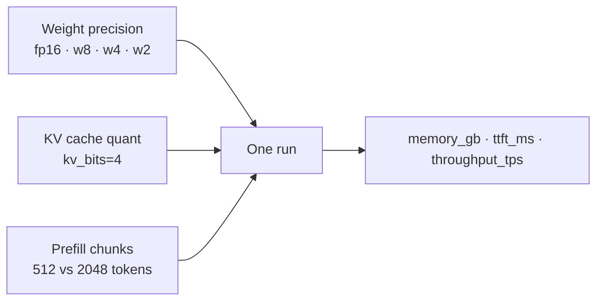

# LLM-Inference

Reproducible benchmarks for **open-source LLM inference on Apple Silicon**, built on [MLX](https://github.com/ml-explore/mlx) and [mlx-lm](https://github.com/ml-explore/mlx-lm). Measure how weight quantization, KV-cache compression, and prefill tuning change **memory**, **time-to-first-token (TTFT)**, and **decode throughput**—then version the numbers in Git.

Designed for a hands-on article series (Mac M3 vs M5 Max), but usable as a standalone sweep harness for any MLX-capable Mac.

---

## What you get

- **Structured sweeps** — 16 configs per model (`fp16` / `w8` / `w4` / `w2` × optional `kv_cache` + `prefill`)
- **21 model presets** — ~0.5B through 72B from `mlx-community` on Hugging Face
- **Article-driven runs** — one command per blog post (`./scripts/run_article.sh 1 "Mac M3"`)
- **Isolated subprocesses** — a Metal OOM on one config does not kill the whole sweep
- **JSON results** — comparable fields for tables, charts, and CI diffs

---

## Requirements

| | |
|---|---|
| **OS** | macOS on Apple Silicon |
| **Python** | 3.10+ (3.11–3.13 tested via venv) |
| **RAM** | ~20 GB+ for 8B fp16; ~24 GB comfortable for 8B at 4-bit; 64 GB+ for 32B+ sweeps |
| **Network** | Hugging Face download on first run per model |

---

## Quick start

```bash
git clone <your-repo-url> LLM-Inference && cd LLM-Inference

./scripts/setup_env.sh
source .venv/bin/activate

# Optional: HF login (rate limits + gated models)
./scripts/hf_login.sh

# Verify all configured repos resolve
python scripts/run_benchmark.py --hf-check

# Single smoke test (~1–3 min depending on download)
python scripts/run_benchmark.py --preset llama3-8b --config fp16 --hardware "Mac M3" -n 1
```

---

## Two ways to run benchmarks

### 1. Article series (recommended for writing)

Twelve posts: one optimization (or small set) each. Results land under `results/<hardware>/article_XX_<slug>/`.

```bash
python scripts/run_article.py --list

./scripts/run_article.sh 0 "Mac M3"    # intro demo
./scripts/run_article.sh 1 "Mac M3"    # weight quantization (all models, w8/w4/w2)
./scripts/run_article.sh 2 "Mac M3"    # KV cache on/off
./scripts/run_article.sh 6 "Mac M3"    # speculative decoding
./scripts/run_article.sh 7 "Mac M3"    # context length, generation length, prefix cache

# All MLX-backed articles (0–7)
./scripts/run_article.sh all "Mac M3"

# Preview planned runs without executing
python scripts/run_article.py --article 5 --dry-run --hardware "Mac M3"

# Build markdown tables from JSON
python scripts/generate_article_tables.py --hardware "Mac M3" --article 2
```

Index and sweep details: [docs/ARTICLES_INDEX.md](docs/ARTICLES_INDEX.md) · [docs/ARTICLE_SERIES.md](docs/ARTICLE_SERIES.md)

### 2. Full optimization matrix

Every weight level × runtime combo for many models (224 runs on a 24 GB M3 by default).

```bash
# M3: 14 small/medium models (skips 12B+)
./scripts/run_full_sweep.sh "Mac M3"

# Workstation: all 21 presets
python scripts/run_benchmark.py \
  --sweep --all-models --include-large \
  --hardware "Mac M5 Max"
```

Step-by-step workflow: [docs/BENCHMARK_WORKFLOW.md](docs/BENCHMARK_WORKFLOW.md)

---

## Optimizations under test

Three independent axes. They stack; the capstone config is `w4+kv_cache+prefill`.



| Axis | What changes | In code |
|------|----------------|---------|
| **Weights** | Checkpoint size and memory bandwidth | Separate HF repos per bit width |
| **KV cache** | Memory during long generations | `kv_bits=4` in `stream_generate` |
| **Prefill** | Prompt processing / TTFT | `prefill_step_size` 512 (off) vs 2048 (on) |

**Also benchmarked (article runners):**

| Feature | Flag / article | Notes |
|---------|----------------|-------|
| Speculative decoding | `--speculative` · article 6 | Draft model + target (see `DRAFT_PRESET_BY_TARGET` in `optimizations.py`) |
| Prefix KV cache | `--prefix-cache` · article 7 | Cold vs warm TTFT with saved cache |
| Context / gen length | article 7 | Sweep `-p` and `-g` |

Deep dives: [weight quant](docs/optimizations/weight-quantization.md) · [KV cache](docs/optimizations/kv-cache-quantization.md) · [prefill](docs/optimizations/prefill-and-flash-attention.md) · [full stack](docs/optimizations/all-optimizations.md)

---

## Sweep size

**16 configs per model** — for each weight level, run: baseline → `+kv_cache` → `+prefill` → `+kv_cache+prefill`.

| Machine | Models (default) | Total runs |
|---------|------------------|------------|
| 24 GB M3 | 14 presets (0.5B–9B) | **224** |
| 64 GB+ with `--include-large` | 21 presets (up to 72B) | **336** |

List presets and RAM hints:

```bash
python scripts/list_models.py
```

Override Hugging Face repos in [models.json](models.json) without editing Python.

---

## Models

Presets are sorted **smallest → largest** during `--all-models` sweeps. Large tiers need `--include-large` on 24 GB Macs.

| Tier | Examples | ~Params |
|------|----------|---------|
| Tiny | `qwen-0.5b` | 0.5B |
| Very small | `llama-3.2-1b`, `qwen-1.5b`, `gemma-2-2b` | 1–2B |
| Small | `llama-3.2-3b`, `qwen-3b`, `phi-3-mini`, `phi-3.5-mini` | 3–4B |
| Medium | `mistral-7b`, `llama3-8b`, `qwen-7b`, DeepSeek R1 7B/8B, `gemma-9b` | 7–9B |
| Large+ | `mistral-nemo-12b`, `qwen-14b`, `mistral-small-22b`, `gemma-27b`, `qwen-35b`, `llama-70b`, `qwen-72b` | 12–72B |

Some families have no public bf16 MLX build; `fp16` maps to the best available 8-bit repo (called out in `list_models.py`).

---

## Results

Per-run JSON under `results/<hardware>/`:

```text
results/Mac_M3/llama3-8b/w4+kv_cache+prefill.json
results/Mac_M3/article_01_weight-quant/llama3-8b/w4.json
results/Mac_M3/article_06_speculative-decoding/llama3-8b/llama3-8b_w4_speculative.json
```

**Key fields**

| Field | Meaning |
|-------|---------|
| `ttft_ms` | Time to first token |
| `throughput_tps` | Decode tokens per second |
| `memory_gb` | Peak memory during run |
| `configuration` | e.g. `w4+kv_cache+prefill` |
| `status` | `ok`, `oom`, `skipped`, `error` |
| `draft_accept_rate` | Speculative runs only |
| `prefix_cache_cold_ttft_ms` / `prefix_cache_warm_ttft_ms` | Prefix-cache runs only |

Sweep summaries: `results/sweep_<hardware>_<timestamp>.json` (gitignored at repo root; per-config JSON under `results/<hardware>/` is meant to be tracked).

---

## Command reference

```bash
# --- Single run ---
python scripts/run_benchmark.py \
  --preset llama3-8b --config w4+kv_cache+prefill \
  --hardware "Mac M3" -p 512 -g 128 -n 3

# --- Partial sweeps ---
python scripts/run_benchmark.py --sweep --weights-only --all-models --hardware "Mac M3"
python scripts/run_benchmark.py --sweep --preset llama3-8b --max-combo-size 1 --hardware "Mac M3"

# --- Advanced ---
python scripts/run_benchmark.py --preset llama3-8b --config w4 --speculative --hardware "Mac M3"
python scripts/run_benchmark.py --preset llama3-8b --config w4 --prefix-cache --hardware "Mac M3"

# --- Recovery ---
./scripts/retry_failed.sh "Mac M3"
```

| Flag | Purpose |
|------|---------|
| `--sweep` | Full or partial config matrix |
| `--all-models` | All presets (smallest first) |
| `--include-large` | Include 12B+ on low-RAM Macs |
| `--weights-only` | fp16 / w8 / w4 / w2 only |
| `--config` | Single label, e.g. `w4+kv_cache` |
| `--hardware` | Label in JSON (e.g. `Mac M3`, `Mac M5 Max`) |
| `-p` / `-g` | Prompt and generation token counts |
| `-n` | Trials after warmup |

---

## Project layout

```text
LLM-Inference/
├── docs/
│   ├── ARTICLES_INDEX.md           # 12-article map
│   ├── ARTICLE_SERIES.md             # Per-article commands
│   ├── BENCHMARK_WORKFLOW.md
│   ├── INFERENCE_OPTIMIZATIONS_CATALOG.md
│   ├── articles/                     # Post outlines
│   └── optimizations/                # Technique guides
├── scripts/
│   ├── run_article.py / run_article.sh   # Article benchmarks
│   ├── run_benchmark.py                  # Core runner + sweep
│   ├── optimizations.py                  # Configs, repos, RAM estimates
│   ├── articles.py                       # Article definitions
│   ├── list_models.py
│   ├── generate_article_tables.py
│   ├── run_full_sweep.sh
│   ├── setup_env.sh
│   ├── hf_login.sh
│   └── retry_failed.sh
├── results/                        # Benchmark JSON (per machine)
├── models.json                     # HF repo overrides
├── notes.md                        # Capstone article draft
└── requirements.txt
```

---

## Documentation

| Topic | Link |
|-------|------|
| Article index (12 posts) | [docs/ARTICLES_INDEX.md](docs/ARTICLES_INDEX.md) |
| Run articles | [docs/ARTICLE_SERIES.md](docs/ARTICLE_SERIES.md) |
| Benchmark workflow | [docs/BENCHMARK_WORKFLOW.md](docs/BENCHMARK_WORKFLOW.md) |
| All inference techniques (reference) | [docs/INFERENCE_OPTIMIZATIONS_CATALOG.md](docs/INFERENCE_OPTIMIZATIONS_CATALOG.md) |
| Capstone draft | [notes.md](notes.md) |

---

## Troubleshooting

| Symptom | What to do |
|---------|----------------|
| `401` / `403` on Hugging Face | `./scripts/hf_login.sh` and accept the model license on huggingface.co |
| `404` on `*-bf16` repo | Pull latest repo; see [weight-quantization.md](docs/optimizations/weight-quantization.md) |
| Many `skipped` rows | RAM budget; try `--weight-bits 4` or `--include-large` only on big Macs |
| Sweep dies mid-run | Use current `run_benchmark.py` (subprocess per config) |
| Speculative: vocab mismatch | Pick a draft preset with matching tokenizer (`optimizations.py`) |
| Qwen 32B OOM on 24 GB | Expected; run on M5 Max with `--include-large` |

---

## License

See [LICENSE](LICENSE).
