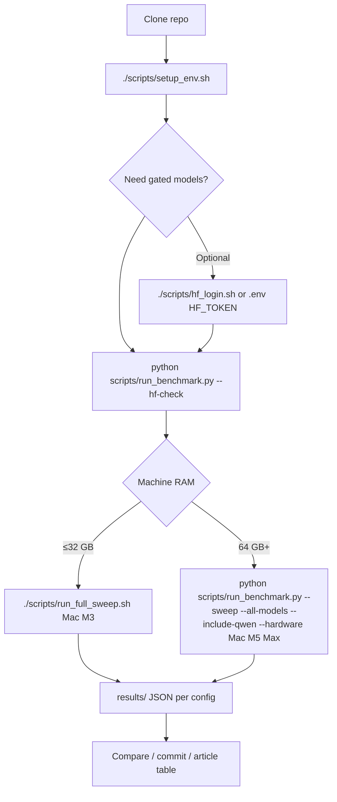
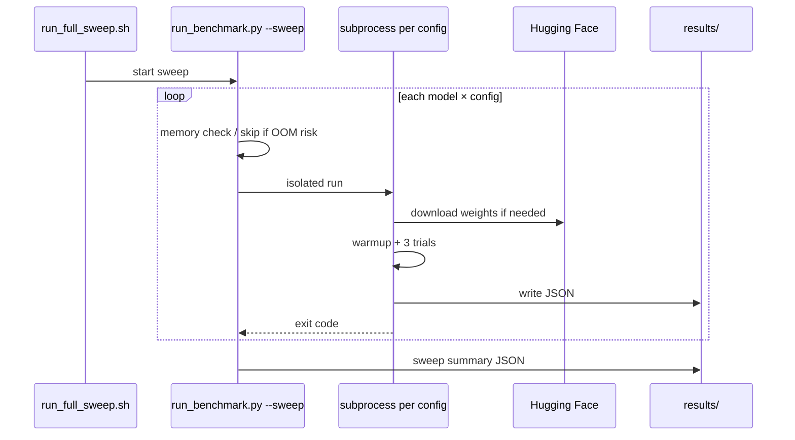

# Benchmark Workflow

Step-by-step guide to running, tracking, and comparing optimization benchmarks on Apple Silicon.

See [optimizations/](optimizations/README.md) for **why** each optimization exists.

**Writing a blog series?** Use [ARTICLE_SERIES.md](ARTICLE_SERIES.md) to run **isolated sweeps** per optimization (weights-only, KV pairs, prefill pairs) instead of one 224-run monolith per post.

---

## End-to-end workflow



---

## 1. Environment setup

```bash
cd LLM-Inference
./scripts/setup_env.sh
source .venv/bin/activate
```

Installs: `mlx`, `mlx-lm`, `psutil`, and Hugging Face tooling.

---

## 2. Hugging Face (optional but recommended)

Most `mlx-community` weight repos are public. Login helps rate limits and any gated models you add in `models.json`.

```bash
./scripts/hf_login.sh
# or: cp .env.example .env   # set HF_TOKEN=hf_...
```

Verify all configured repos:

```bash
python scripts/run_benchmark.py --hf-check
```

Expected: `OK` for every repo listed (10 repos with default presets).

---

## 3. Choose a sweep mode

### Full sweep (recommended for article data)

**24 GB Mac (M3)** — llama + mistral only:

```bash
./scripts/run_full_sweep.sh "Mac M3"
```

**64 GB+ Mac** — include Qwen 32B:

```bash
python scripts/run_benchmark.py \
  --sweep --all-models --include-qwen \
  --hardware "Mac M5 Max"
```

### Weight precision only (4 runs per model)

Isolates fp16 vs w8 vs w4 vs w2 without KV/prefill:

```bash
python scripts/run_benchmark.py --sweep --weights-only --preset llama3-8b --hardware "Mac M3"
```

### Single configuration

```bash
python scripts/run_benchmark.py --preset llama3-8b --config w4+kv_cache --hardware "Mac M3"
python scripts/run_benchmark.py --preset llama3-8b --weight-bits 4 --kv-cache --hardware "Mac M3"
```

---

## 4. What happens during a sweep



- Each config runs in a **subprocess** so Metal OOM does not kill the entire sweep.
- **5 s cooldown** between configs (default) to let memory settle.
- Failed runs still write JSON with `"status": "error"`, `"oom"`, or `"skipped"`.

---

## 5. Results layout

```text
results/
  Mac_M3/
    llama3-8b/
      fp16.json
      fp16+kv_cache.json
      w4.json
      w4+kv_cache+prefill.json
      ...
    mistral-7b/
      ...
  sweep_Mac_M3_20260519T194500Z.json   # combined summary
```

### Example result fields

```json
{
  "hardware": "Mac M3",
  "model_preset": "llama3-8b",
  "configuration": "w4+kv_cache",
  "weight_bits": 4,
  "optimizations": { "weight_bits": 4, "kv_cache": true, "prefill": false },
  "model_repo": "mlx-community/Meta-Llama-3.1-8B-Instruct-4bit",
  "memory_gb": 5.81,
  "ttft_ms": 2484.6,
  "throughput_tps": 20.2,
  "status": "ok"
}
```

---

## 6. Building comparison tables

Align with [notes.md](../notes.md) article format:

| Model | Hardware | Configuration | Memory | TTFT | Throughput |
|-------|----------|---------------|--------|------|------------|
| Llama 3 8B | Mac M3 | fp16 | from `fp16.json` | … | … |
| Llama 3 8B | Mac M3 | w4+kv_cache+prefill | from `w4+kv_cache+prefill.json` | … | … |

**Suggested comparisons:**

1. **Quantization only** — `fp16` vs `w8` vs `w4` vs `w2` (weights-only sweep).
2. **Runtime opts on fp16** — `fp16` vs `fp16+kv_cache` vs `fp16+prefill` vs `fp16+kv_cache+prefill`.
3. **Full stack** — `fp16` vs `w4+kv_cache+prefill` (article “optimized” row).
4. **Cross-machine** — same config label on `Mac M3` vs `Mac M5 Max` results folders.

---

## 7. CLI reference

| Flag | Purpose |
|------|---------|
| `--sweep` | Run full config matrix |
| `--all-models` | llama3-8b + mistral-7b + qwen-35b |
| `--include-qwen` | Do not auto-skip qwen on low RAM |
| `--weights-only` | 4 weight levels only |
| `--max-combo-size 0` | Weight only per level (no kv/prefill) |
| `--skip-presets qwen-35b` | Manual skip |
| `--hf-check` | Validate HF repo access |
| `-n 3` | Trials per config (after warmup) |
| `-p 512` | Prompt tokens |
| `-g 128` | Generation tokens |

---

## 8. Troubleshooting

| Symptom | Action |
|---------|--------|
| `401` / `404` on old `*-bf16` names | Pull latest code; see [weight-quantization.md](optimizations/weight-quantization.md) |
| Sweep stops with OOM | Use updated runner; skip qwen on 24 GB |
| Many `skipped` JSONs | Check `error` field; often memory budget |
| Re-run failed fp16/w8 | `./scripts/retry_failed.sh "Mac M3"` |

---

## 9. Git-tracking results (optional)

For article reproducibility:

```bash
git add results/Mac_M3/
git commit -m "Benchmark: M3 full sweep llama+mistral"
```

Use branches for experiments, e.g. `benchmark/m3-sweep-v2`, and compare JSON diffs over time.
