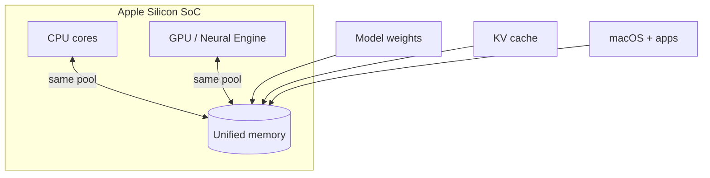
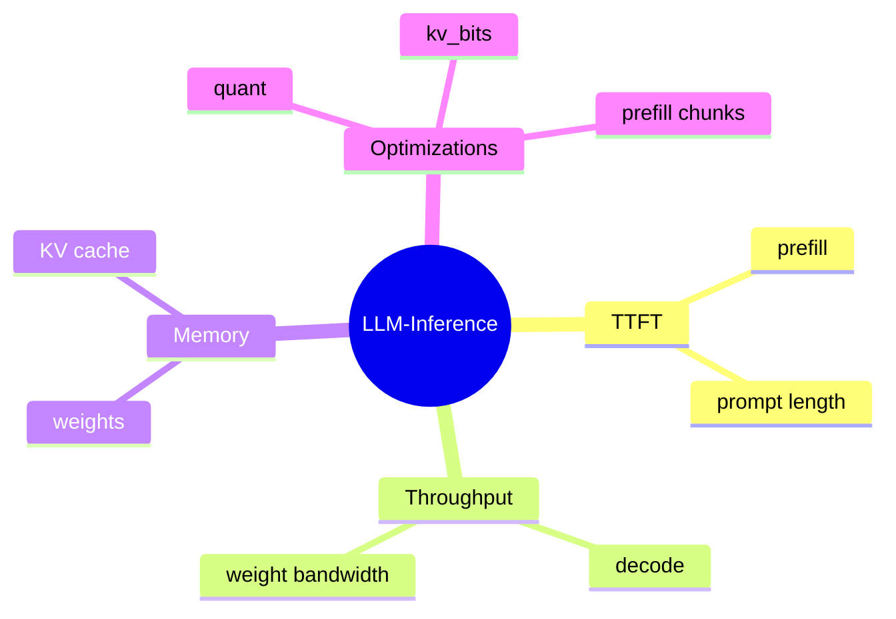

# Article 0: Introduction — local LLMs on Apple Silicon

**Covers:** M3 vs M5 Max, unified memory, metrics, repo workflow.

**References:** [19], [20], [21], [24] — [REFERENCES.md](../REFERENCES.md).

---

## Figure — Unified memory on Apple Silicon



Unlike discrete GPU PCs, there is no separate VRAM bar—**total RAM is shared** [20].

---

## Figure — What this repo measures



---

## Methodology (schema v1)

Each benchmark JSON includes:

| Field | Meaning |
|-------|---------|
| `schema_version` | `1` — current result format |
| `warmup_policy` | 1 discarded warmup trial before measured trials |
| `trials` | Per-trial arrays (`ttft_ms`, `throughput_tps`, …) |
| `stats` | `median`, `p50`, `p95`, `std` per metric |
| `ttft_ms` / `throughput_tps` | **Median** of measured trials (not mean) |

Validate after a sweep:

```bash
python scripts/validate_results.py --hardware "Mac M3"
python scripts/report.py --hardware "Mac M3"
```

Legacy files (`baseline`, `quantization`) → migrate with `scripts/migrate_results.py --apply`.

---

## Run

```bash
./scripts/run_article.sh 0 "Mac M3"
```

See [ARTICLE_SERIES.md](../ARTICLE_SERIES.md) § Article 0.
