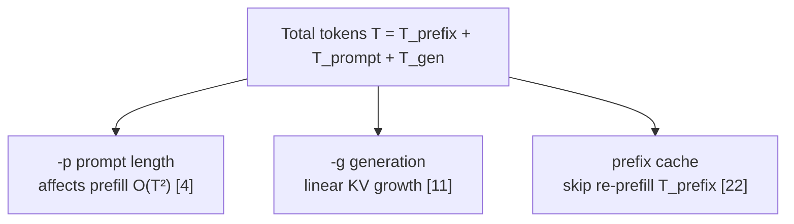

# Article 7: Context, generation length & prompt cache (set)

**One article** covering three related ideas—same math (sequence length \(T\)), different programming levers.

**References:** [1], [4], [11], [13], [22] — [REFERENCES.md](../REFERENCES.md).

---

## Figure — Three levers on sequence length \(T\)



---

## 1. Prompt length — math

Total sequence length during prefill is \(T_{\text{prompt}} = p\) (our `-p` flag).

**KV size after prefill:**

$$
M_{\text{KV}} \propto T_{\text{prompt}} \quad \text{(linear)}
$$

**Attention work (prefill, naive upper bound):**

$$
\mathrm{FLOPs}_{\text{prefill}} \propto T_{\text{prompt}}^2 \quad \text{(per layer, per head)}
$$

So TTFT often grows **faster than linear** in \(p\) when attention dominates:

| `-p` | Relative \(T\) | Relative attention work (rough) |
|------|----------------|--------------------------------|
| 256 | 1× | 1× |
| 512 | 2× | 4× |
| 1024 | 4× | 16× |
| 2048 | 8× | 64× |

**Example sweep:**

```bash
for P in 256 512 1024 2048; do
  python scripts/run_benchmark.py --preset llama3-8b --config w4+prefill \
    --hardware "Mac M3" -p "$P" -g 128
done
```

Plot `ttft_ms` vs \(p\) — Article 3 prefill ON makes the curve shallower at large \(p\).

---

## 2. Generation length — math

After prefill, decode adds \(T_{\text{gen}} = g\) tokens (`-g` flag). Total cached length:

$$
T_{\text{total}} = T_{\text{prompt}} + T_{\text{gen}}
$$

$$
M_{\text{KV}} = 2 L H_{\text{kv}} T_{\text{total}} D \cdot \frac{b_{\text{kv}}}{8}
$$

**Programming:** only `max_tokens=g` changes; weights unchanged.

| `-g` | \(T_{\text{total}}\) (with `-p 512`) | FP16 KV (8B, rough) |
|------|--------------------------------------|---------------------|
| 64 | 576 | ~76 MB |
| 256 | 768 | ~101 MB |
| 512 | 1024 | ~134 MB |

With `w4+kv_cache` (\(b_{\text{kv}}=4\)), divide KV column by ~4.

```bash
for G in 64 256 512; do
  python scripts/run_benchmark.py --preset llama3-8b --config w4+kv_cache \
    --hardware "Mac M3" -p 512 -g "$G"
done
```

---

## 3. Prefix KV cache — math + programming

### Math

Split prompt into **prefix** \(T_{\text{prefix}}\) (system prompt) and **suffix** \(T_{\text{suffix}}\) (user turn).

**Cold** (no reuse): cost \(\propto (T_{\text{prefix}} + T_{\text{suffix}})^2\) for attention during prefill.

**Warm** (prefix cached): prefill cost \(\approx \text{cost}(T_{\text{suffix}})\) plus small cache load.

$$
\mathrm{TTFT}_{\text{warm}} \ll \mathrm{TTFT}_{\text{cold}}
\quad \text{when } T_{\text{prefix}} \gg T_{\text{suffix}}
$$

### Programming (`--prefix-cache`)

```bash
python scripts/run_benchmark.py --preset llama3-8b --config w4 \
  --prefix-cache --hardware "Mac M3"
```

Runner flow:

1. Prefill `system_tokens` → `save_prompt_cache(file)`  
2. Load cache → prefill only `user_tokens` → measure TTFT  
3. JSON: `prefix_cache_cold_ttft_ms`, `prefix_cache_warm_ttft_ms`

Uses `mlx_lm.models.cache.make_prompt_cache` / `save_prompt_cache` / `load_prompt_cache`.

---

## Combined example (one session)

| Stage | \(T\) | Lever |
|-------|-------|-------|
| System prompt cached | 256 | prefix cache (programming) |
| User message | 128 | `-p` suffix |
| Reply | 512 | `-g` |
| KV bits | 4 | `kv_cache` (math + programming) |

$$
T_{\text{total}} = 256 + 128 + 512 = 896
$$

Use [KV formula](../optimizations/kv-cache-quantization.md) with \(b_{\text{kv}}=4\) for peak memory estimate.

---

## 4. Workload stress matrix (task × data × pressure)

Beyond raw `-p` / `-g` sweeps, Article 7 runs **`wl_*` workloads** — realistic task shapes from light chat to heavy RAG.

| Pressure | Example ID | Stress |
|----------|------------|--------|
| 1 | `chat_light` | decode |
| 2 | `qa_json` | balanced |
| 3 | `summarize_long` | prefill |
| 4 | `rag_agent` | memory |
| 5 | `stress_prefill` / `stress_decode` | max prefill or decode |

Full matrix: [workload-stress-matrix.md](../optimizations/workload-stress-matrix.md)

```bash
./scripts/run_article.sh 7 "Mac M3"
python scripts/run_benchmark.py --preset llama3-8b --workload-sweep --hardware "Mac M3"
```

---

## See also

- [Workload stress matrix](../optimizations/workload-stress-matrix.md)  
- [Math vs programming overview](../optimizations/math-and-implementation.md)  
- [KV cache quantization](../optimizations/kv-cache-quantization.md)  
- [Prefill & Flash Attention](../optimizations/prefill-and-flash-attention.md)  
- [ARTICLE_SERIES.md](../ARTICLE_SERIES.md) § Article 7
