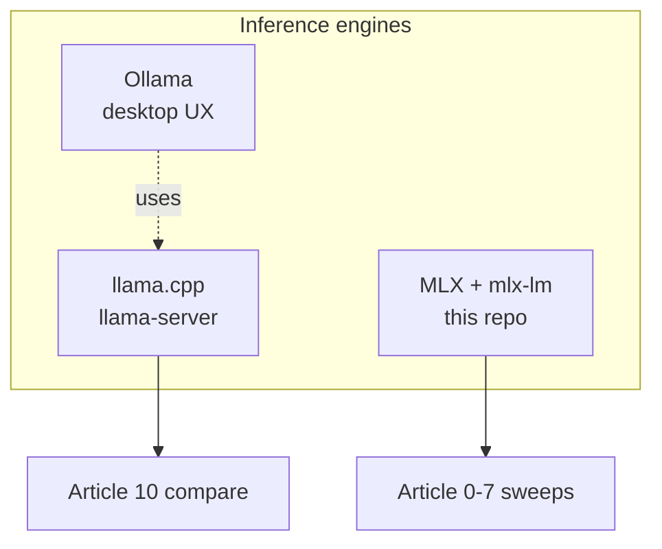

# Article 10: Local runtimes compared (set)

**One article:** MLX (this repo) vs **llama.cpp** (benchmarked) vs Ollama (concept).

**Deep dive:** [llama-cpp-vs-mlx.md](../optimizations/llama-cpp-vs-mlx.md) · **References:** [25] and MLX [21]–[24] in [REFERENCES.md](../REFERENCES.md).

---

## Figure — Three ways to run local LLMs on Mac



---

## Benchmarked: MLX vs llama.cpp

```bash
# Install llama.cpp (macOS)
brew install llama.cpp

# Run Article 10 comparison
./scripts/run_article.sh 10 "Mac M3"
```

Compares (default matrix):

| Preset | Config | MLX repo | GGUF quant |
|--------|--------|----------|------------|
| `llama3-8b` | `fp16` | mlx-community bf16 | F16 GGUF |
| `llama3-8b` | `w4` | mlx-community 4bit | Q4_K_M |
| `mistral-7b` | `w4` | mlx-community 4bit | Q4_K_M |

Results: `results/<hardware>/article_10_runtimes/*_compare.json`

### Metrics to report

| Field | Runtime |
|-------|---------|
| `mlx.throughput_tps` | MLX decode |
| `llamacpp.tg_tps` | llama.cpp decode |
| `comparison.throughput_ratio_mlx_over_llamacpp` | Who is faster |

---

## Ollama (concept section)

- Distribution and model management  
- llama.cpp + GGUF underneath  
- Not run by `compare_runtimes.py` — discuss qualitatively with diagram in [llama-cpp-vs-mlx.md](../optimizations/llama-cpp-vs-mlx.md)

---

## Article outline

1. **Introduction** — same Mac, same quant *tier*, different file formats  
2. **MLX path** — Metal-native, `mlx-community`, article sweeps  
3. **llama.cpp path** — GGUF, `llama-server`, `llama-bench`  
4. **Numbers** — table from `*_compare.json`  
5. **When to use which** — decision flowchart  
6. **Ollama** — convenience layer  

---

## See also

[ARTICLE_SERIES.md](../ARTICLE_SERIES.md) § Article 10
