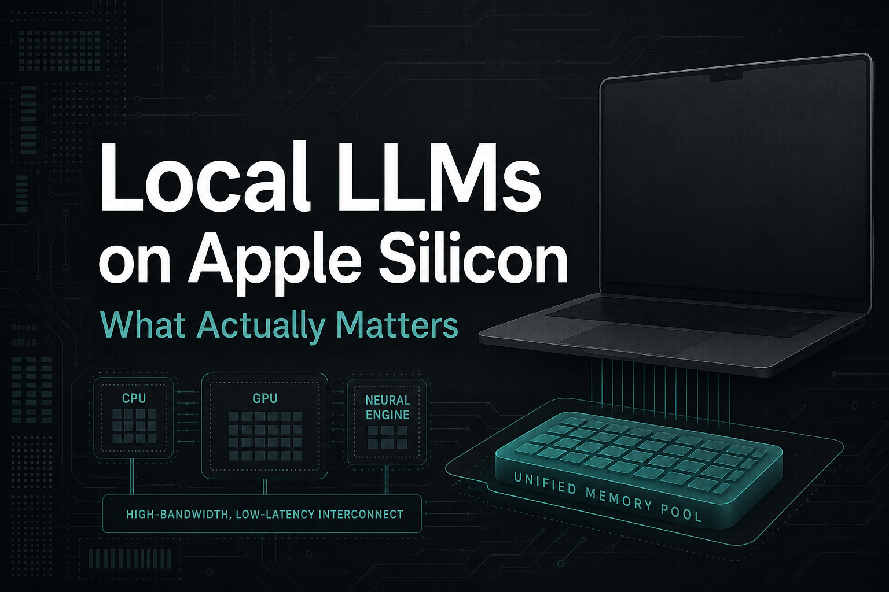
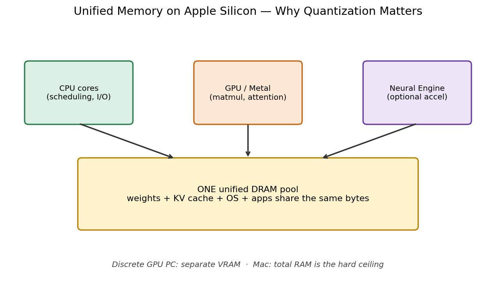
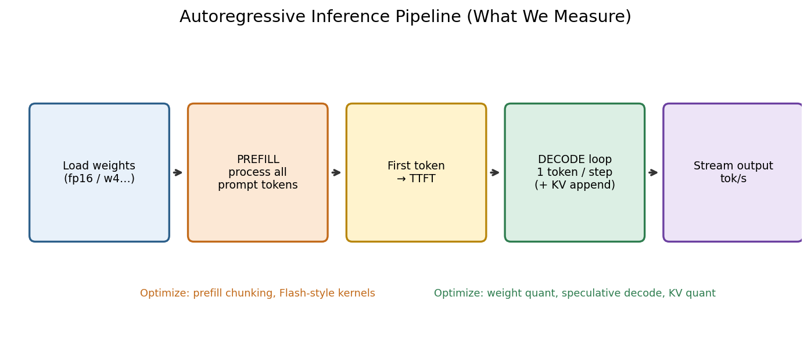
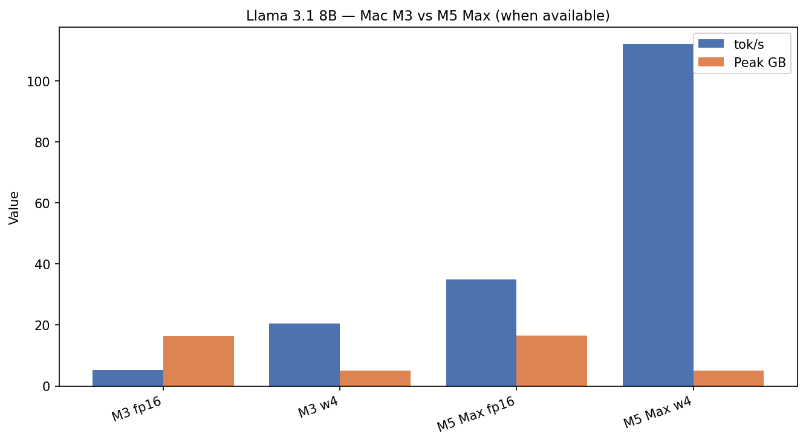
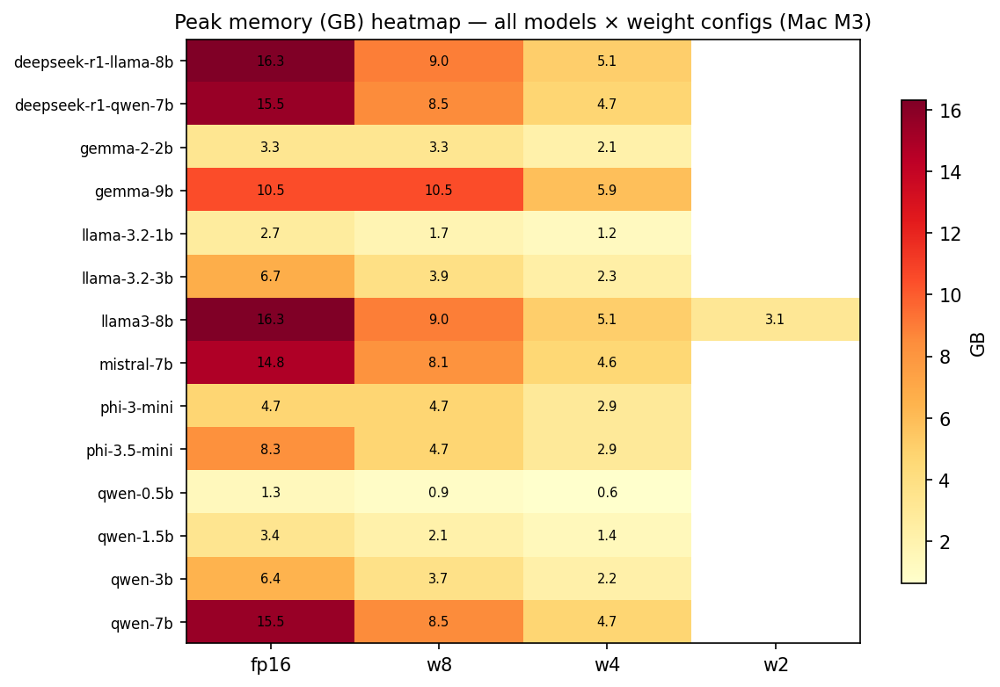
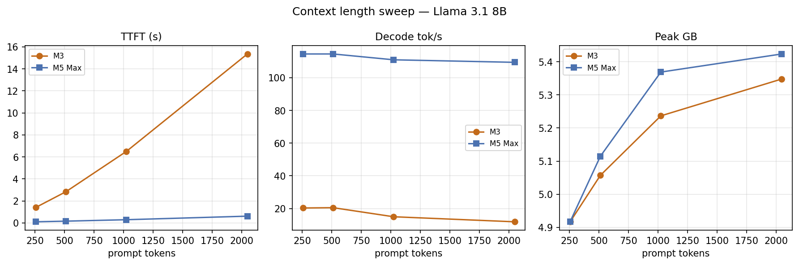
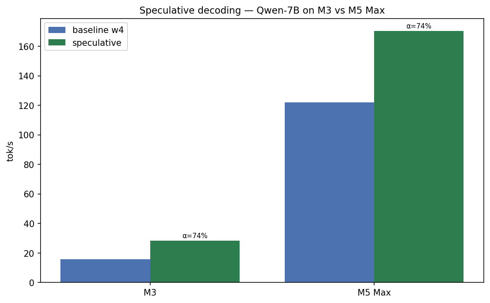

# Running 8B LLMs on a MacBook: What Actually Matters

*Part 1 of 7 — Local LLMs on Apple Silicon*

I still remember the first time I loaded Meta’s Llama 3.1 8B on a stock MacBook Pro and watched Activity Monitor paint the memory bar red. No cloud bill. No discrete NVIDIA card. Just `mlx_lm.generate`, a Hugging Face checkpoint, and a quiet fan that wasn’t quiet for long. The model *ran*. It also felt like dial-up: roughly **5 tokens per second**, with a multi-second freeze before the first word appeared.

That gap — between “it runs on my laptop” and “I would actually use this every day” — is the entire point of this series. Marketing slides say Apple Silicon is great for on-device AI. Blog posts say “just use 4-bit.” Very few posts show you the full measurement loop: same prompt length, same generation length, medians across trials, JSON you can replot, and the same sweep on two chips so you know what is software and what is silicon.

So I built an open benchmark harness on [MLX](https://github.com/ml-explore/mlx), pointed it at [mlx-community](https://huggingface.co/mlx-community) checkpoints, and ran it on a **Mac M3 (24 GB)** and a **Mac M5 Max**. This opening post is the map: unified memory, the two-phase inference pipeline, the three metrics that matter, a brutal FP16 baseline, and how the rest of the series stacks optimizations on top of that baseline.

---

## Why this matters

Local LLMs stopped being a curiosity the moment 7–9B instruct models became “good enough” for coding assistants, summarization, and private RAG. The remaining question is operational:

| Question | Why it hurts if you ignore it |
|----------|-------------------------------|
| Will it fit? | Swap thrash feels like a hung Mac |
| How long to first token? | Prefill latency kills chat UX |
| How fast does it stream? | Decode tok/s is what you *feel* typing |
| What do I enable next? | Blind toggles waste hours |

Cloud APIs hide those questions behind a price tag. On a laptop you *are* the ops team. Apple Silicon makes the economics attractive — shared DRAM, Metal acceleration, no PCIe tax — but it also means **your Chrome tabs and your 8B weights fight for the same pool**. Quantization, KV-cache tricks, prefill chunking, and speculative decoding are not optional polish; they are how you leave headroom for a real workload.

This series is written for people who want numbers they can reproduce, not vibes. Every figure ships from JSON under `results/`. Every command is in the repo. If your Mac is slower or faster than mine, you should be able to prove it in an afternoon.

---

## How it works — unified memory + the inference pipeline

### How Apple Silicon changes the game

On a classic gaming PC, GPU VRAM is a separate pool from system RAM. Weights live on the GPU; the CPU shovels tensors over PCIe. On Apple Silicon, **CPU and GPU share one unified memory pool**. There is no host↔device copy in the discrete-GPU sense. Metal kernels read the same DRAM the OS uses for Safari.



*Figure 1 — Workflow: CPU, GPU, and Neural Engine share one DRAM pool. Weights, KV cache, macOS, and apps all compete for the same ceiling.*

That architecture is why “24 GB Mac” is a meaningful LLM capacity number — and why it is also a trap. An 8B model in FP16 burns ~16 GB *before* the KV cache grows with context. Leave 4–6 GB for the OS and you are already on the edge. Quantization is how you reclaim a working machine, not just how you chase leaderboard tok/s.

> **Fun fact:** Apple’s M1 (2020) was the first Mac SoC where the GPU could address the *same* physical DRAM as the CPU without a PCIe-style copy. Local LLM inference on Mac only became *practical* once consumer unified memory crossed roughly 16–24 GB — enough to hold a quantized 7–8B model and still open Slack.

Mathematically, weight memory for an \(N\)-parameter model at \(b\) bits is approximately:

\[
\mathrm{Mem}_{\text{weights}} \approx \frac{N \cdot b}{8 \cdot 10^9}\ \text{GB}
\]

For \(N = 8 \times 10^9\) and \(b = 16\): \(\approx 16\) GB. At \(b = 4\): \(\approx 4\) GB for weights alone (plus overhead, embeddings, and activations). That one equation is why Part 2 of this series exists. Papers that sit under this systems story: Vaswani et al. (attention), Williams et al. (Roofline), Jacob / GPTQ / AWQ (quantization — deep-dived next), and Apple’s MLX stack (how we actually run the benches).

### The inference pipeline (what we actually measure)

Every chat reply has two phases with different bottlenecks. Confusing them is the fastest way to optimize the wrong thing.



*Figure 2 — Workflow: load weights → prefill the prompt → emit first token (TTFT) → autoregressive decode loop (tok/s).*

| Metric | Phase | Bottleneck intuition | User feels |
|--------|-------|----------------------|------------|
| **Peak memory (GB)** | Load + KV growth | Capacity of unified DRAM | Will it fit without swap? |
| **TTFT (ms)** | Prefill | Compute / memory for full prompt | Cursor freeze after Enter |
| **Decode tok/s** | Autoregressive loop | Weight bandwidth per step | How fast the answer streams |

**Prefill** processes the entire prompt in (ideally) highly parallel matmuls. Longer prompts raise TTFT roughly with sequence length. **Decode** emits one token at a time; each step typically touches nearly all weights. On bandwidth-bound hardware, shrinking bytes-per-weight raises tok/s even when FLOPS headroom remains.

The [Roofline model](https://people.csail.mit.edu/stajich/publications/cacm09.pdf) (Williams et al., 2009) is the right mental picture: when arithmetic intensity is low, **memory bandwidth caps throughput**, not peak FLOPS. LLM decode on a laptop is textbook low intensity — giant weight read, tiny compute per token.

This series optimizes each phase separately, then stacks them:

1. Weight quantization → memory + decode  
2. KV cache quantization → long-context memory  
3. Prefill / TTFT → first-token latency  
4. Model size ladder → capacity planning  
5. Full stack → daily driver configs  
6. Speculative decoding → multi-token drafts  

---

## Baseline: Llama 3.1 8B in FP16 on Mac M3

Article 0’s demo run is intentionally boring: one model, one config, no tricks. Prompt = 512 tokens, generation = 128 tokens, 1 warmup + 3 measured trials, **medians** reported.

| Config | Peak memory | TTFT | Decode tok/s |
|--------|-------------|------|--------------|
| **demo_fp16** (Mac M3) | **16.33 GB** | **2,651 ms** | **5.3** |

Read that slowly. Sixteen gigabytes for a single chat model. Two and a half seconds before the first token. Five tokens per second afterward — about as fast as careful handwriting. On a 24 GB machine, you have maybe ~6–8 GB left for macOS, IDE, browser, and a growing KV cache. This is the “it works” baseline that every optimization in the series has to beat.

On the **Mac M5 Max**, the same demo (`demo_fp16`) lands at **16.46 GB** peak, **193 ms** TTFT, and **34.4 tok/s**. Memory barely moves (same weights). Latency and throughput jump hard — roughly **14×** faster TTFT and **~6.5×** decode versus the M3 demo. Silicon matters. Software still matters more for fitting.



*Figure 3 — Results: same Llama 3.1 8B family, different precision and hardware. On M3, dropping to 4-bit cuts memory ~3× and lifts decode ~3.5×; M5 Max raises the absolute ceiling.*

A preview of Part 2 (weights-only sweep, not the demo label): on M3, Llama 3.1 8B moves from **5.8 tok/s @ 16.3 GB (fp16)** → **20.5 tok/s @ 5.1 GB (w4)** → **35.8 tok/s @ 3.1 GB (w2)**. That is the headline you will see again with heatmaps and Pareto plots.

---

## Cross-hardware: what M3 vs M5 Max teaches early

| Observation | M3 (24 GB) | M5 Max | Takeaway |
|-------------|------------|--------|----------|
| FP16 8B memory | ~16.3 GB | ~16.5 GB | Capacity is model-bound, not chip-bound |
| FP16 8B decode | ~5.3–5.8 tok/s | ~34–35 tok/s | Bandwidth / SoC generation dominates speed |
| FP16 8B TTFT (512 tok) | ~2.6–2.7 s | ~0.19 s | Prefill loves bigger silicon |
| Room for 8B @ fp16 | Tight / fragile | Comfortable | Quantization is mandatory on 24 GB |

If you only ever benchmark on an M5 Max, you will under-appreciate why 4-bit exists. If you only ever benchmark on an M3, you will under-appreciate how much headroom modern Max chips add for larger models and speculative decoding (two models in memory). This series always labels hardware in the figure captions and JSON paths (`results/Mac_M3/…`, `results/Mac_M5_Max/…`).

---

## Methodology (schema v1) — so you can trust the tables

Every result JSON includes:

| Field | Meaning |
|-------|---------|
| `schema_version` | `1` — current result format |
| `warmup_policy` | 1 discarded warmup trial before measured trials |
| `num_trials` | Measured trials (default 3) |
| `trials` | Per-trial arrays (`ttft_ms`, `throughput_tps`, `memory_gb`, …) |
| `stats` | `median`, `p50`, `p95`, `std`, min/max |
| Top-level `ttft_ms` / `throughput_tps` / `memory_gb` | **Medians** of measured trials |

Defaults for the standard harness:

- **Runtime:** [MLX](https://github.com/ml-explore/mlx) + [mlx-lm](https://github.com/ml-explore/mlx-lm)  
- **Models:** [mlx-community](https://huggingface.co/mlx-community) checkpoints via presets  
- **Prompt / gen:** 512 prompt tokens, 128 generation tokens (unless an article overrides)  
- **Isolation:** each config in a subprocess (Metal OOM does not kill the sweep)  
- **Repo:** [LLM-Inference](https://github.com/Chirumamilla1522/LLM-Inference)

Validate and summarize after a sweep:

```bash
python scripts/validate_results.py --hardware "Mac M3"
python scripts/report.py --hardware "Mac M3"
```

> **Fun fact:** A full Article 1 weights-only sweep across 14 models × up to 4 bit-widths can take **4–12 hours** on an M3. The harness checkpoints progress so a laptop sleep does not throw away an afternoon.

### What a result file looks like

The Article 0 demo is deliberately one JSON file you can open in any editor:

```text
results/Mac_M3/article_00_introduction/llama3-8b/demo_fp16.json
```

Top-level medians match the table above (`memory_gb ≈ 16.33`, `ttft_ms ≈ 2651`, `throughput_tps ≈ 5.28`). Nested `trials` arrays keep the raw samples; `stats` exposes mean/median/p95/std so you can see whether a “weird” run is noise or a real regression. When something looks too good on a plot, open the JSON — that habit catches thermal throttling, wrong checkpoints, and accidental config mismatches faster than any dashboard.

I treat the harness like a lab notebook: hardware string in the path (`Mac_M3` vs `Mac_M5_Max`), article id in metadata, and subprocess isolation so one Metal OOM becomes a `status: error` row instead of a dead shell. That is the only reason a 14-model × 4-config sweep is publishable instead of heroic.

---

## Family-by-family preview (what “8B class” really means)

“8B” is a marketing bin, not a performance constant. Even before deep quantization charts, absolute decode rates at a fixed bit-width diverge by family:

| Family (≈ size) | Why it shows up in this series |
|-----------------|--------------------------------|
| **Qwen2.5** (0.5B–7B+) | Excellent small-model speed; great draft candidates later |
| **Llama 3 / 3.2** (1B–8B) | The default “does it feel like ChatGPT-local?” yardstick |
| **Mistral** (7B) | Strong instruct baseline; clean 4-bit MLX ports |
| **Gemma 2** (2B / 9B) | Different architecture quirks; sometimes odd fp16/w8 packaging |
| **Phi-3 / 3.5** | Small models that punch above size; great 24 GB citizens |
| **DeepSeek-R1 distill** | Same size class, reasoning-tuned; useful quality sanity checks |

Part 2 will put **all 14 M3-friendly presets** on one heatmap. Part 4 will climb the size ladder toward 70B-class on Max memory. For now, treat the Llama 8B FP16 demo as the emotional baseline — the number that made me open Activity Monitor and swear quietly.

---

## Sneak peek: the dataset behind this series

This is not a one-model blog series. The harness already produced **hundreds of JSON runs** across Mac M3 and Mac M5 Max. Here is the visual preview so you know what “more results” looks like before Part 2.

### Every model × every bit-width (Mac M3)


*Figure 4 — Results: decode tok/s heatmap for all Article 1 models × fp16/w8/w4/w2. Bright cells = fast. Notice how w4 lights up the board versus fp16.*



*Figure 5 — Results: peak memory (GB) for the same matrix. fp16 columns are the red zone on a 24 GB machine.*

### Speedup and efficiency


*Figure 6 — Results: fp16→w4 decode speedup and memory-reduction factor for every model that has both checkpoints.*


*Figure 7 — Results: efficiency = tok/s per GB at w4. Tiny Qwen models dominate; 8–9B models buy quality with lower efficiency.*

### Silicon generation gap


*Figure 8 — Results: same w4 checkpoints on M3 vs M5 Max. Annotations show the speedup factor (often ~5× on 7–8B models).*


*Figure 9 — Results: Llama 3.1 8B across fp16/w8/w4/w2 on both chips. M5 Max w4 alone (~112 tok/s) beats M3 w2 (~36 tok/s).*

### Family zoom-ins + the size ladder


*Figure 10 — Results: Qwen / Llama / Phi / Gemma / Mistral–DeepSeek panels, fp16 vs w4.*


*Figure 11 — Preview of Part 5: model-size ladder at w4 on Mac M3 — from 238 tok/s (0.5B) down to ~15 tok/s (9B).*


*Figure 12 — Preview: M5 Max extends the ladder through 12B–27B class models that simply do not fit as daily drivers on 24 GB.*

### Why later posts exist (context + stack + speculation)



*Figure 13 — Preview of the RAG problem: as prompt length grows, TTFT explodes and tok/s falls (M3 vs M5 Max).*


*Figure 14 — Preview of Part 6: fp16 vs optimized stack on both machines.*



*Figure 15 — Preview of Part 7: speculative decoding on Qwen-7B (M3 ~16→28 tok/s; M5 ~122→170 tok/s at 74% accept).*

If you only remember one thing from this gallery: **the FP16 demo is the floor, not the product.** The rest of the series is how we climb.

---

## Practical recipes / decision guide (before you optimize)

| Your situation | Do this first | Don’t start here |
|----------------|---------------|------------------|
| 16 GB unified memory | 3B–7B @ **w4** | FP16 8B |
| 24 GB (this M3) | 7–8B @ **w4** as daily driver | FP16 8B for chat |
| 32–64 GB+ / Max | FP16 for quality A/Bs; w4 for speed | Assuming cloud latency |
| You care about first token | Measure TTFT with *your* prompt length | Optimizing only tok/s |
| Long RAG contexts | Plan KV memory early (Part 3) | Ignoring cache growth |
| You want max stream speed | Quantize weights first (Part 2) | Buying a new Mac first |

Rule of thumb I actually use:

1. **Fit** the model at w4.  
2. **Measure** TTFT on a realistic prompt.  
3. **Then** chase exotic speedups (speculative, runtime tweaks).

Skipping step 1 is how people conclude “local LLMs are unusable” after one FP16 experiment.

### A 10-minute sanity protocol

Before you trust any blog number — including mine — run this on your machine:

1. Pick one preset you care about (`llama3-8b` or `mistral-7b`).  
2. Run fp16 and w4 only (skip the full 14-model marathon).  
3. Confirm memory drops ~2–3× and decode rises ~3× on an M3-class chip.  
4. Note TTFT with *your* prompt length; do not assume 512-token benches match a 40-token chat box.

If step 3 fails, you almost always have the wrong checkpoint bit-width, a thermal-limited fan curve, or a UI wrapper adding latency outside the generate loop. Fix that before stacking Part 3–7 optimizations.

---

## Fun facts

1. **Unified memory is a feature and a resource tax.** There is no separate “VRAM full” error that spares your GUI — when the model wins, your desktop loses.  
2. **Decode is often bandwidth-bound, not FLOPS-bound.** That is why 4-bit can be *faster* and *smaller* at the same time.  
3. **Medians beat single runs.** Metal warmup, thermal state, and background apps move tok/s by noticeable percentages; our harness always does 1 warmup + 3 measured trials.  
4. **The M5 Max does not shrink FP16 weights.** It makes the same 16 GB footprint *usable* by finishing prefill and decode much faster — capacity planning still needs quantization for multi-app workflows.

---

## Limitations / what we didn’t measure (yet)

- **Quality / perplexity / eval harnesses** — this series is systems performance first. Bit-width quality tradeoffs are discussed qualitatively in Part 2, not with MMLU tables.  
- **Battery, thermals, sustained clocks** — numbers are plugged-in desk runs.  
- **Non-MLX runtimes** (llama.cpp, Ollama defaults, PyTorch MPS) get a later runtime article; Article 0 is MLX-centric.  
- **Interactive chat UI overhead** — we measure the generate loop, not Electron wrappers.  
- **Network / tool-calling agents** — out of scope for the core latency tables.

---

## How to reproduce

```bash
# Article 0 demo (Llama 3.1 8B fp16)
./scripts/run_article.sh 0 "Mac M3"

# Optional: same demo on Max silicon
./scripts/run_article.sh 0 "Mac M5 Max"

# Regenerate ALL Medium figures after you have results
python scripts/plot_medium_diagrams.py
python scripts/plot_medium_charts.py --hardware "Mac M3"
python scripts/plot_medium_deep.py
```

Expected artifact for the baseline table above:

`results/Mac_M3/article_00_introduction/llama3-8b/demo_fp16.json`

---

## What comes next

| Part | Topic | Main lever |
|------|-------|------------|
| **1 (this post)** | Introduction | Metrics + unified memory |
| **2** | Weight quantization | fp16 → w8 / w4 / w2 |
| **3** | KV cache quantization | Long-context memory |
| **4** | Prefill & TTFT | First-token latency |
| **5** | Model size ladder | 0.5B → 70B |
| **6** | Full stack | Combine everything |
| **7** | Speculative decoding | Draft models |

Every number ships as JSON you can plot yourself. If you only read one more post in the series, make it **Part 2** — weight quantization is still the highest-leverage single change on a 24 GB Mac.

---

## References

1. Vaswani et al., *Attention Is All You Need* (2017) — [arXiv:1706.03762](https://arxiv.org/abs/1706.03762)  
2. Dubey et al., *The Llama 3 Herd of Models* (2024) — [arXiv:2407.21783](https://arxiv.org/abs/2407.21783)  
3. Williams et al., *Roofline: An Insightful Visual Performance Model* (2009) — [CACM PDF](https://people.csail.mit.edu/stajich/publications/cacm09.pdf)  
4. Apple Machine Learning Research, *MLX* — [github.com/ml-explore/mlx](https://github.com/ml-explore/mlx)  
5. Apple, *mlx-lm* — [github.com/ml-explore/mlx-lm](https://github.com/ml-explore/mlx-lm)  
6. Jacob et al., *Quantization and Training of Neural Networks for Efficient Integer-Arithmetic-Only Inference* (2018) — [arXiv:1712.05877](https://arxiv.org/abs/1712.05877)  
7. Frantar et al., *GPTQ: Accurate Post-Training Quantization for Generative Pre-trained Transformers* (2022) — [arXiv:2210.17323](https://arxiv.org/abs/2210.17323)  
8. Dao et al., *FlashAttention: Fast and Memory-Efficient Exact Attention* (2022) — [arXiv:2205.14135](https://arxiv.org/abs/2205.14135)  
9. mlx-community model hub — [huggingface.co/mlx-community](https://huggingface.co/mlx-community)  
10. LLM-Inference benchmark repo — [github.com/Chirumamilla1522/LLM-Inference](https://github.com/Chirumamilla1522/LLM-Inference)  
11. Apple, *Apple Silicon unified memory architecture* (developer documentation / WWDC sessions on Metal memory)  
12. Kaplan et al., *Scaling Laws for Neural Language Models* (2020) — [arXiv:2001.08361](https://arxiv.org/abs/2001.08361)  

---

## Series nav

**Next →** [Part 2: 4-Bit Weights Changed Everything](01-weight-quantization.md)

*Local LLMs on Apple Silicon — Part 1 of 7*

**Tags:** `Machine Learning` `Apple` `LLM` `MLX` `Local AI` `Apple Silicon`
