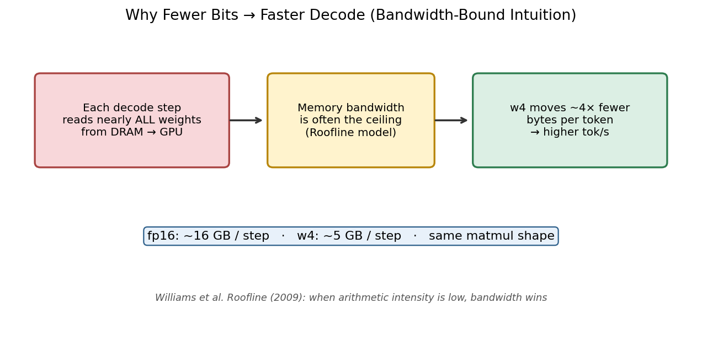
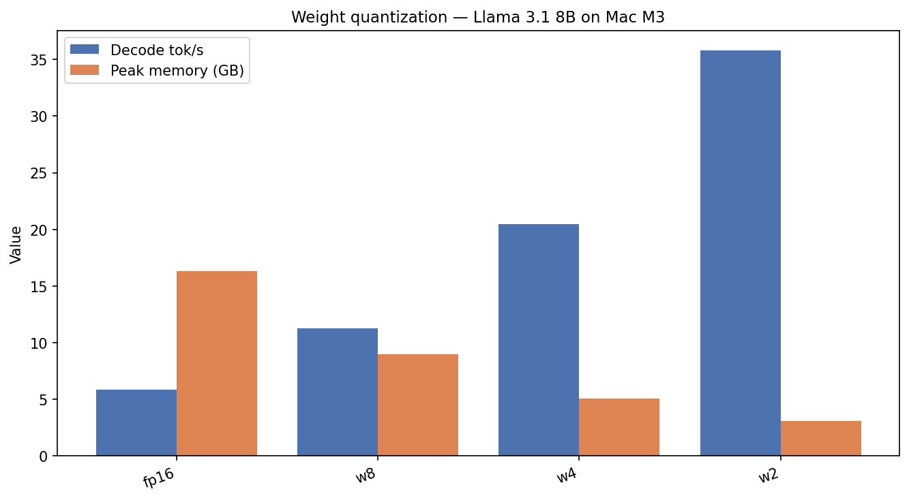
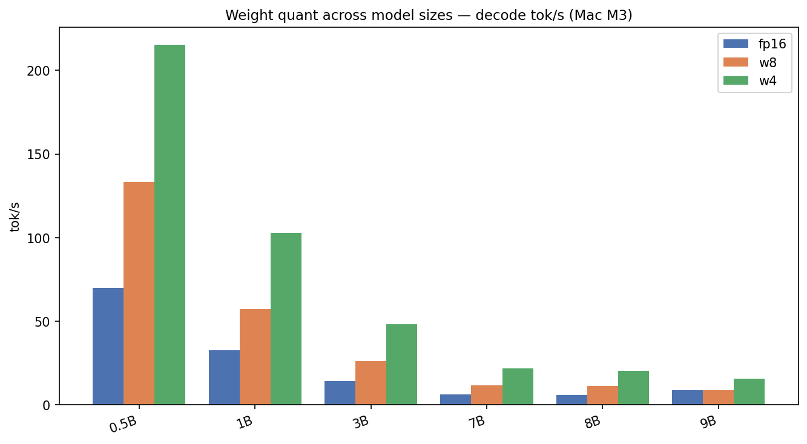

# 4-Bit Weights Changed Everything on My M3 Mac

*Part 2 of 7 — Local LLMs on Apple Silicon*

An 8-billion-parameter model in FP16 needs ~**16 GB** just for weights. On a 24 GB MacBook that leaves almost nothing for the OS, your editor, and the KV cache.

**Weight quantization** stores each parameter in fewer bits — typically 8, 4, or 2 — with modest quality loss if done well. This is the single highest-leverage change for local Mac inference.

---

## How it works (paper → practice)

High-precision weights are floats. **Affine quantization** maps each weight \(w\) to an integer code \(q\) with a per-group scale \(s\) and zero-point \(z\):

\[
q = \mathrm{clip}\left(\mathrm{round}\left(\frac{w}{s} + z\right),\ 0,\ 2^b - 1\right), \quad \hat{w} = s \cdot (q - z)
\]


*Figure 1 — Workflow: FP16 matrix → group-wise (s, z) → packed INT4 codes (Jacob et al.; GPTQ / AWQ family).*

Common LLM recipes:

| Method | Paper | Idea |
|--------|-------|------|
| **GPTQ** | Frantar et al. 2022 | Hessian-aware column quant, post-training |
| **AWQ** | Lin et al. 2023 | Protect “salient” weights using activation stats |
| **LLM.int8()** | Dettmers et al. 2022 | Mixed precision for outlier channels |

In our harness we load **pre-quantized mlx-community checkpoints** — no runtime quant during the bench.

> **Fun fact:** GPTQ was designed to shrink **175B-class** models that literally could not fit on a single GPU at fp16. The same math now makes 8B models comfortable on a laptop.

---

## Why fewer bits also make decode *faster*

Quantization is not only about fitting. During decode, each step often reads nearly **all weights** from DRAM. Fewer bytes per weight → higher effective tok/s on a bandwidth-bound chip.



*Figure 2 — Workflow: Roofline intuition — LLM decode is often memory-bandwidth limited, not FLOPS-limited.*

---

## Results: Llama 3.1 8B on Mac M3

| Config | Peak memory | TTFT | Decode tok/s | vs fp16 |
|--------|-------------|------|--------------|---------|
| **fp16** | 16.33 GB | 2,637 ms | 5.8 | 1.0× |
| **w8** | 8.96 GB | 2,775 ms | 11.3 | 1.9× |
| **w4** | 5.06 GB | 2,738 ms | **20.5** | **3.5×** |
| **w2** | 3.11 GB | 2,826 ms | 35.8 | 6.2× |



*Figure 3 — Results: memory roughly halves with each bit-width step; decode throughput rises with it.*


*Figure 4 — Results: explicit speedup factors for w8 / w4 / w2.*


*Figure 5 — Results: the Pareto frontier — w4 is the practical sweet spot on 24 GB.*

**Takeaway:** **w4** is the daily driver for 8B on 24 GB Macs — ~5 GB peak, ~3.5× faster decode, widely available checkpoints. w2 is faster still but quality can slip on reasoning.

---

## Not just Llama — multi-model sweep



*Figure 6 — Results: fp16 vs w8 vs w4 across 0.5B–9B models. Smaller models win absolute tok/s; all gain from w4.*

| Model | w4 memory | w4 tok/s |
|-------|-----------|----------|
| Qwen 0.5B | 0.64 GB | **215.2** |
| Llama 3.2 1B | 1.24 GB | 102.9 |
| Phi-3 Mini | 2.93 GB | 37.1 |
| Mistral 7B | 4.62 GB | 21.7 |
| Llama 3.1 8B | 5.06 GB | 20.5 |
| Gemma 9B | 5.88 GB | 15.9 |

> **Fun fact:** Phi-3 Mini (3.8B) at w4 hits ~37 tok/s under 3 GB — Microsoft trained it on “textbook-quality” synthetic data to punch above its size class.

---

## Practical recipe

| Your RAM | Start here | Avoid as daily driver |
|----------|------------|------------------------|
| 16 GB | 3B–7B @ w4 | fp16 8B |
| 24 GB | 8B @ w4 | fp16 8B |
| 32 GB+ | 8B fp16 for quality checks | w2 for production |
| 64 GB+ | 32B–70B @ w4/w8 | — |

```bash
./scripts/run_article.sh 1 "Mac M3"
python scripts/plot_medium_charts.py --hardware "Mac M3"
python scripts/plot_medium_diagrams.py
```

---

## References

1. Jacob et al., *Integer-Arithmetic-Only Inference* (2018) — [arXiv:1712.05877](https://arxiv.org/abs/1712.05877)  
2. Frantar et al., *GPTQ* (2022) — [arXiv:2210.17323](https://arxiv.org/abs/2210.17323)  
3. Lin et al., *AWQ* (2023) — [arXiv:2306.00978](https://arxiv.org/abs/2306.00978)  
4. Dettmers et al., *LLM.int8()* (2022) — [arXiv:2208.07339](https://arxiv.org/abs/2208.07339)  
5. Williams et al., *Roofline* (2009) — [CACM](https://people.csail.mit.edu/stajich/publications/cacm09.pdf)  
6. mlx-community — [huggingface.co/mlx-community](https://huggingface.co/mlx-community)  

---

**← Previous:** [Part 1](00-introduction.md) · **Next →** [Part 3: KV Cache](02-kv-cache-quantization.md)

**Tags:** `Quantization` `LLM` `Apple Silicon` `MLX` `GPTQ` `AWQ` `Performance`
