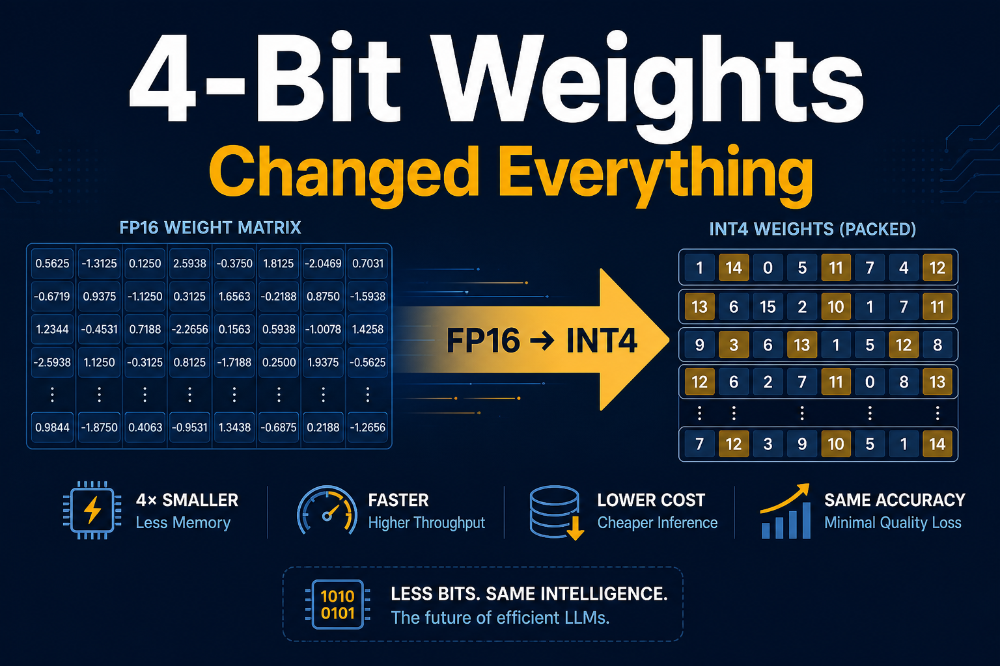

# 4-Bit Weights Changed Everything on My M3 Mac

*Part 2 of 7 — Local LLMs on Apple Silicon*

In Part 1 I loaded Llama 3.1 8B in FP16 on a 24 GB Mac M3 and watched the machine flinch: **16.33 GB** peak, **2.6+ seconds** to first token, and roughly **5–6 tokens/sec** of decode. The model worked. The laptop did not feel like a product anymore — it felt like a science fair demo that forgot to leave RAM for the operating system.

Weight quantization is the boring-looking fix that somehow fixes *everything at once*. Store each parameter in fewer bits — typically 8, 4, or 2 — and two things happen on Apple Silicon: **peak memory collapses**, and **decode throughput climbs**, because autoregressive generation is usually reading weights from DRAM every step. On my M3, the same Llama 8B jumps from **5.8 → 20.5 tok/s** at 4-bit while falling from **16.3 → 5.1 GB**. That is not a rounding error. That is the difference between “I’ll use the API” and “I’ll keep this local.”

This post is the long version: the affine math and the papers, why fewer bits make decode *faster*, deep tables for **all 14** M3-friendly presets, heatmaps and Pareto plots, M3 vs M5 Max cross-hardware ratios, family-by-family notes, and the recipes I actually use day to day.

---

## Why this matters

If you only change one inference setting on a MacBook, change **weight bit-width**.

| Pain | FP16 7–9B on 24 GB | After w4 |
|------|--------------------|----------|
| Fits with browser + IDE? | Barely / no | Comfortably |
| Decode feel | Handwriting pace | Readable stream |
| Room for KV cache / RAG | Starved | Recovered ~10 GB |
| Headroom for a draft model | Fantasy | Plausible (see Part 7) |

Cloud GPUs often have dedicated VRAM. Your Mac has **one pool**. Quantization is capacity planning with a side of free bandwidth. Everything later in this series — KV quant, prefill tuning, speculative decoding — assumes you already picked a sane weight precision.

---

## How it works — affine quantization, papers, and MLX practice

High-precision weights are floats. **Affine quantization** maps each weight \(w\) to an integer code \(q\) using a scale \(s\) and zero-point \(z\) (often per group or per channel):

\[
q = \mathrm{clip}\left(\mathrm{round}\left(\frac{w}{s} + z\right),\ 0,\ 2^{b}-1\right)
\]

\[
\hat{w} = s \cdot (q - z)
\]

Group-wise scales keep dynamic range honest when a tensor has outliers. At inference time, kernels dequantize on the fly (or operate in low precision end-to-end) so you never materialize a full FP16 copy of the model if you do not need to.

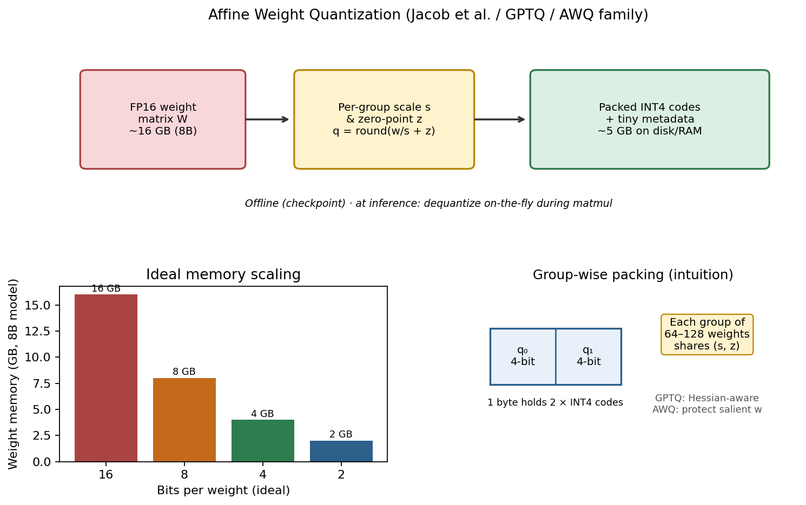

*Figure 1 — Workflow: FP16/BF16 matrix → group-wise \((s, z)\) → packed INT\(b\) codes → dequantized matmul (Jacob et al.; GPTQ / AWQ family practice).*

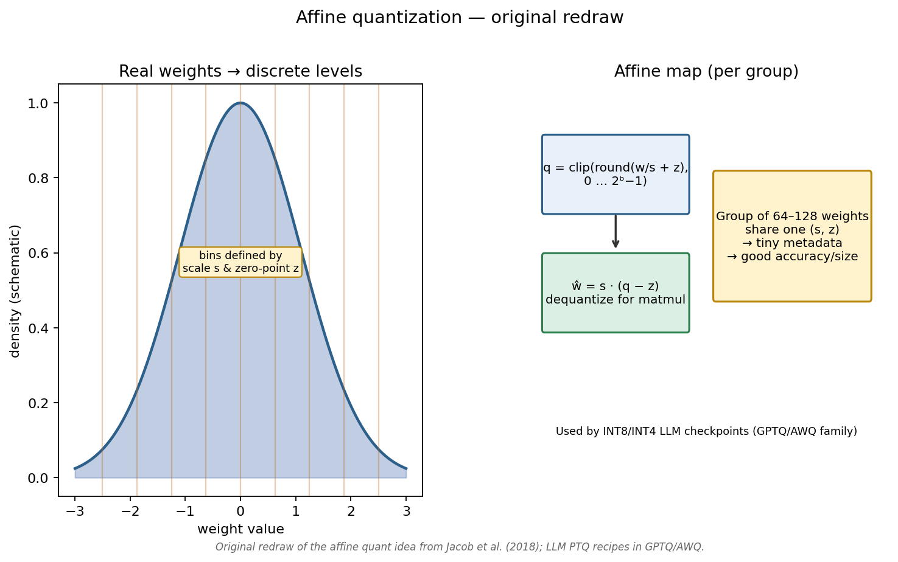

*Figure — **Original redraw** of affine quantization (Jacob et al., 2018): continuous weights → discrete levels via scale \(s\) and zero-point \(z\).*

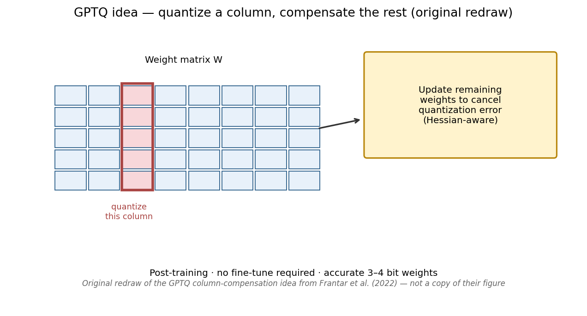

*Figure — **Original redraw** of the GPTQ idea (Frantar et al., 2022): quantize a column, compensate remaining weights (Hessian-aware). Not a copy of their paper figure.*

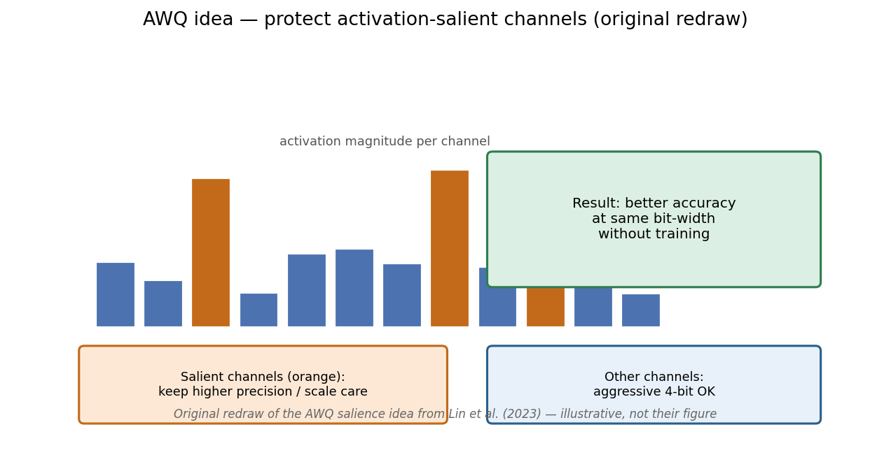

*Figure — **Original redraw** of the AWQ idea (Lin et al., 2023): protect activation-salient channels; quantize the rest more aggressively.*

### Paper map (what practitioners actually cite)

| Method | Paper | Core idea | Why Mac users care |
|--------|-------|-----------|--------------------|
| **Affine / integer inference** | Jacob et al., 2018 | Scale + zero-point integer arithmetic | The algebra above |
| **GPTQ** | Frantar et al., 2022 | Hessian-aware post-training column quant | High-quality 3–4-bit checkpoints |
| **AWQ** | Lin et al., 2023 | Protect “salient” weights via activation stats | Robust 4-bit without huge calibration pain |
| **LLM.int8()** | Dettmers et al., 2022 | Mixed precision for outlier channels | Explains why naive 8-bit can fail |
| **SmoothQuant** | Xiao et al., 2023 | Migrate activation difficulty into weights | W8A8-style thinking |

In this harness we load **pre-quantized mlx-community checkpoints** (`*4bit`, `*8bit`, occasional `*2bit`). We are measuring *serving* behavior, not re-deriving GPTQ on-device during the bench.

> **Fun fact:** GPTQ was motivated by **175B-class** models that could not fit on a single GPU at FP16. The same math now makes 8B models comfortable on a laptop — a hilarious inversion of the original constraint.

### Why fewer bits also make decode *faster*

Quantization is not only about fitting. During decode, each step often reads nearly **all weights** from DRAM. Roofline intuition: LLM decode is frequently **memory-bandwidth limited**, not FLOPS-limited. Fewer bytes per weight → more tokens per second on the same bus.


*Figure 2 — Workflow: Roofline sketch — when arithmetic intensity is low, bandwidth caps tok/s; shrinking weight bytes moves you rightward in effective throughput.*

Rough bandwidth model for decode:

\[
\mathrm{tok/s} \lesssim \frac{B_{\text{eff}}}{\text{bytes per weight read per token}}
\]

If an 8B model’s dominant read is \(\propto N \cdot (b/8)\), cutting \(b\) from 16 → 4 is a **4×** byte reduction before kernel overheads. Real speedups land around **3–3.5×** on M3 for Llama 8B — close enough that the model is predictive, not mystical.

---

## Deep benchmark results — Llama 3.1 8B on Mac M3

Weights-only sweep (`article_01`), prompt 512 / gen 128, medians of 3 trials after 1 warmup:

| Config | Peak memory | TTFT | Decode tok/s | vs fp16 |
|--------|-------------|------|--------------|---------|
| **fp16** | 16.33 GB | 2,637 ms | **5.8** | 1.0× |
| **w8** | 8.96 GB | 2,775 ms | 11.3 | **1.9×** |
| **w4** | 5.06 GB | 2,738 ms | **20.5** | **3.5×** |
| **w2** | 3.11 GB | 2,826 ms | **35.8** | **6.2×** |


*Figure 3 — Results: Llama 3.1 8B on Mac M3 — memory roughly halves each major bit-width step while decode throughput climbs.*

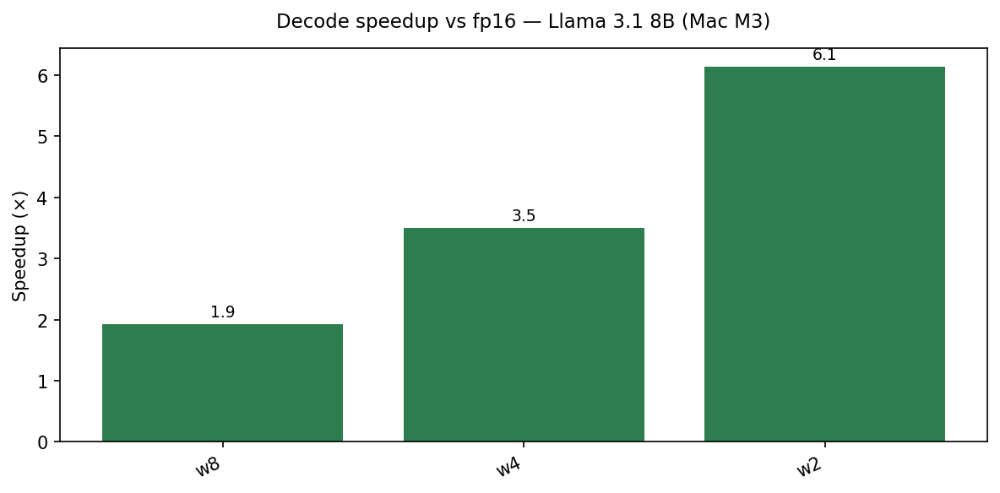

*Figure 4 — Results: explicit speedup factors for w8 / w4 / w2 versus FP16 on Llama 3.1 8B (M3).*

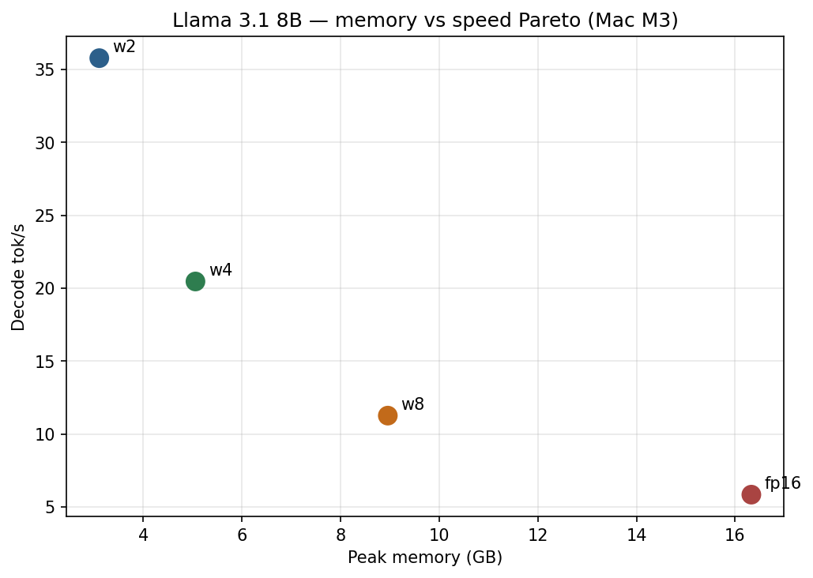

*Figure 5 — Results: memory–speed Pareto frontier. **w4** is the practical knee on 24 GB; w2 is faster still but quality risk rises.*

**Takeaway:** **w4** is the daily driver for 8B on 24 GB Macs — ~5 GB peak, ~3.5× decode, widely available checkpoints. **w2** is a speed toy / extreme fit tool (and only some presets have a 2-bit repo — Llama 8B does).

TTFT barely moves across bit-widths here (~2.6–2.8 s). That is expected: this article’s default prompt is fixed, and weight quant helps decode bandwidth more than it magically shrinks prefill latency. Prefill gets its own chapter in Part 4.

---

## All 14 models on Mac M3 — the full weights-only table

These are the M3-friendly presets from the Article 1 sweep (smallest → largest). Values are peak GB / decode tok/s. Cells marked **—** mean no 2-bit repo was configured (`status: skipped`).

### Decode throughput (tok/s)

| Model | fp16 | w8 | w4 | w2 | w4 / fp16 |
|-------|------|----|----|-----|-----------|
| Qwen2.5 0.5B | 70.1 | 133.1 | **215.2** | — | 3.07× |
| Llama 3.2 1B | 32.8 | 57.3 | **102.9** | — | 3.14× |
| Qwen2.5 1.5B | 24.9 | 47.1 | **89.3** | — | 3.59× |
| Gemma 2 2B | 30.0 | 30.3 | **54.4** | — | 1.81× |
| Llama 3.2 3B | 13.6 | 25.4 | **45.8** | — | 3.37× |
| Qwen2.5 3B | 14.3 | 26.4 | **48.4** | — | 3.38× |
| Phi-3 Mini | 21.4 | 21.1 | **37.1** | — | 1.73× |
| Phi-3.5 Mini | 11.5 | 21.3 | **37.0** | — | 3.22× |
| Qwen2.5 7B | 6.3 | 11.9 | **21.8** | — | 3.46× |
| Mistral 7B | 6.3 | 11.8 | **21.7** | — | 3.44× |
| DeepSeek-R1 Qwen 7B | 6.2 | 12.0 | **21.8** | — | 3.52× |
| Llama 3.1 8B | 5.8 | 11.3 | **20.5** | **35.8** | 3.53× |
| DeepSeek-R1 Llama 8B | 5.8 | 11.2 | **20.6** | — | 3.55× |
| Gemma 2 9B | 8.8 | 8.9 | **15.9** | — | 1.81× |

### Peak memory (GB)

| Model | fp16 | w8 | w4 | w2 |
|-------|------|----|----|-----|
| Qwen2.5 0.5B | 1.34 | 0.89 | **0.64** | — |
| Llama 3.2 1B | 2.71 | 1.75 | **1.24** | — |
| Qwen2.5 1.5B | 3.35 | 2.14 | **1.43** | — |
| Gemma 2 2B | 3.32 | 3.32 | **2.12** | — |
| Llama 3.2 3B | 6.73 | 3.86 | **2.34** | — |
| Qwen2.5 3B | 6.42 | 3.74 | **2.22** | — |
| Phi-3 Mini | 4.71 | 4.71 | **2.93** | — |
| Phi-3.5 Mini | 8.29 | 4.71 | **2.93** | — |
| Qwen2.5 7B | 15.49 | 8.52 | **4.72** | — |
| Mistral 7B | 14.77 | 8.13 | **4.62** | — |
| DeepSeek-R1 Qwen 7B | 15.49 | 8.52 | **4.72** | — |
| Llama 3.1 8B | 16.33 | 8.96 | **5.06** | **3.11** |
| DeepSeek-R1 Llama 8B | 16.33 | 8.96 | **5.06** | — |
| Gemma 2 9B | 10.51 | 10.51 | **5.88** | — |


*Figure 6 — Results: fp16 vs w8 vs w4 decode throughput across the multi-model sweep. Smaller models win absolute tok/s; nearly everyone gains from w4.*

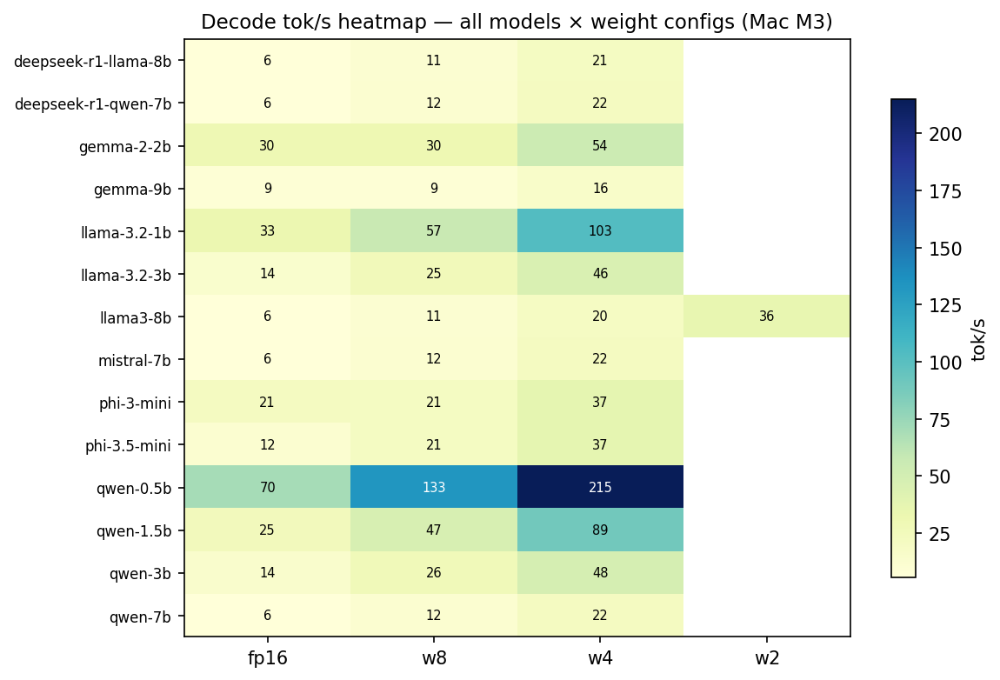

*Figure 7 — Results: decode tok/s heatmap — all models × weight configs (Mac M3). Brighter = faster.*


*Figure 8 — Results: peak memory heatmap — all models × weight configs (Mac M3). Darker low-memory cells cluster at w4/w2.*

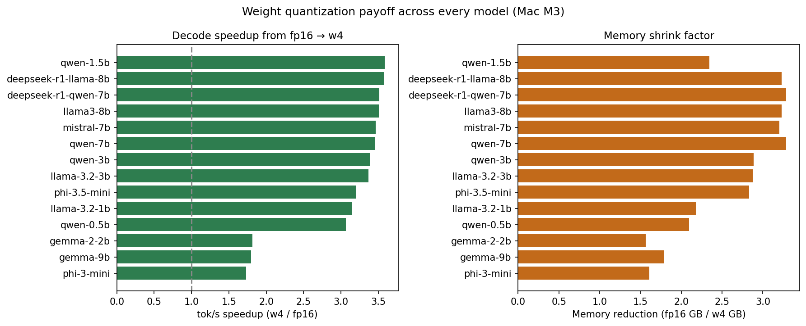

*Figure 9 — Results: w4 speedup versus fp16 across models. Most land near ~3–3.6×; Gemma/Phi packaging quirks show lower ratios when “fp16” was already an 8-bit checkpoint.*


*Figure 10 — Results: TTFT across models/configs. Bit-width is not the main TTFT story — model size and prefill dominate.*

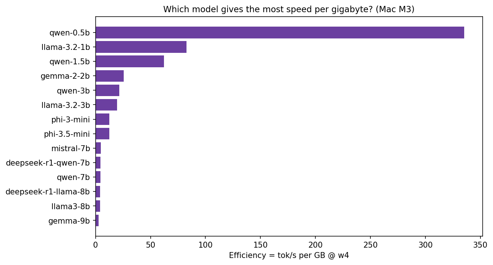

*Figure 11 — Results: efficiency view (tok/s per GB peak). Tiny Qwen/Llama models look absurdly good; 7–9B w4 is the practical efficiency band for quality.*

### Quick w4 leaderboard (Mac M3)

| Rank | Model | w4 tok/s | w4 GB |
|------|-------|----------|-------|
| 1 | Qwen2.5 0.5B | **215.2** | 0.64 |
| 2 | Llama 3.2 1B | 102.9 | 1.24 |
| 3 | Qwen2.5 1.5B | 89.3 | 1.43 |
| 4 | Gemma 2 2B | 54.4 | 2.12 |
| 5 | Qwen2.5 3B | 48.4 | 2.22 |
| 6 | Llama 3.2 3B | 45.8 | 2.34 |
| 7 | Phi-3 Mini | 37.1 | 2.93 |
| 8 | Phi-3.5 Mini | 37.0 | 2.93 |
| 9 | Qwen2.5 7B | 21.8 | 4.72 |
| 10 | DeepSeek-R1 Qwen 7B | 21.8 | 4.72 |
| 11 | Mistral 7B | 21.7 | 4.62 |
| 12 | DeepSeek-R1 Llama 8B | 20.6 | 5.06 |
| 13 | Llama 3.1 8B | 20.5 | 5.06 |
| 14 | Gemma 2 9B | 15.9 | 5.88 |

---

## Cross-hardware: Mac M3 vs Mac M5 Max

Same weights-only methodology on **Mac M5 Max**. Absolute speed jumps; memory footprints stay in the same ballpark (same checkpoints).

### Llama 3.1 8B — all bit-widths

| Config | M3 tok/s | M5 Max tok/s | M5 / M3 |
|--------|----------|--------------|---------|
| fp16 | 5.8 | **35.0** | **6.0×** |
| w8 | 11.3 | **63.3** | 5.6× |
| w4 | 20.5 | **112.1** | **5.5×** |
| w2 | 35.8 | **176.3** | 4.9× |

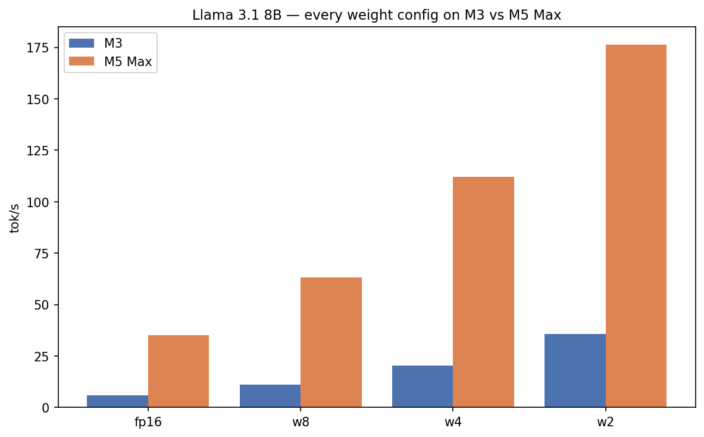

*Figure 12 — Results: Llama 3.1 8B decode across fp16/w8/w4/w2 on M3 vs M5 Max. The shape of the curve is similar; the y-axis just got taller.*

### Selected w4 comparisons

| Model | M3 w4 tok/s | M5 Max w4 tok/s | M5 / M3 |
|-------|-------------|-----------------|---------|
| Qwen2.5 0.5B | 215.2 | **581.5** | 2.7× |
| Mistral 7B | 21.7 | **115.3** | 5.3× |
| Qwen2.5 7B | 21.8 | **121.4** | 5.6× |
| Llama 3.1 8B | 20.5 | **112.1** | 5.5× |

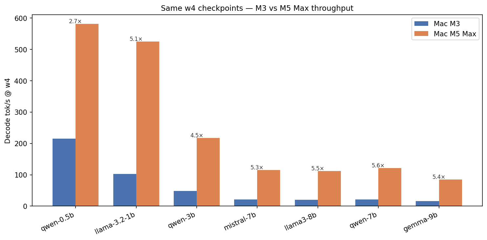

*Figure 13 — Results: w4 decode throughput on M3 vs M5 Max for representative presets. Mid-size models see ~5–5.6×; the tiniest models show smaller ratios (already less bandwidth-starved on M3).*

**Interpretation:**

- **Memory** problems on 24 GB do not disappear on Max silicon if you keep loading FP16 8B+ and a pile of apps — capacity is still bytes.  
- **Speed** problems often *do* disappear: 112 tok/s at w4 on Llama 8B is “product UI” territory.  
- **Quantization still wins on Max** — 35 → 112 tok/s (fp16 → w4) on Llama 8B is another **3.2×** on top of the generational leap.

M5 Max also unlocks larger presets in the same article folder (12B–70B-class) that the 24 GB M3 cannot comfortably sweep. Those belong more to the size-ladder post; the point here is that **w4 remains the default**, not a consolation prize.

---

## Family-by-family analysis

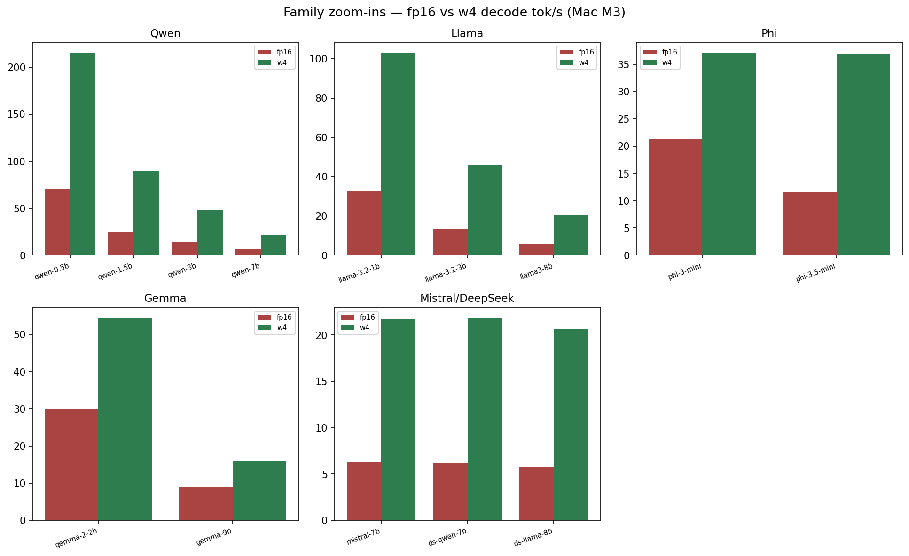

*Figure 14 — Results: family panels — Qwen / Llama / Mistral / Phi / Gemma / DeepSeek distill behavior under weight quantization on M3.*

### Qwen2.5 (0.5B → 7B)

The speed demons. Qwen 0.5B @ w4 hits **215 tok/s** on M3 and **581 tok/s** on M5 Max. Scaling up to 7B lands ~**22 tok/s** (M3) / **121 tok/s** (M5) at w4 — almost interchangeable with Mistral 7B for throughput. If you need a speculative **draft** model later, this family is why Qwen 0.5B keeps showing up.

### Llama (3.2 1B/3B + 3.1 8B)

The reference ladder. 1B and 3B show clean ~3.1–3.4× w4 speedups. 8B is the emotional center of the series: **5.8 → 20.5 → 35.8** tok/s across fp16/w4/w2 on M3, and **35 → 112 → 176** on M5 Max. If a blog only shows one chart, it should be this family.

### Mistral 7B

Tracks Qwen 7B almost suspiciously well: **21.7** (M3 w4) vs **21.8**, and **115.3** vs **121.4** on M5 Max. Excellent “second opinion” instruct model when you want architecture diversity without changing your memory budget.

### Phi-3 / Phi-3.5 Mini

Phi-3 Mini’s fp16 and w8 rows look alike (~21 tok/s, ~4.7 GB) because the mlx-community “fp16” preset for that model is already an **8-bit** packaged repo in our config map — a packaging footnote, not a physics violation. At true 4-bit both Phi-3 and Phi-3.5 land ~**37 tok/s** under **3 GB** on M3. Fantastic local assistants for 16–24 GB machines.

### Gemma 2 (2B / 9B)

Lower w4/fp16 speedup ratios (~1.8×) for a similar reason: several Gemma presets reuse 8-bit repos for the “fp16” slot in `models` wiring. Still, Gemma 9B @ w4 is a usable ~**16 tok/s** / **5.9 GB** option on M3 — slower than Llama 8B w4, hungrier than Phi.

### DeepSeek-R1 distills (Qwen-7B / Llama-8B)

Throughput clones of their base sizes (as expected — same parameter footprints). On M3, R1-Qwen-7B w4 ≈ **21.8 tok/s**; R1-Llama-8B w4 ≈ **20.6**. Use these when you care about reasoning-style behavior; do not expect free tok/s from the distill label alone.

---

## Practical recipes / decision guides

### Bit-width chooser

| Goal | Pick | Notes |
|------|------|-------|
| Daily driver 7–9B on 24 GB | **w4** | Best Pareto knee |
| Quality A/B on ≥32–64 GB | fp16 or w8 | Keep w4 for speed passes |
| Extreme fit / max stream | w2 (if repo exists) | Watch quality on hard prompts |
| Draft model for speculative | 0.5B–1B @ w4 | See Part 7 |

### RAM → model guide (weights-only intuition)

| Unified memory | Start here | Avoid as daily driver |
|----------------|------------|------------------------|
| **16 GB** | ≤3–7B @ **w4** | FP16 8B |
| **24 GB** (this M3) | 7–8B @ **w4** | FP16 8B chat |
| **32 GB** | 8B fp16 for checks; 13B-class @ w4 | Ignoring KV growth |
| **64 GB+ / Max** | 30B–70B @ w4/w8 experiments | Assuming fp16 70B is “fine” multitasking |

### Operator checklist

1. Confirm the mlx-community repo bit-width matches the label you think you loaded.  
2. Measure **memory**, **TTFT**, and **tok/s** — not just one.  
3. Prefer medians of ≥3 trials after warmup.  
4. Only then stack KV quant / prefill / speculative decoding.

```bash
./scripts/run_article.sh 1 "Mac M3"
./scripts/run_article.sh 1 "Mac M5 Max"   # if you have Max silicon + disk

python scripts/plot_medium_charts.py --hardware "Mac M3"
python scripts/plot_medium_deep.py --hardware "Mac M3"
python scripts/plot_medium_diagrams.py
```

---

## Fun facts

1. **w4 can be both smaller and faster.** On bandwidth-bound decode, bytes are time. Llama 8B on M3: 16.3 GB @ 5.8 tok/s → 5.1 GB @ 20.5 tok/s.  
2. **Only Llama 8B had a configured 2-bit repo in this sweep** among the 14 M3 presets — which is why the w2 column is mostly dashes, not failures.  
3. **Phi-3 Mini @ w4** delivers ~**37 tok/s** under **3 GB** — Microsoft’s “textbook quality” training pitch showing up as systems headroom.  
4. **M5 Max Llama 8B @ w2 hits 176 tok/s** in this harness — faster than many people expect from “a laptop,” and still the same model family as the 5.8 tok/s M3 FP16 crawl.  
5. **Qwen 0.5B @ w4 on M5 Max (581 tok/s)** is so fast that UI overhead and tokenizer time start to matter more than matmuls — a nice problem to have.

---

## Limitations / what we didn’t measure

- **Generation quality** (MMLU, HumanEval, blind side-by-sides) — not in these JSONs. Treat w2 as “measure twice.”  
- **Activation quantization / W8A8** — weights-only story here.  
- **Calibration variance** across GPTQ/AWQ recipes — we consume published mlx-community artifacts.  
- **Thermal sustained multi-hour decode** — desk, plugged-in runs.  
- **Gemma/Phi “fp16” packaging quirks** — some presets already point at 8-bit repos; ratios look muted until you notice the wiring.  
- **>9B on M3** — deferred to the size-ladder / Max-memory articles.  
- **End-to-end chat apps** — harness measures `generate`, not Electron.

---

## How to reproduce

```bash
# Full Article 1 sweep (14 models × fp16/w8/w4/w2 where repos exist)
./scripts/run_article.sh 1 "Mac M3"

# Single-model sanity check
python scripts/run_benchmark.py \
  --preset llama3-8b \
  --config w4 \
  --hardware "Mac M3"

# Validate + report
python scripts/validate_results.py --hardware "Mac M3"
python scripts/report.py --hardware "Mac M3"
```

Primary artifacts:

- `results/Mac_M3/article_01_weight-quantization/<preset>/{fp16,w8,w4,w2}.json`  
- `results/Mac_M5_Max/article_01_weight-quantization/...`  
- Figures under `docs/medium/images/01_*.png` and `docs/medium/images/_source/workflows/01_*.png`

---

## References

1. Jacob et al., *Quantization and Training of Neural Networks for Efficient Integer-Arithmetic-Only Inference* (2018) — [arXiv:1712.05877](https://arxiv.org/abs/1712.05877)  
2. Frantar et al., *GPTQ: Accurate Post-Training Quantization for Generative Pre-trained Transformers* (2022) — [arXiv:2210.17323](https://arxiv.org/abs/2210.17323)  
3. Lin et al., *AWQ: Activation-aware Weight Quantization for LLM Compression and Acceleration* (2023) — [arXiv:2306.00978](https://arxiv.org/abs/2306.00978)  
4. Dettmers et al., *LLM.int8(): 8-bit Matrix Multiplication for Transformers at Scale* (2022) — [arXiv:2208.07339](https://arxiv.org/abs/2208.07339)  
5. Xiao et al., *SmoothQuant: Accurate and Efficient Post-Training Quantization for Large Language Models* (2023) — [arXiv:2211.10438](https://arxiv.org/abs/2211.10438)  
6. Williams et al., *Roofline: An Insightful Visual Performance Model* (2009) — [CACM PDF](https://people.csail.mit.edu/stajich/publications/cacm09.pdf)  
7. Dubey et al., *The Llama 3 Herd of Models* (2024) — [arXiv:2407.21783](https://arxiv.org/abs/2407.21783)  
8. Jiang et al., *Mistral 7B* (2023) — [arXiv:2310.06825](https://arxiv.org/abs/2310.06825)  
9. Qwen Team, *Qwen2.5 Technical Report* (2024) — [arXiv:2412.15115](https://arxiv.org/abs/2412.15115)  
10. Abdin et al., *Phi-3 Technical Report* (2024) — [arXiv:2404.14219](https://arxiv.org/abs/2404.14219)  
11. mlx-community — [huggingface.co/mlx-community](https://huggingface.co/mlx-community)  
12. Apple MLX / mlx-lm — [github.com/ml-explore/mlx](https://github.com/ml-explore/mlx), [github.com/ml-explore/mlx-lm](https://github.com/ml-explore/mlx-lm)  
13. LLM-Inference — [github.com/Chirumamilla1522/LLM-Inference](https://github.com/Chirumamilla1522/LLM-Inference)  

---

## Series nav

**← Previous:** [Part 1: Running 8B LLMs on a MacBook](00-introduction.md)  
**Next →:** [Part 3: KV Cache Quantization](02-kv-cache-quantization.md)

*Local LLMs on Apple Silicon — Part 2 of 7*

**Tags:** `Quantization` `LLM` `Apple Silicon` `MLX` `GPTQ` `AWQ` `Performance`
