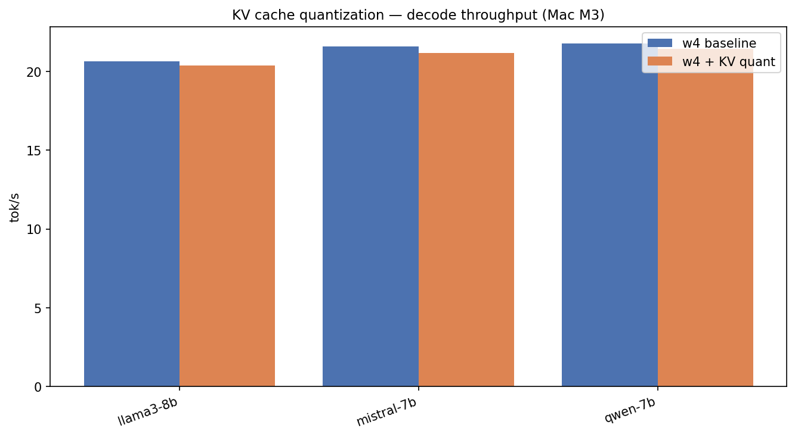

# The Hidden Memory Hog: KV Cache Quantization

*Part 3 of 7 — Local LLMs on Apple Silicon*

Weight quantization gets the spotlight. But once generation starts, something else grows: the **KV cache** — stored key and value tensors for every token in your context.

For a long chat or RAG pipeline, the KV cache can rival weight memory. **KV cache quantization** stores those tensors in fewer bits during decode.

---

## What is the KV cache?

During autoregressive generation, each new token attends to all previous tokens. The model caches **Key** and **Value** projections so it does not recompute them.

Memory scales linearly with sequence length \(T\):

\[
M_{\text{KV}} \approx 2 \cdot L \cdot H_{\text{kv}} \cdot T \cdot D \cdot \frac{b_{\text{kv}}}{8}
\]

Where \(L\) = layers, \(H_{\text{kv}}\) = KV heads (reduced by GQA), \(D\) = head dim, \(b_{\text{kv}}\) = bits per KV entry.

> **Fun fact:** Llama 3 uses **Grouped Query Attention (GQA)** — fewer KV heads than query heads — specifically to shrink the KV cache. Ainslie et al. (2023) showed you can merge multi-head checkpoints into GQA with minimal quality loss.

At 512 prompt + 128 generated tokens on Llama 8B, fp16 KV is ~100 MB — modest. At **8K context**, it is gigabytes.

---

## Benchmark: w4 vs w4 + KV quant (Mac M3)

We compared baseline w4 against `w4+kv_cache` (4-bit KV) on three 7–8B models:

| Model | w4 tok/s | w4 + KV tok/s | Memory change |
|-------|----------|---------------|---------------|
| Llama 3.1 8B | 20.7 | 20.4 | ~same (short ctx) |
| Mistral 7B | 21.6 | 21.2 | ~same |
| Qwen 7B | 21.8 | 21.4 | ~same |



*Figure 1: At 512+128 tokens, throughput is nearly identical — KV quant pays off at longer context.*

**Why no speed win here?** Our default benchmark uses a **512-token prompt and 128-token generation**. KV cache is still small relative to weights. The win appears when:

- Context length exceeds ~2K tokens  
- You run multiple concurrent sessions  
- You are memory-constrained (16 GB Mac)

We also ran a **512-token generation** variant (`llama3-8b_w4_kv_long_g`): throughput dipped slightly (19.8 vs 20.7 tok/s) — the extra KV pressure shows up in longer outputs.

---

## When KV quant matters most

| Scenario | Weight quant | KV quant |
|----------|--------------|----------|
| Short chat (512 ctx) | **High impact** | Low impact |
| RAG with 4K+ docs | Medium | **High impact** |
| Multi-user local server | Medium | **High impact** |
| Code completion (long file) | Medium | **High impact** |

Think of weight quant as “can I load the model?” and KV quant as “can I keep a long conversation?”

---

## Connection to production systems

PagedAttention (Kwon et al., 2023) — the memory manager behind vLLM — solves a related problem at serving scale: **fragmentation** of KV blocks across requests. Our local MLX benchmark uses a simpler in-process cache, but the math is the same: **KV is the scaling bottleneck for context**, not FLOPS.

> **Fun fact:** Pope et al. (2022) at Google estimated that for long sequences, **KV cache memory exceeds weight memory** — the crossover point depends on model size and context length, but it often hits between 2K and 8K tokens for 7B models.

---

## Practical advice

1. **Always quantize weights first** (w4) — biggest bang for buck  
2. **Enable KV quant** if you use >2K context or run RAG  
3. **Combine with GQA-aware models** (Llama 3, Mistral, Qwen 2.5) for smaller baseline cache  

```bash
./scripts/run_article.sh 2 "Mac M3"
python scripts/run_benchmark.py --preset llama3-8b --config w4+kv_cache --hardware "Mac M3"
```

---

## References

1. Ainslie et al., *GQA: Training Generalized Multi-Query Transformer Models* (2023) — [arXiv:2305.13245](https://arxiv.org/abs/2305.13245)  
2. Kwon et al., *PagedAttention* (2023) — [arXiv:2309.06180](https://arxiv.org/abs/2309.06180)  
3. Pope et al., *Efficiently Scaling Transformer Inference* (2022) — [arXiv:2211.05102](https://arxiv.org/abs/2211.05102)  
4. Vaswani et al., *Attention Is All You Need* (2017) — [arXiv:1706.03762](https://arxiv.org/abs/1706.03762)  

---

**← Previous:** [Part 2: Weight Quantization](01-weight-quantization.md)  
**Next →** [Part 4: Prefill & TTFT](03-prefill-and-ttft.md)

**Tags:** `LLM` `KV Cache` `Memory` `Apple Silicon` `Inference` `Transformers`
