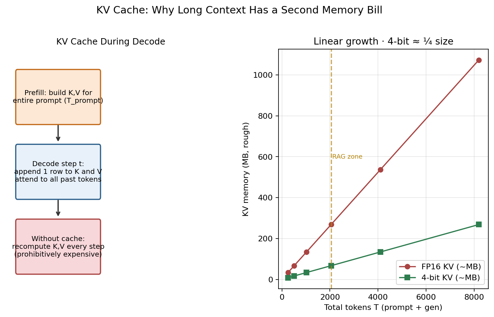
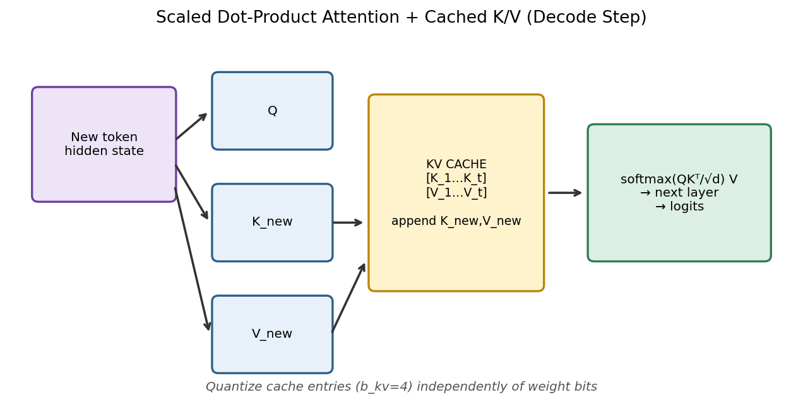
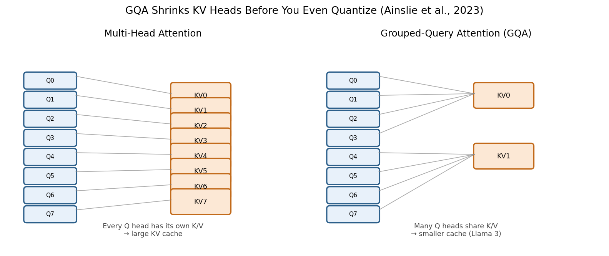
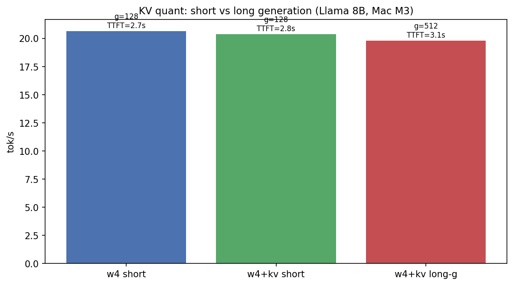
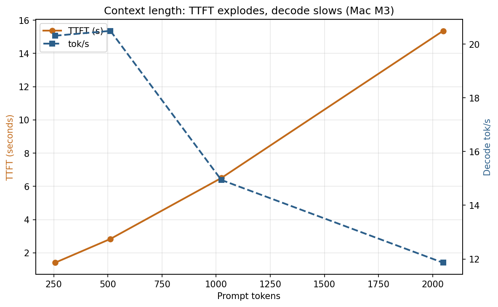
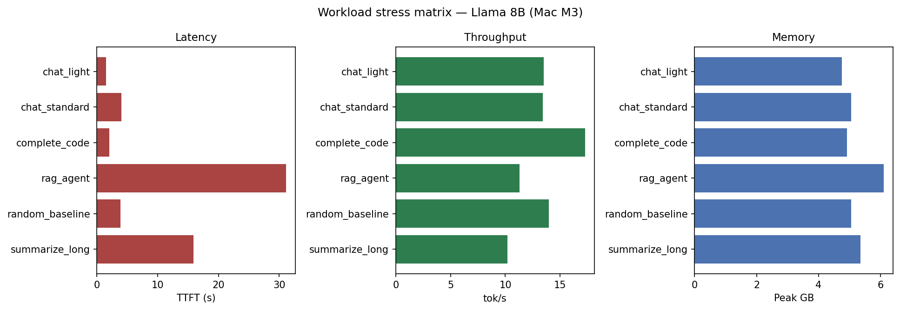

# The Hidden Memory Hog: KV Cache Quantization

*Part 3 of 7 — Local LLMs on Apple Silicon*

Weight quantization gets the spotlight — and for good reason. On a 24 GB Mac, moving Llama 3.1 8B from FP16 to 4-bit is the difference between “barely fits” and “comfortable daily driver.” But once generation starts, something else grows in the background: the **KV cache**.

Every new token must attend to every previous token. Transformers do not recompute keys and values from scratch for the full history at each step. They **cache** them. That cache is a second memory budget that scales with context length \(T\), number of layers, and number of KV heads. For long chat, RAG, or multi-turn coding sessions, KV memory can rival — or exceed — weight memory.

**KV cache quantization** stores those tensors in fewer bits (we use 4-bit) during decode. This article explains the math, the GQA connection, why short-context benches look disappointing, and when the knob actually matters on Mac M3 and Mac M5 Max.

---

## Hook: the optimization that “does nothing” — until it does

Open Activity Monitor during a long local chat and watch two lines: the Python/MLX process size, and compressed memory. Weights are mostly fixed after load. The creep — especially with RAG or multi-turn agents — is cache.

If you only ever measure **512 prompt tokens + 128 generated tokens**, KV cache quantization looks like a dud. On Mac M3 at w4:

| Model | w4 tok/s | w4 + KV tok/s | Δ |
|-------|----------|---------------|---|
| Llama 3.1 8B | **20.7** | **20.4** | −1.5% |
| Mistral 7B | **21.6** | **21.2** | −1.9% |
| Qwen 2.5 7B | **21.8** | **21.4** | −1.8% |

Throughput barely moves. Peak memory (as reported by the harness at this short \(T\)) looks identical. So why does every serious serving stack obsess over KV?

Because our default bench is **weight-dominated**. At \(T \approx 640\) total tokens, the cache is still a few hundred megabytes for an 8B GQA model. Weights at w4 are ~5 GB. Cutting KV by 4× is cutting a small term. Stretch \(T\) to 4K, 8K, or keep many concurrent sessions alive, and the small term becomes the wall.

That is the theme of this article: **KV quantization is a long-context / multi-session memory tool, not a short-chat speedup.**

---

## How the cache works

During autoregressive generation, each new token produces a query \(Q_t\) and must compute attention against keys and values for tokens \(1\ldots t\). Recomputing \(K\) and \(V\) for the entire prefix every step would repeat almost the same matmuls. So each layer stores:

\[
K_{1:t},\quad V_{1:t}
\]

and only appends the newest row each decode step.



*Figure 1 — Workflow: after prefill, each decode step appends one K/V row per layer; cache size grows linearly with sequence length \(T\). Quantizing KV from 16-bit to 4-bit shrinks that footprint by roughly 4×.*

### The memory formula

A practical estimate for KV bytes (one sequence, one model):

\[
M_{\text{KV}} = 2 \cdot L \cdot H_{\text{kv}} \cdot T \cdot D \cdot \frac{b_{\text{kv}}}{8}
\]

| Symbol | Meaning | Llama 3.1 8B typical |
|--------|---------|----------------------|
| \(2\) | Keys + values | — |
| \(L\) | Layers | 32 |
| \(H_{\text{kv}}\) | KV heads (not query heads) | **8** with GQA |
| \(T\) | Prompt + generated tokens | 512–8192+ |
| \(D\) | Head dimension | 128 |
| \(b_{\text{kv}}\) | Bits per element | 16 (default) or 4 (quantized) |

Worked example — Llama 3.1 8B, FP16 KV, \(T=4096\):

\[
M_{\text{KV}} = 2 \cdot 32 \cdot 8 \cdot 4096 \cdot 128 \cdot 2
\approx 536\ \text{MB}
\]

Same at 4-bit KV:

\[
M_{\text{KV}}^{(4)} \approx 134\ \text{MB}
\]

At \(T=32{,}768\) (a realistic long RAG / agent trace), FP16 KV is on the order of **~4.3 GB** — comparable to the entire w4 weight footprint of the model. That is when KV quantization stops being theoretical.

> **Fun fact #1:** Pope et al. (2022) observed that for long sequences, **KV memory can exceed weight memory**. For 7B-class models that crossover often lands somewhere between roughly 2K and 8K tokens depending on head layout — exactly the regime local RAG apps wander into when users paste documents.

---

## Attention with a cache (one decode step)

Understanding *when* KV bits matter requires seeing one decode step clearly.



*Figure 2 — Workflow: new token → project Q/K/V → append K/V to cache → softmax attention over the full history → output projection. Prefill builds the initial cache; decode only extends it.*

Important consequences:

1. **Prefill** builds \(K,V\) for the whole prompt in one (or chunked) forward pass. TTFT is dominated here — covered in [Part 4](03-prefill-and-ttft.md).
2. **Decode** is usually **weight-bandwidth bound** on Apple Silicon: you stream nearly all weights each token. The cache add is comparatively cheap *until* \(T\) is large enough that attention IO and KV traffic compete.
3. Quantizing KV reduces **bytes moved for attention history**, and more importantly reduces **resident memory**, which on unified-memory Macs is the hard ceiling shared with the OS, browser, and IDE.

---

## GQA: shrink heads before you quantize

Before you touch bit-width, architecture already decided how fat the cache is.

Classic **Multi-Head Attention (MHA)** uses one KV head per query head. Llama 3, Mistral, and Qwen 2.5 use **Grouped Query Attention (GQA)** (Ainslie et al., 2023): many query heads share a smaller set of KV heads. That directly shrinks \(H_{\text{kv}}\) in the formula above.



*Figure 3 — Workflow: MHA keeps a 1:1 Q/KV head ratio; GQA maps many Q heads onto fewer KV heads, cutting cache size before quantization.*

Rough intuition for Llama-style 32 query heads → 8 KV heads: **~4× smaller KV** than full MHA at the same \(T\) and \(D\), *before* 4-bit KV. Stack GQA + 4-bit KV and you are looking at roughly an order-of-magnitude reduction vs naive FP16 MHA caches of older 7B models.

> **Fun fact #2:** GQA was motivated as a deployability feature as much as a quality feature. Training a model that is “almost as good as MHA” but ships with a thinner cache is how labs made long-context serving affordable — the same pressure local Mac users feel when Chrome and an 8B model share 24 GB.

---

### Decode-step bandwidth vs cache bandwidth (order-of-magnitude)

At batch 1, each decode step for an 8B w4 model streams on the order of **gigabytes of weights**. Attention over a few hundred cached tokens moves far fewer bytes. That ratio is why Figure 4 is boring and Figure 1’s formula is not: **speed** cares about the heavy term; **fit** eventually cares about the growing term.

When does attention IO start to compete? Roughly when KV bytes approach a non-trivial fraction of weight bytes *and* \(T\) forces large softmax traffic every step. Laptop batch-1 chat hits the memory wall first (swap); multi-user servers hit both.

> **Fun fact #4:** The original transformer paper (Vaswani et al., 2017) already flagged self-attention’s \(O(T^2)\) cost. KV caching does not remove that asymptotic for *prefill*; it only stops decode from replaying history matmuls. Quantizing the cache is a *bytes* optimization riding on top of that algorithmic cache.

---

## Results: w4 vs w4+KV on Mac M3 (short context)

Harness: MLX / mlx-lm, mlx-community 4-bit Instruct checkpoints, **1 warmup + 3 measured trials**, medians reported. Default shape: **prompt = 512, generation = 128**.

### Throughput (the “almost nothing” table)

| Model | Peak GB | w4 tok/s | w4+KV tok/s | w4 TTFT | w4+KV TTFT |
|-------|---------|----------|-------------|---------|------------|
| Llama 3.1 8B | 5.06 | **20.7** | **20.4** | 2,670 ms | 2,773 ms |
| Mistral 7B | 4.62 | **21.6** | **21.2** | 2,693 ms | 2,807 ms |
| Qwen 2.5 7B | 4.72 | **21.8** | **21.4** | 2,560 ms | 2,632 ms |


*Figure 4 — Results (Mac M3): short-context decode throughput for w4 vs w4+KV across three 7–8B models. Bars are nearly identical — the win is not in tok/s at \(T\approx 640\).*

### Why short context shows little speedup

At this working set:

- **Weights dominate IO.** Each decode step still reads ~5 GB of packed 4-bit weights. Saving tens/hundreds of MB on KV does not move the roofline needle.
- **Attention over 640 tokens is cheap** relative to the MLP/attention projections against full weights.
- **Peak memory reporters** often still show ~weight size because the cache has not grown into the noise floor of allocator / Metal residency accounting.

So if your product is “short chat with 8B w4,” enable KV quant for **future-proofing**, not for a 20→30 tok/s miracle.

### Long generation run (same prompt, 512 gen tokens)

We also ran Llama 3.1 8B **w4+KV** with **512 prompt + 512 generation** on M3:

| Run | Prompt | Gen | Peak GB | TTFT | tok/s |
|-----|--------|-----|---------|------|-------|
| w4 short | 512 | 128 | 5.06 | 2,670 ms | 20.7 |
| w4+KV short | 512 | 128 | 5.06 | 2,773 ms | 20.4 |
| w4+KV long-g | 512 | **512** | 5.06 | 3,054 ms | **~19.8** |



*Figure — Results: short vs long generation with KV quant on Llama 8B (Mac M3).*

### Foreshadowing: where KV pressure actually shows up

Short-context Article 2 benches barely move tok/s. The pain shows up when prompts grow — exactly what Article 7 measures.



*Figure — Results: as prompt length grows, TTFT explodes and decode tok/s decays (Mac M3). That is KV + attention pressure in the wild.*



*Figure — Results: workload stress matrix — `rag_agent` is the memory/latency villain; light chat is not.*


*Figure — Results: same context sweep on M3 vs M5 Max. Bigger silicon shrinks TTFT but does not erase the shape of the curve.*

Decode remains in the same band (~20 tok/s). The cache is larger, attention is a bit heavier, but you are still weight-bound. The formula says the **memory** story accelerates later; the **throughput** story at laptop batch-size 1 is subtle until context is much longer or concurrency appears.

---

## Mac M5 Max: same recipe, different ceiling

On Mac M5 Max, short-context 8B w4 is an order of magnitude faster — and KV still does not magically double tok/s:

| Model | w4 tok/s | w4+KV tok/s | Notes |
|-------|----------|-------------|-------|
| Llama 3.1 8B | 104.2 | **106.7** | Within noise / slight win |
| Mistral 7B | 117.8 | 113.0 | Slight regression |
| Qwen 2.5 7B | 122.4 | 114.7 | Slight regression |

Long-g Llama w4+KV on M5 Max: **~106.3 tok/s** at 512 gen — still weight-bound, just with a much higher bandwidth floor.

**Takeaway across chips:** KV quant is **not** the primary tok/s lever on Apple Silicon for short interactive turns. Weight bits ([Part 2](01-weight-quantization.md)) and model size ([Part 5](04-model-size-ladder.md)) dominate speed. KV bits dominate **whether long context still fits without swap**.

---

## When KV quantization *does* matter (decision matrix)

| Scenario | Weight quant leverage | KV quant leverage | Why |
|----------|----------------------|-------------------|-----|
| Short chat (≤512–1K) | **High** | Low | Weights ≫ KV |
| Long chat / agent traces (4K–32K) | Medium | **High** | KV linear in \(T\) |
| RAG with stuffed chunks | Medium | **High** | Prefill hurts TTFT; KV hurts RAM |
| Multi-user local server | Medium | **High** | Many caches concurrently |
| Long code files in context | Medium | **High** | Persistent large \(T\) |
| Tiny models (0.5B–1B) | Medium | Lower | Absolute KV smaller; still useful at huge \(T\) |

Production GPU servers go further with **PagedAttention** (Kwon et al., 2023 / vLLM): they treat KV like virtual memory pages to reduce fragmentation across requests. Local MLX uses a simpler in-process cache — **same bytes math**, different scheduler. Quantizing KV is orthogonal and complementary: fewer bytes per page (or per tensor) whether or not you page.

> **Fun fact #3:** vLLM’s breakthrough was not “faster matmuls.” It was admitting that **KV fragmentation** wasted more VRAM than people thought. On a Mac you feel the cousin problem as unified-memory pressure: Activity Monitor yellow → swap → tok/s collapse. KV quant is one of the cheapest ways to push that cliff farther out.

---

## Quality, numerics, and what we are *not* claiming

4-bit KV is a lossy store of activations in the attention path. In practice, for chat-style decoding with modern GQA models, quality impact is usually small compared to aggressive **weight** quantization (especially w2). Still:

- Prefer evaluating on **your** prompts if you do math-heavy or brittle structured output.
- Do not confuse “median tok/s unchanged” with “free lunch forever” — at extreme lengths, attention numerics and eviction policies matter more.
- Our harness reports generation throughput and memory; it is not a full MMLU / human-eval suite per KV setting.

Research prototypes go further than our on/off 4-bit switch: **KVQuant**, **KIVI**, and related work explore asymmetric bit-widths (e.g., fewer bits on values than keys), outlier isolation, and per-channel scales tuned specifically for cache tensors. The laptop takeaway is simpler: once weights are w4, **turning on KV quant is the next cheap memory win** when \(T\) grows — you do not need a new training run.

---

## Worked memory budgets (copy these into a spreadsheet)

Assume Llama-like GQA: \(L=32\), \(H_{\text{kv}}=8\), \(D=128\).

| Context \(T\) | FP16 KV | 4-bit KV | vs ~5 GB w4 weights |
|---------------|---------|----------|---------------------|
| 512 | ~67 MB | ~17 MB | Negligible |
| 2,048 | ~268 MB | ~67 MB | Still small |
| 8,192 | ~1.07 GB | ~268 MB | Starts to matter |
| 32,768 | ~4.29 GB | ~1.07 GB | **FP16 KV ≈ weights** |
| 32,768 × 4 sessions | ~17 GB | ~4.3 GB | **Multi-session cliff** |

This table is why Article 2’s short-context throughput plot and the memory formula must be told together. Engineers who only read tok/s bars will disable KV quant “because it does nothing.” Engineers who read the table will enable it before the first overnight RAG soak test.

On unified memory, the failure mode is soft: macOS starts compressing and swapping, decode tok/s quietly collapses, fans spin, and the model looks “randomly slow.” That debugging story is much harder than reading \(M_{\text{KV}}\) once.

---

## Interaction with prefill and speculative decoding

KV quantization does not replace prefill optimization. Prefill still builds the cache; TTFT still tracks prompt length ([Part 4](03-prefill-and-ttft.md)). What KV quant changes is **whether that cache remains affordable after prefill succeeds**.

Similarly, speculative decoding ([Part 7](06-speculative-decoding.md)) loads a **second** model. Peak memory becomes roughly `target + draft + KV(target) (+ KV(draft) depending on implementation)`. On a 24 GB machine already holding an 8B w4 target, the draft is cheap — until long context makes KV the surprise third tenant. Enable KV quant *before* you celebrate a 1.8× speculative speedup that only works on 512-token toys.

---

## Practical recipes (Apple Silicon / MLX)

**Recipe A — Daily driver laptop (24 GB)**  
1. Always start with **w4 weights**.  
2. Leave **KV quant on** if you use RAG, long pastes, or multi-hour chats.  
3. Prefer **GQA** models (Llama 3, Mistral, Qwen 2.5).  

**Recipe B — “I only chat in short turns”**  
Weight quant still mandatory. KV quant optional for speed; still nice for memory headroom when the browser eats 8 GB.

**Recipe C — Local multi-session server**  
KV quant + smaller context caps per session + (later) prefix caching ([bonus context article](07-context-and-cache.md)). Memory scales with **sessions × \(T\)**, not with hope.

**Recipe D — Debugging “why is my Mac swapping?”**  
Check: (1) fp16 weights still loaded? (2) context actually 8K+? (3) multiple model processes? Fix in that order — KV bits help most after weights are already w4.

```bash
# Reproduce Article 2 on your machine
./scripts/run_article.sh 2 "Mac M3"

# Focused Llama comparison
python scripts/run_benchmark.py --preset llama3-8b --config w4 \
  --hardware "Mac M3" -p 512 -g 128
python scripts/run_benchmark.py --preset llama3-8b --config w4+kv_cache \
  --hardware "Mac M3" -p 512 -g 128

# Long generation stress
python scripts/run_benchmark.py --preset llama3-8b --config w4+kv_cache \
  --hardware "Mac M3" -p 512 -g 512
```

Plots used in this article:

```bash
python scripts/plot_medium_charts.py --hardware "Mac M3"
python scripts/plot_medium_diagrams.py
```

---

## Limitations

1. **Short default benches understate the benefit.** If you only ship 512/128 numbers, readers will think KV quant is useless. Publish a long-\(T\) memory projection alongside tok/s.
2. **Peak GB in JSON can look flat** while theoretical \(M_{\text{KV}}\) grows — allocator granularity and measurement timing matter.
3. **Batch size 1** local chat is not multi-tenant serving; concurrency multiplies KV.
4. **M3 vs M5** changes absolute tok/s dramatically; it does **not** change the linear KV memory law.
5. We did not sweep every KV bit-width (e.g., 8-bit KV) or every eviction policy — 4-bit on/off is the lever under test.

---

## What to remember

- KV cache grows **\(O(T)\)** in memory; attention compute in prefill grows worse than that ([Part 4](03-prefill-and-ttft.md)).
- **GQA cuts \(H_{\text{kv}}\)**; KV quant cuts \(b_{\text{kv}}\). Stack them.
- On M3 short context: **20.7 → 20.4** tok/s (Llama) — expect “no speedup,” not failure.
- Enable KV quant when **long \(T\)** or **many sessions** threaten unified memory.
- Next up: why the cursor freezes before the first token even when decode tok/s looks fine.

---

## References

1. Vaswani et al., *Attention Is All You Need* (2017) — [arXiv:1706.03762](https://arxiv.org/abs/1706.03762)
2. Ainslie et al., *GQA: Training Generalized Multi-Query Transformer Models from Multi-Head Checkpoints* (2023) — [arXiv:2305.13245](https://arxiv.org/abs/2305.13245)
3. Shazeer, *Fast Transformer Decoding: One Write-Head is All You Need* (MQA, 2019) — [arXiv:1911.02150](https://arxiv.org/abs/1911.02150)
4. Pope et al., *Efficiently Scaling Transformer Inference* (2022) — [arXiv:2211.05102](https://arxiv.org/abs/2211.05102)
5. Kwon et al., *Efficient Memory Management for Large Language Model Serving with PagedAttention* (2023) — [arXiv:2309.06180](https://arxiv.org/abs/2309.06180)
6. Dao et al., *FlashAttention: Fast and Memory-Efficient Exact Attention with IO-Awareness* (2022) — [arXiv:2205.14135](https://arxiv.org/abs/2205.14135)
7. Dubey et al., *The Llama 3 Herd of Models* (2024) — [arXiv:2407.21783](https://arxiv.org/abs/2407.21783)
8. Jiang et al., *Mistral 7B* (2023) — [arXiv:2310.06825](https://arxiv.org/abs/2310.06825)
9. Qwen Team, *Qwen2.5 Technical Report* (2024) — [arXiv:2412.15115](https://arxiv.org/abs/2412.15115)
10. Williams et al., *Roofline: An Insightful Visual Performance Model…* (2009) — [CACM PDF](https://people.csail.mit.edu/stajich/publications/cacm09.pdf)
11. Apple MLX — [github.com/ml-explore/mlx](https://github.com/ml-explore/mlx)
12. Apple mlx-lm — [github.com/ml-explore/mlx-lm](https://github.com/ml-explore/mlx-lm)
13. mlx-community checkpoints — [huggingface.co/mlx-community](https://huggingface.co/mlx-community)
14. LLM-Inference benchmark harness — [github.com/Chirumamilla1522/LLM-Inference](https://github.com/Chirumamilla1522/LLM-Inference)
15. Hooper et al., *KVQuant: Towards 10 Million Context Length LLM Inference with KV Cache Quantization* (2024) — [arXiv:2401.18079](https://arxiv.org/abs/2401.18079)
16. Liu et al., *KIVI: A Tuning-Free Asymmetric 2bit Quantization for KV Cache* (2024) — [arXiv:2402.02750](https://arxiv.org/abs/2402.02750)

---

**← Previous:** [Part 2: Weight Quantization](01-weight-quantization.md) · **Next →** [Part 4: Prefill & TTFT](03-prefill-and-ttft.md)

**Series:** [Intro](00-introduction.md) · [Weights](01-weight-quantization.md) · **KV** · [Prefill](03-prefill-and-ttft.md) · [Ladder](04-model-size-ladder.md) · [Full stack](05-full-optimization-stack.md) · [Speculative](06-speculative-decoding.md) · [Context bonus](07-context-and-cache.md)

**Tags:** `LLM` `KV Cache` `Memory` `Apple Silicon` `GQA` `Inference` `Transformers` `MLX`
