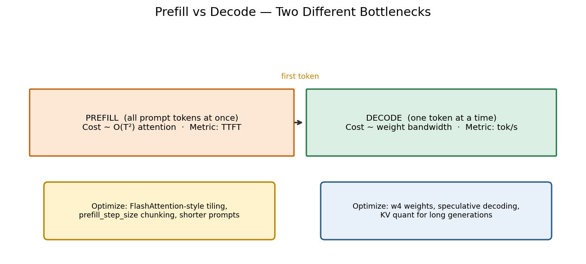
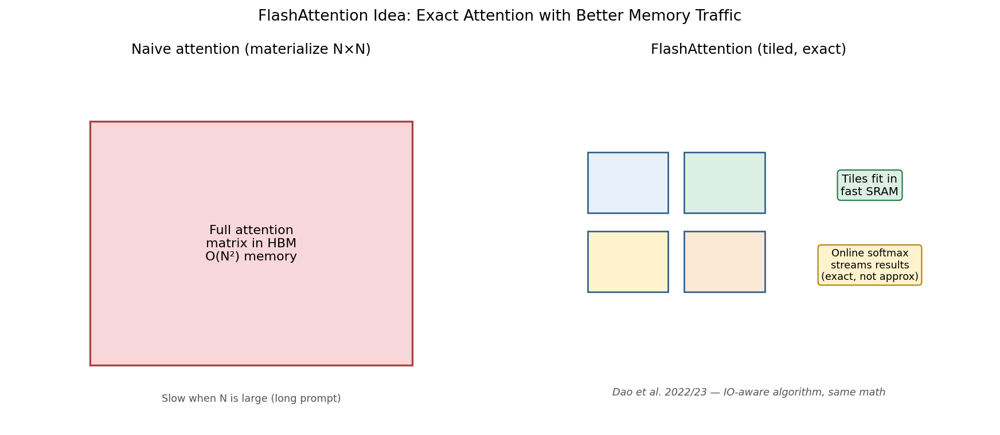
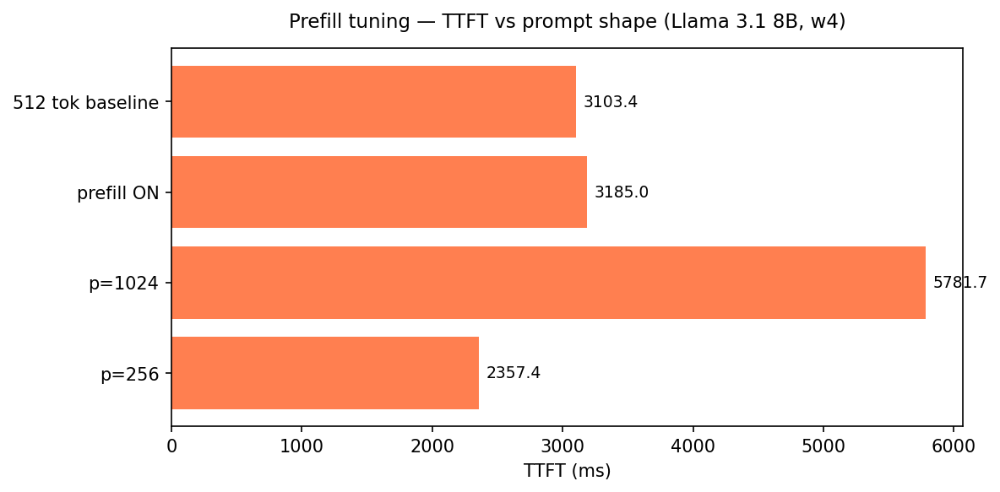
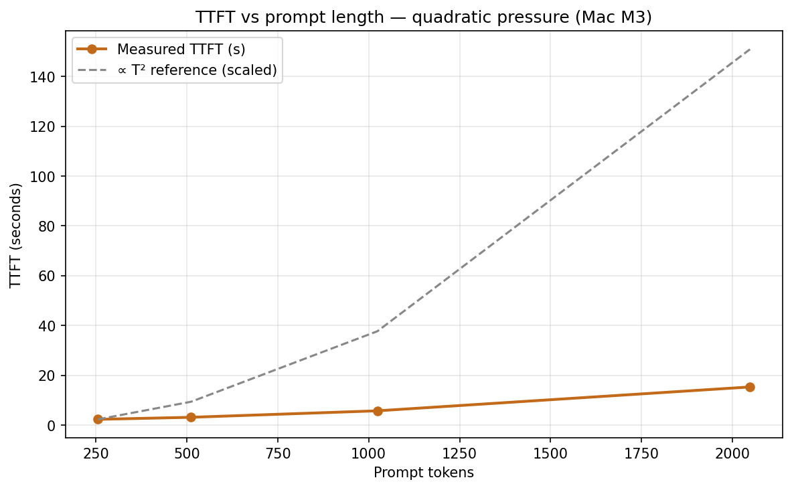
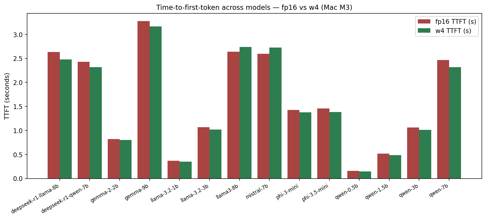

# Why Your Chatbot Feels Slow Before the First Word

*Part 4 of 7 — Local LLMs on Apple Silicon*

Users blame “slow AI” on streaming speed — how fast tokens drip onto the screen. Often the real pain is earlier: **time-to-first-token (TTFT)** — the silent pause between pressing Enter and seeing the first character.

That pause is **prefill**. The model must push your *entire* prompt through every layer before decode can begin. Prefill is attention-heavy. In the naive picture, attention work scales like \(O(T^2)\) in prompt length \(T\). On a MacBook that math is not academic: paste a long document and TTFT jumps from a couple of seconds to **fifteen**.

This article separates prefill from decode, explains why FlashAttention-style kernels matter, plots the quadratic story with real Mac M3 / M5 Max numbers, and maps optimizations to product UX.

---

## Hook: the metric that decides whether the app feels broken

Streaming tokens are visible progress. Prefill is invisible labor. Product teams that only dashboard tok/s ship demos that look fine in CI and feel broken on real prompts.

Imagine two local assistants, both decoding at ~20 tok/s on an M3:

| Assistant | Prompt | TTFT | Decode | User story |
|-----------|--------|------|--------|------------|
| A | 256 tokens | **2.4 s** | 20 tok/s | Feels snappy enough |
| B | 2048 tokens | **15.4 s** | ~12 tok/s | “Is it frozen?” |

Same model class. Same machine. Completely different product. Streaming speed did not cause the rage-quit — **prefill did**.

On Mac M3 with Llama 3.1 8B w4, our Article 3 sweep measured:

| Run | Prompt | TTFT | tok/s |
|-----|--------|------|-------|
| baseline | 512 | **3,103 ms** | 20.6 |
| prefill ON | 512 | **3,185 ms** | 18.7 |
| prefill, p=256 | 256 | **2,357 ms** | 13.7 |
| prefill, p=1024 | 1024 | **5,782 ms** | 20.1 |

And from the longer-context suite (Article 7): **p=2048 → TTFT ≈ 15,355 ms**.

That curve — not the tok/s column — is why local RAG demos die in the first week.

---

## Two phases, two bottlenecks

Every completion has two regimes with different physics.



*Figure 1 — Workflow: prefill consumes the full prompt and owns TTFT; decode emits tokens one-by-one and owns sustained tok/s. Optimizations do not transfer 1:1 between phases.*

| Phase | What happens | Dominant cost on Apple Silicon | User-facing metric | Primary levers |
|-------|--------------|--------------------------------|--------------------|----------------|
| **Prefill** | Parallel over prompt tokens; build initial KV | Attention FLOPs / IO, activation traffic | **TTFT** | Shorter prompts, Flash-style kernels, chunked prefill, prefix cache |
| **Decode** | One new token; read (almost) all weights | **Memory bandwidth** to weights | **tok/s** | w4/w8 weights, speculative decoding, smaller models |

Roofline intuition ([Williams et al., 2009](https://people.csail.mit.edu/stajich/publications/cacm09.pdf)): decode for large LLMs is classically **memory-bound**. Prefill can be much more **compute- / attention-IO-bound**, especially as \(T\) grows. That is why 4-bit weights rocket tok/s ([Part 2](01-weight-quantization.md)) but only partially help a 15-second TTFT on a stuffed prompt.

> **Fun fact #1:** The “instant” feel of strong hosted chat products on short messages is often **prefix caching of system prompts** plus **speculative decoding** — not raw FLOPS supremacy alone. Local stacks can copy both ideas; MLX already exposes knobs for chunked prefill, and later articles cover speculative + prefix cache.

---

## What prefill actually does

Given prompt tokens \(x_1,\ldots,x_T\):

1. Embed and run all layers over the full sequence (possibly in chunks).
2. Materialize (or stream) attention for each layer — every token attending to earlier tokens.
3. Write the full **KV cache** for \(T\) positions ([Part 3](02-kv-cache-quantization.md)).
4. Produce logits for the *next* token → that latency is **TTFT**.
5. Only then does the decode loop start.

So TTFT includes: graph overhead, prompt embedding, \(L\) layers of prefill, sampler for token #1. When people say “prefill is quadratic,” they usually mean the **attention** term inside step 2.

### Relative attention work (rough \(T^2\) scaling)

If attention cost \(\propto T^2\), normalizing to 256 tokens:

| Prompt length \(T\) | Relative attention work | M3 Llama 8B TTFT (measured) |
|---------------------|-------------------------|-----------------------------|
| 256 | **1×** | 2,357 ms |
| 512 | **4×** | 3,103–3,185 ms |
| 1024 | **16×** | 5,782 ms |
| 2048 | **64×** | **15,355 ms** (Art. 7) |

Reality is not a pure parabola — linear matmuls, memory hierarchy, and kernel launch overhead bend the curve — but the **shape** is unmistakable once you leave the 256–512 comfort zone.

---

## FlashAttention (exact, not approximate)

Naive attention materializes an \(N \times N\) score matrix in high-bandwidth-but-slower device memory. For long \(N\), that matrix dominates IO.

**FlashAttention** (Dao et al., 2022; FlashAttention-2, 2023) tiles the computation so working sets fit in fast on-chip SRAM, fuses softmax with **online normalizers** (Milakov & Gimelshein, 2018), and returns the **same mathematical result** — exact attention, better IO.



*Figure 2 — Workflow: naive attention materializes huge \(N\times N\) intermediates; FlashAttention-style tiling streams blocks through fast memory and keeps exact softmax semantics.*

On NVIDIA this is a famous CUDA kernel story. On Apple Silicon / MLX, you typically do **not** flip a consumer “enable FlashAttention” checkbox the way some PyTorch stacks do — IO-aware Metal kernels and framework fusion absorb much of the idea. What you *can* control in our harness is **`prefill_step_size`**: chunk long prompts so peak activation memory stays bounded even when \(T\) is large.

Chunking trades a bit of scheduling overhead for **not OOMing** mid-prefill. At 512 tokens on M3, turning “prefill config” on barely changes TTFT (3,103 → 3,185 ms). At 1024+, the *length* dominates; chunking is about survival and stability more than shaving milliseconds.

---

## Results: TTFT vs prompt shape (Llama 3.1 8B, w4, Mac M3)

All medians from 1 warmup + 3 trials.

| Run label | Config | Prompt | Gen | Peak GB | TTFT | Decode tok/s | Prompt tok/s |
|-----------|--------|--------|-----|---------|------|--------------|--------------|
| baseline | w4 | 512 | 128 | 5.06 | **3,103 ms** | 20.6 | 165 |
| prefill | w4+prefill | 512 | 128 | 5.06 | **3,185 ms** | 18.7 | 161 |
| p256 | w4+prefill | **256** | 128 | 4.92 | **2,357 ms** | 13.7 | 109 |
| p1024 | w4+prefill | **1024** | 128 | 5.24 | **5,782 ms** | 20.1 | 177 |



*Figure 3 — Results (Mac M3, Llama 8B w4): TTFT by prompt configuration. Shorter prompts win decisively; at 512 tokens prefill tuning is subtle; at 1024 tokens latency roughly doubles vs the 512 baseline.*

### Reading the oddities

- **p256 has lower TTFT but also lower decode tok/s (13.7).** Short prompts change the working set and measurement mix; do not overfit one cell — the TTFT column is the headline for UX.
- **prefill ON at 512 is within ~3% of baseline TTFT.** Chunked prefill is not a magic accelerator at moderate \(T\); it is a **memory-stability** feature.
- **p1024 TTFT ≈ 5.8 s** already feels sluggish for interactive chat.



*Figure 4 — Results: measured TTFT versus prompt length with a \(\propto T^2\) reference sketch. This is the RAG danger zone visual — beyond ~1K tokens, first-token latency becomes the product.*

### Extending the curve with Article 7 (same model family, M3)

| Prompt | TTFT | Decode tok/s | Peak GB | Source |
|--------|------|--------------|---------|--------|
| 256 | 2,357 ms | 13.7 | 4.92 | Art. 3 |
| 512 | 3,103 ms | 20.6 | 5.06 | Art. 3 baseline |
| 1024 | 5,782 ms (Art. 3) / 6,503 ms (Art. 7) | 20.1 / 14.9 | ~5.2 | Two suites |
| **2048** | **15,355 ms** | **11.9** | 5.35 | Art. 7 |
| 4096 (RAG workload) | ~31,118 ms | ~11.3 | — | Art. 7 |

Slight differences between Article 3 and Article 7 at 1024 are expected (configs, prefill step, workload text). The **order of magnitude** story is stable: **2K tokens ⇒ ~15 s TTFT on M3 8B w4.**

---

## Cross-model TTFT at fixed prompt (why size still matters)

Prefill cost also scales with model width/depth. At a fixed prompt length, larger models pay more before the first token.



*Figure — Results: TTFT across every Article 1 model at fp16 vs w4. Weight quant barely fixes first-token latency — that is a prefill problem.*

### Cross-check with the long-context article

Article 3’s 512/1024 prompts are only the beginning. Article 7 pushes to 2048 tokens and realistic workloads:


*Figure — Results: measured TTFT vs a ∝ T² reference — the curve that makes RAG feel broken.*


*Figure — Results: TTFT (seconds) and tok/s on one chart as prompt length grows.*


*Figure — Results: M5 Max flattens absolute latency but the quadratic shape remains.*


*Figure — Results: `rag_agent` hits ~31 s TTFT on M3 — prefill dominates the user experience.*

*Figure 5 — Results: TTFT across the model ladder at comparable settings. Tiny models return first tokens in well under a second; 7–9B models sit in the multi-second regime on M3 even before you stuff RAG context.*

Pair this with the size ladder ([Part 5](04-model-size-ladder.md)): if your UX budget is “first token under 1 second,” a 0.5B–3B router or summarizer in front of an 8B generator is often smarter than forcing 8B to prefill a novel.

---

## Measuring TTFT correctly (so your blog charts do not lie)

A few methodology notes from the harness:

- **Warmup discarded:** Metal/MLX first-iteration effects otherwise inflate TTFT.  
- **Median of 3:** less drama than a single noisy run.  
- **Subprocess isolation:** one OOM should not poison the sweep.  
- **Separate prompt_tps:** useful for seeing prefill throughput distinct from decode tok/s.  

If you compare against online APIs, remember they often hide TTFT behind HTTP buffering, CDN trickery, or streamed “thinking” placeholders. Local metrics are harsher — and more honest for offline UX.

Quadratic fits are guides. Plot **your** measured points (256 / 512 / 1024 / 2048) before writing SLO documents. Our M3 series is the cautionary template: comfort at 512, concern at 1024, crisis at 2048.

---

## Mac M5 Max: same curve, shifted down

M5 Max does not repeal \(T^2\); it buys a higher ceiling.

| Run | Prompt | M3 TTFT | M5 Max TTFT | M3 tok/s | M5 tok/s |
|-----|--------|---------|-------------|----------|----------|
| baseline w4 | 512 | 3,103 ms | **170 ms** | 20.6 | 105 |
| prefill | 512 | 3,185 ms | **162 ms** | 18.7 | 113 |
| p256 | 256 | 2,357 ms | 230 ms | 13.7 | 93 |
| p1024 | 1024 | 5,782 ms | **294 ms** | 20.1 | 113 |
| Art. 7 p2048 | 2048 | **15,355 ms** | **~615 ms** | 11.9 | ~109 |

On M5 Max, 2K-token TTFT stays **sub-second to low hundreds of ms** in our runs — still rising with \(T\), but inside interactive budgets that feel impossible on M3. If you are designing a local RAG product:

- **24 GB M3 class:** treat 2K+ stuffed prompts as a last resort; retrieve fewer / better chunks; summarize; cache prefixes.
- **High-memory M5 Max class:** you get more headroom, but 4K+ workloads still climb (Art. 7 RAG ~1.5 s TTFT on M5 Max at 4096).

---

## UX mapping: optimize the phase users actually feel

| Product goal | Users complain about | Optimize first | Secondary |
|--------------|---------------------|----------------|-----------|
| Chat assistant | “It hangs after Enter” | **TTFT** — short system prompts, prefix cache | w4 decode |
| Long-form writer | “Streaming is slow” | **tok/s** — w4, speculative | modest TTFT |
| RAG / search | “Paste PDF = freeze” | **TTFT + memory** — chunking, fewer tokens, KV quant | rerankers |
| Code completion | “Suggestions lag” | **tok/s** + tiny draft models | short prefixes |
| Agent with tool traces | Both | Cap history; summarize; KV quant | speculative |

> **Fun fact #2:** Cutting prompt tokens is often the highest-ROI “model optimization” you can ship without touching weights. A better retriever that returns 400 tokens instead of 2,000 can outperform a heroic kernel tweak on M3.

> **Fun fact #3:** Online softmax (the numerical heart of FlashAttention) was published in 2018 as a *numerics / stability* technique — years before it became a performance meme. Sometimes the path to speed is “never materialize the thing that hurts.”

---

## Anatomy of a “frozen” local RAG demo

A typical failure weekend looks like this:

1. Demo works on a 200-token FAQ question (~2–3 s TTFT on M3 8B).  
2. Someone pastes a 20-page PDF “just to see.” Retriever returns 8 chunks × ~500 tokens → **~4K tokens** stuffed into the prompt.  
3. Prefill runs for **~30 seconds** (Art. 7 RAG workload ~31 s on M3).  
4. Audience assumes the app crashed. Decode at ~11 tok/s cannot socially recover that first impression.

Mitigations that actually move TTFT, ranked by leverage on M3:

1. **Hard token budget** on retrieved context (e.g., 512–1024 total).  
2. **Rerank + compress** (LLM or extractive summary of chunks).  
3. **Prefix cache** the static system prompt / tool schema ([bonus article](07-context-and-cache.md)).  
4. **Smaller prefill model** for map-reduce summarization, then 8B for the final answer.  
5. **Faster silicon** (M5 Max) — real, but expensive compared to better retrieval.

Kernel folklore is optional until those five are done.

---

## Chunked prefill vs disaggregated serving (why papers keep splitting phases)

Cloud systems increasingly **disaggregate prefill and decode** (e.g., DistServe-style designs): prefill is compute-hungry and bursty; decode is bandwidth-hungry and sticky to KV state. Even on a single Mac you feel a baby version of that split:

- Prefill wants short queues and big parallel work over \(T\).  
- Decode wants weights hot in memory and predictable token cadence.  

Sarathi-style **chunked prefills** piggyback decodes between prefill chunks to improve goodput under load. Our MLX `prefill_step_size` is the local cousin for **memory bounding**, not a full scheduler. Knowing the vocabulary matters when you graduate from one chat window to a laptop “API server” with two concurrent users.

---

## Practical recipes

**Recipe A — Interactive chat on 24 GB M3**  
Keep system + history + user turn in a budget (e.g., ≤1K tokens). w4 weights. Accept ~2–3 s TTFT at 512; panic above ~6 s.

**Recipe B — Local RAG**  
Retrieve top-\(k\) with a hard token budget. Summarize chunks. Enable KV quant for the long cache ([Part 3](02-kv-cache-quantization.md)). Measure TTFT at **your** \(T\), not at 512.

**Recipe C — “Prefill config” in MLX harness**  
Use `w4+prefill` / `prefill_step_size` for long prompts to bound peak memory. Do not expect a miracle at 512 tokens — expect fewer OOMs at 2K–4K.

**Recipe D — Hardware fork**  
If the product *requires* multi-thousand-token prompts interactively, M3-class machines need algorithmic help (retrieval, cache); M5 Max can brute-force more — still measure.

**Recipe E — Product SLO sheet**  
Write numeric budgets before picking models: e.g., “p95 TTFT ≤ 2.5 s for chat; ≤ 8 s for RAG.” Then pick \(T\) caps and model tiers that mathematically fit those budgets on the target Mac.

```bash
# Reproduce Article 3
./scripts/run_article.sh 3 "Mac M3"

# Explicit prompt sweep
python scripts/run_benchmark.py --preset llama3-8b --config w4 \
  --hardware "Mac M3" -p 512 -g 128
python scripts/run_benchmark.py --preset llama3-8b --config w4+prefill \
  --hardware "Mac M3" -p 256 -g 128
python scripts/run_benchmark.py --preset llama3-8b --config w4+prefill \
  --hardware "Mac M3" -p 1024 -g 128

# The scary point on the curve (also in Article 7)
python scripts/run_benchmark.py --preset llama3-8b --config w4+prefill \
  --hardware "Mac M3" -p 2048 -g 64
```

---

## Limitations

1. **TTFT includes more than attention** — sampler, framework overhead, and first-token logistics add a floor (visible at small \(T\)).
2. **Two suites (Art. 3 vs Art. 7)** differ slightly at overlapping lengths; use them as a band, not rival ground truths.
3. **Decode tok/s at short prompts** can look noisy; do not rank models on p256 decode alone.
4. **FlashAttention** here is conceptual + kernel reality on Metal — we are not claiming a CUDA FA2 parity microbenchmark.
5. Quality of answers is out of scope; this article is latency physics.

---

## What to remember

- Users feel **TTFT** before they feel tok/s.
- Prefill ≈ attention-heavy; scales poorly with prompt length — **15.4 s at 2048 tokens on M3 Llama 8B w4**.
- At 512 tokens, prefill chunking ≈ wash on TTFT; at long \(T\), length dominates everything.
- M5 Max shifts the curve down hard but does not flatten it.
- Next: pick the model size that matches your latency and RAM budget ([Part 5](04-model-size-ladder.md)).

---

## References

1. Dao et al., *FlashAttention: Fast and Memory-Efficient Exact Attention with IO-Awareness* (2022) — [arXiv:2205.14135](https://arxiv.org/abs/2205.14135)
2. Dao, *FlashAttention-2: Faster Attention with Better Parallelism and Work Partitioning* (2023) — [arXiv:2307.08691](https://arxiv.org/abs/2307.08691)
3. Milakov & Gimelshein, *Online normalizer calculation for softmax* (2018) — [arXiv:1805.02867](https://arxiv.org/abs/1805.02867)
4. Pope et al., *Efficiently Scaling Transformer Inference* (2022) — [arXiv:2211.05102](https://arxiv.org/abs/2211.05102)
5. Vaswani et al., *Attention Is All You Need* (2017) — [arXiv:1706.03762](https://arxiv.org/abs/1706.03762)
6. Williams et al., *Roofline* (2009) — [CACM PDF](https://people.csail.mit.edu/stajich/publications/cacm09.pdf)
7. Agrawal et al., *Sarathi: Efficient LLM Inference by Piggybacking Decodes with Chunked Prefills* (2023) — [arXiv:2308.16369](https://arxiv.org/abs/2308.16369)
8. Zhong et al., *DistServe: Disaggregating Prefill and Decoding for Goodput-optimized LLM Serving* (2024) — [arXiv:2401.09670](https://arxiv.org/abs/2401.09670)
9. Dubey et al., *The Llama 3 Herd of Models* (2024) — [arXiv:2407.21783](https://arxiv.org/abs/2407.21783)
10. Kwon et al., *PagedAttention / vLLM* (2023) — [arXiv:2309.06180](https://arxiv.org/abs/2309.06180)
11. Apple MLX — [github.com/ml-explore/mlx](https://github.com/ml-explore/mlx)
12. Apple mlx-lm — [github.com/ml-explore/mlx-lm](https://github.com/ml-explore/mlx-lm)
13. mlx-community — [huggingface.co/mlx-community](https://huggingface.co/mlx-community)
14. LLM-Inference — [github.com/Chirumamilla1522/LLM-Inference](https://github.com/Chirumamilla1522/LLM-Inference)
15. Leviathan et al., *Fast Inference from Transformers via Speculative Decoding* (2023) — [arXiv:2211.17192](https://arxiv.org/abs/2211.17192)

---

**← Previous:** [Part 3: KV Cache](02-kv-cache-quantization.md) · **Next →** [Part 5: Model Ladder](04-model-size-ladder.md)

**Series:** [Intro](00-introduction.md) · [Weights](01-weight-quantization.md) · [KV](02-kv-cache-quantization.md) · **Prefill** · [Ladder](04-model-size-ladder.md) · [Full stack](05-full-optimization-stack.md) · [Speculative](06-speculative-decoding.md) · [Context bonus](07-context-and-cache.md)

**Tags:** `LLM` `TTFT` `Flash Attention` `Latency` `Apple Silicon` `UX` `Prefill` `MLX`
