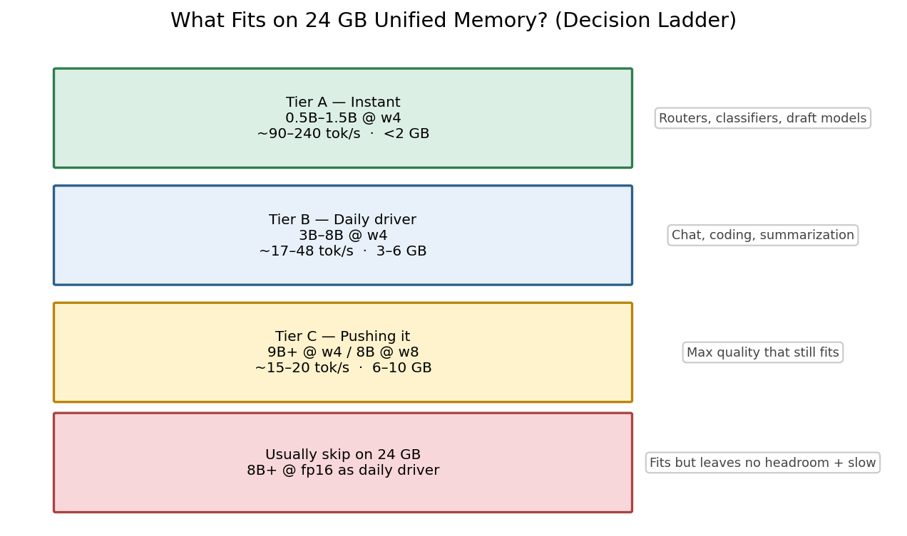

# From 0.5B to 70B: What Fits on Apple Silicon

*Part 5 of 7 — Local LLMs on Apple Silicon*

“Which model should I run locally?” is really two questions:

1. **Will it fit in RAM?**  
2. **Will it be fast enough?**

We measured **14 presets from 0.5B to 9B** at w4 on a **24 GB Mac M3**, plus larger models on **Mac M5 Max**.

---

## Decision ladder (before the numbers)



*Figure 1 — Workflow: Tier A (instant) → Tier B (daily driver) → Tier C (pushing it) → skip fp16 8B as daily.*

---

## Results: w4 ladder on Mac M3

| Model | Params | Peak GB | TTFT | tok/s |
|-------|--------|---------|------|-------|
| Qwen 0.5B | 0.5B | 0.64 | 145 ms | **238.3** |
| Llama 3.2 1B | 1B | 1.24 | 347 ms | 112.0 |
| Qwen 1.5B | 1.5B | 1.43 | 488 ms | 90.8 |
| Qwen 3B | 3B | 2.22 | 1,017 ms | 48.3 |
| Phi-3 Mini | 3.8B | 2.93 | 1,505 ms | 35.6 |
| Mistral 7B | 7B | 4.62 | 3,456 ms | 17.4 |
| Llama 3.1 8B | 8B | 5.06 | 2,817 ms | 20.6 |
| Gemma 9B | 9B | 5.88 | 3,852 ms | 15.4 |


*Figure 2 — Results: absolute tok/s collapses as size grows; memory climbs.*


*Figure 3 — Results: memory vs speed scatter — pick your point on the frontier.*

> **Fun fact:** Qwen 0.5B @ w4 exceeds **238 tok/s** on M3 — faster than most people type. At that speed the UI becomes the bottleneck.

---

## Same size class, different families (~7–8B @ w4)

| Family | tok/s | Notes |
|--------|-------|-------|
| Mistral 7B | 17.4 | Strong generalist |
| Llama 3.1 8B | 20.6 | Best MLX ecosystem support |
| Qwen 2.5 7B | 21.6 | Strong multilingual |
| DeepSeek R1 (Qwen 7B) | 18.6 | Reasoning-tuned |

Differences are **10–20%**, not 2× — pick by license, language, and fine-tune.

---

## What about 32B / 70B? (M5 Max)

With **64–128 GB** unified memory:

- **32B @ w4** — fits; usable interactive speeds  
- **70B @ w4** — fits at 64 GB+ with KV headroom  
- **fp16 70B** — ~140 GB; not a consumer Mac today  

See `results/Mac_M5_Max/article_04_model-size-ladder/` in the repo.

---

## Task → model cheat sheet (24 GB)

| Task | Sweet spot |
|------|------------|
| Local IDE copilot | 7B w4 |
| Offline chat | 8B w4 |
| Router / classifier | 0.5B–1.5B w4 |
| Reasoning-heavy | 7B reasoning-tuned w4 |
| Max quality local | 9B w4 or 8B w8 |

```bash
./scripts/run_article.sh 4 "Mac M3"
```

---

## References

1. Dubey et al., *Llama 3 Herd* (2024) — [arXiv:2407.21783](https://arxiv.org/abs/2407.21783)  
2. Touvron et al., *Llama 2* (2023) — [arXiv:2307.09288](https://arxiv.org/abs/2307.09288)  
3. Qwen2.5 — [huggingface.co/Qwen](https://huggingface.co/Qwen)  
4. Williams et al., *Roofline* (2009) — [CACM](https://people.csail.mit.edu/stajich/publications/cacm09.pdf)  

---

**← Previous:** [Part 4](03-prefill-and-ttft.md) · **Next →** [Part 6: Full Stack](05-full-optimization-stack.md)

**Tags:** `LLM` `Model Size` `Apple Silicon` `Benchmark` `Qwen` `Llama`
