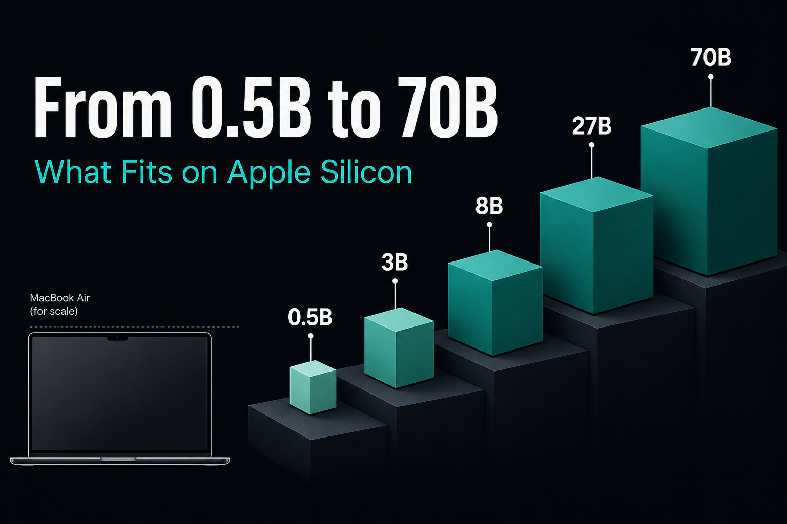
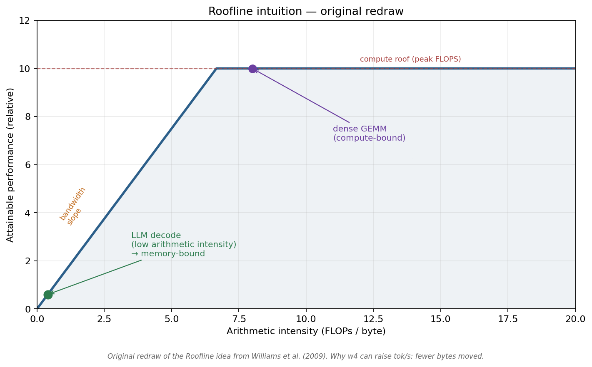
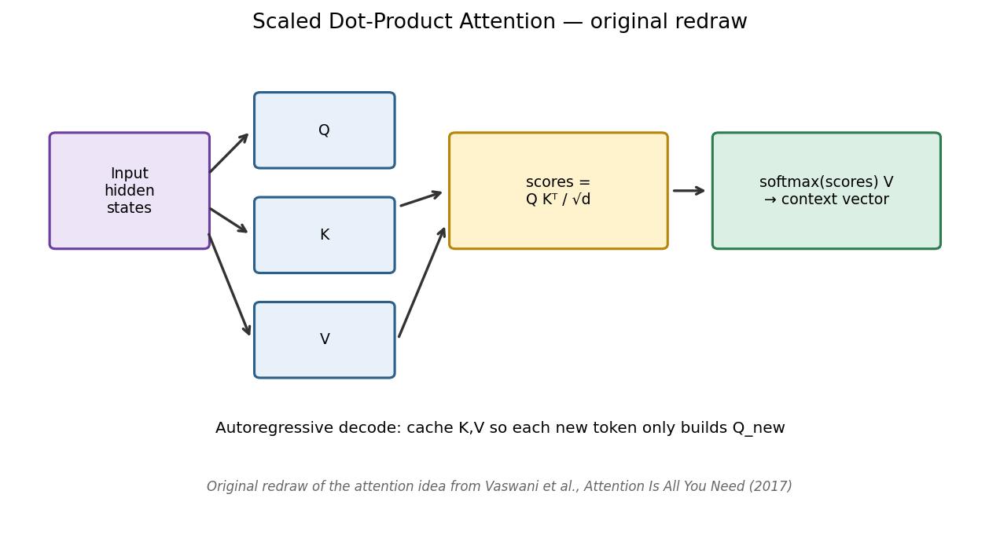
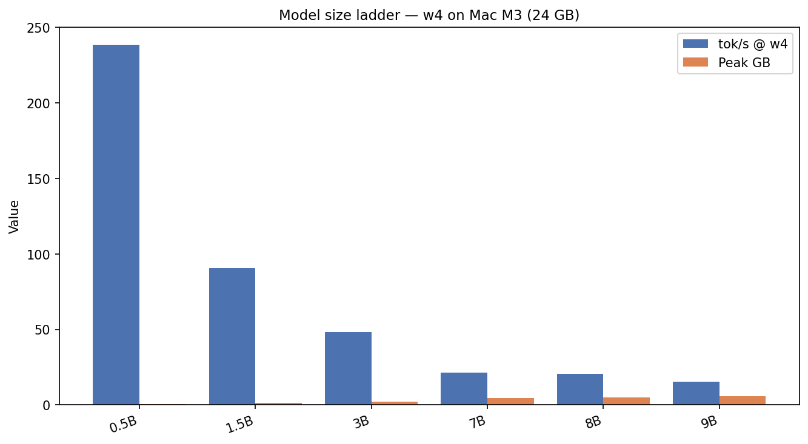
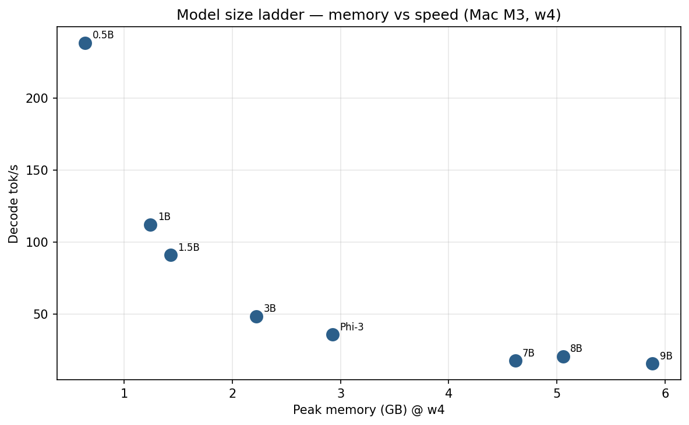
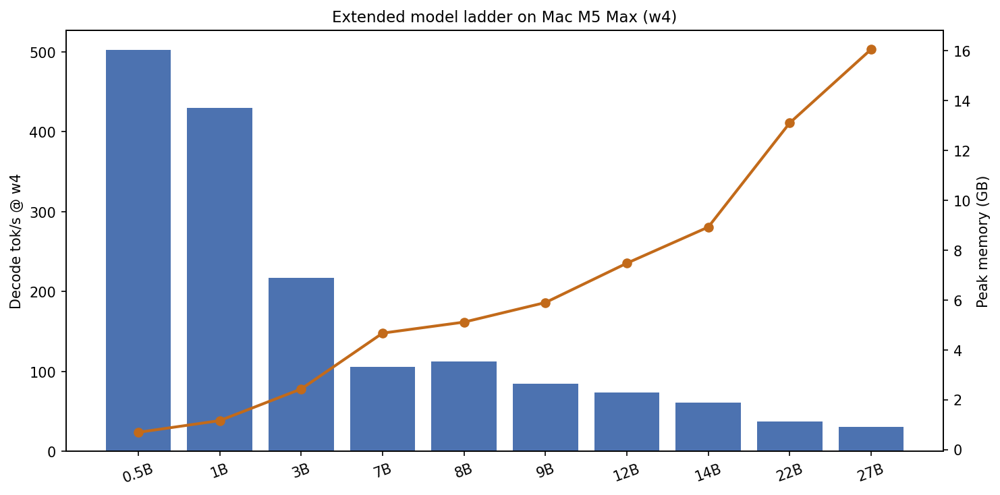

# From 0.5B to 70B: What Fits on Apple Silicon

*Part 5 of 7 — Local LLMs on Apple Silicon*

“Which model should I run locally?” sounds like a quality question. On a laptop it is really two engineering questions:

1. **Will it fit in unified memory** (with OS + browser + IDE still alive)?  
2. **Will it be fast enough** that TTFT and tok/s match the product?

We measured a dense **w4 ladder on Mac M3 (24 GB)** from **0.5B → 9B**, then extended on **Mac M5 Max** through **27B-class** models (and probed larger). The shape is brutal and useful: absolute tok/s collapses as parameters grow; memory climbs; the efficient frontier is a *choice*, not a single winner.

---

## Hook: three orders of magnitude on one desk

On the same Mac M3, same w4 recipe, same 512/128 benchmark shape:

| Model | Peak GB | tok/s |
|-------|---------|-------|
| Qwen 2.5 0.5B | **0.64** | **238.3** |
| Llama 3.1 8B | 5.06 | 20.6 |
| Gemma 2 9B | 5.88 | 15.4 |

That is **~15×** throughput from the bottom of the “real laptop” tier to the top of the tiny tier — before you even leave single-digit billions of parameters. On M5 Max, Llama 8B w4 jumps to **~112 tok/s**, Qwen 0.5B hits about **581 tok/s** in peak/chart callouts (suite median still ~502), and Gemma 27B w4 holds a usable **~32.9 tok/s**.

If you pick models by Twitter vibes alone, you will either (a) run a 70B that swaps itself to death, or (b) run a 0.5B and wonder why reasoning collapsed. This article is the ladder in between.

---

## Decision ladder (before the numbers)


*Figure 1 — Workflow: Tier A (instant) → Tier B (daily driver) → Tier C (pushing it) → skip fp16 8B as daily.*



*Figure — **Original redraw** of Roofline (Williams et al., 2009): smaller models move less weight per token — that is why 0.5B @ w4 can hit 200+ tok/s on the same chip where 8B @ fp16 crawls.*



*Figure — **Original redraw** of attention (Vaswani et al., 2017): every size still pays the same algorithmic tax — capacity and bandwidth decide who feels interactive.*

*Figure 1 — Workflow: Tier A (instant / router-class) → Tier B (daily driver 3B–8B) → Tier C (pushing a 24 GB box) → skip FP16 8B as a daily driver on 24 GB. Move tiers when RAM or latency budgets change.*

| Tier | Params (w4) | Feel on M3 24 GB | Typical jobs |
|------|-------------|------------------|--------------|
| **A — Instant** | 0.5B–1.5B | Hundreds of tok/s possible | Routing, classify, rewrite, draft for speculative decoding |
| **B — Daily** | 3B–8B | ~20–50 tok/s | Chat, coding help, local agents |
| **C — Stretch** | ~9B | Teens of tok/s, tighter RAM | Max quality before jumping hardware |
| **D — Desktop/pro** | 12B–27B+ | Needs M5 Max-class memory/bandwidth | Heavier reasoning, better long-form |

FP16 8B (~16 GB weights) is intentionally **not** Tier B on 24 GB — it fits poorly once KV + apps join the party ([Part 2](01-weight-quantization.md)).

---

## Results: full w4 ladder on Mac M3

Harness: MLX, mlx-community Instruct 4-bit checkpoints where available, **1 warmup + 3 trials**, medians. Default **512 prompt / 128 gen**.

### Primary table (headline models)

| Model | Params | Peak GB | TTFT (ms) | tok/s |
|-------|--------|---------|-----------|-------|
| Qwen 2.5 0.5B | 0.5B | **0.64** | 145 | **238.3** |
| Llama 3.2 1B | 1B | **1.24** | 347 | **112.0** |
| Qwen 2.5 1.5B | 1.5B | 1.43 | 488 | **90.8** |
| Qwen 2.5 3B | 3B | 2.22 | 1,017 | **48.3** |
| Phi-3 Mini | 3.8B | 2.93 | 1,505 | **35.6** |
| Mistral 7B | 7B | 4.62 | 3,456 | **17.4** |
| Llama 3.1 8B | 8B | 5.06 | 2,817 | **20.6** |
| Gemma 2 9B | 9B | 5.88 | 3,852 | **15.4** |



*Figure 2 — Results (Mac M3, w4): absolute decode throughput collapses as model size grows while peak memory climbs. The “best” model depends on whether you optimize tok/s, TTFT, or quality.*

### Extended M3 w4 table (same sweep family)

| Model | Peak GB | TTFT (ms) | tok/s | Notes |
|-------|---------|-----------|-------|-------|
| Qwen 2.5 0.5B | 0.64 | 145 | 238.3 | Speculative draft candidate |
| Llama 3.2 1B | 1.24 | 347 | 112.0 | Strong tiny Llama |
| Qwen 2.5 1.5B | 1.43 | 488 | 90.8 | Multilingual small |
| Gemma 2 2B | 2.12 | 803 | 53.1 | Compact Gemma |
| Qwen 2.5 3B | 2.22 | 1,017 | 48.3 | Sweet mid-tiny |
| Llama 3.2 3B | 2.34 | 1,022 | 45.8 | — |
| Phi-3 Mini | 2.93 | 1,505 | 35.6 | “Textbook” data story |
| Phi-3.5 Mini | 2.93 | 1,472 | 36.8 | Slight edge vs Phi-3 |
| Mistral 7B | 4.62 | 3,456 | 17.4 | Generalist |
| Qwen 2.5 7B | 4.72 | 2,653 | 21.6 | Strong multilingual |
| DeepSeek R1 (Qwen 7B) | 4.72 | 3,559 | 18.6 | Reasoning-tuned |
| Llama 3.1 8B | 5.06 | 2,817 | 20.6 | Best MLX ecosystem gravity |
| DeepSeek R1 (Llama 8B) | 5.06 | 3,069 | 19.4 | Reasoning-tuned |
| Gemma 2 9B | 5.88 | 3,852 | 15.4 | Top of M3 comfort |



*Figure 3 — Results: memory vs speed scatter for the ladder. Pick a point on the frontier — nothing is free; moving up in quality usually means sliding down-right in this plot.*

> **Fun fact #1:** Qwen 0.5B @ w4 exceeds **238 tok/s** on M3 — faster than almost anyone types. At that speed the UI, tokenizer detok, and widget re-render become the bottleneck. The model is waiting on *you*.

---

## Efficiency: tok/s per GB

Raw tok/s favors tiny models. A fairer laptop metric is **throughput per gigabyte of peak memory** — how hard each resident GB works.


*Figure 4 — Results: efficiency view (tok/s per GB). Small models look even stronger; huge models must justify themselves with quality, not with bandwidth thrift.*

Rule of thumb from the M3 w4 ladder:

- **0.5B–1.5B:** efficiency kings; use as routers / drafters.  
- **3B–4B:** best “smart enough / still fast” compromise on smaller Macs.  
- **7B–9B:** quality tier; pay in TTFT and tok/s.  
- **Above ~10B on 24 GB:** usually the wrong default unless aggressively quantized and context-capped.

---

## Same size class, different families (~7–8B @ w4, M3)

| Family | tok/s | Peak GB | TTFT | Notes |
|--------|-------|---------|------|-------|
| Qwen 2.5 7B | **21.6** | 4.72 | 2,653 | Strong multilingual |
| Llama 3.1 8B | 20.6 | 5.06 | 2,817 | Best ecosystem / docs / fine-tunes |
| DeepSeek R1 Distill Llama 8B | 19.4 | 5.06 | 3,069 | Reasoning-tuned |
| DeepSeek R1 Distill Qwen 7B | 18.6 | 4.72 | 3,559 | Reasoning-tuned |
| Mistral 7B | 17.4 | 4.62 | 3,456 | Solid generalist |

Differences are typically **10–25%**, not 2×. Inside a size class, pick by **license, language, tool-use fine-tunes, and reasoning behavior** — not by a 2 tok/s brag.

---

## Mac M5 Max: the ladder grows teeth

M5 Max changes two things at once: **memory headroom** and **bandwidth**. The same w4 8B that does ~20 tok/s on M3 lands around **112 tok/s**. Tiny models enter “why is my fan quiet?” territory. Mid-20B models become realistic interactively.

### Headline M5 Max w4 points

| Model | Peak GB | tok/s (suite) | Role |
|-------|---------|---------------|------|
| Qwen 2.5 0.5B | ~0.7 | **~581** class (suite median ~502; peaks higher) | Draft / router |
| Llama 3.1 8B | ~5.1 | **~112** | Daily driver, fast |
| Gemma 2 27B | ~16.1 | **~32.9** (suite median ~31.1) | Heavy local quality |



*Figure 5 — Results (Mac M5 Max): extended ladder up through ~27B-class w4 models. The qualitative shape matches M3 — bigger is slower — but the absolute speeds stay interactive much longer.*

### Broader M5 Max w4 table (measured medians)

| Model | Peak GB | TTFT (ms) | tok/s |
|-------|---------|-----------|-------|
| Qwen 2.5 0.5B | 0.69 | 27 | 502.0 |
| Llama 3.2 1B | 1.16 | 42 | 430.1 |
| Qwen 2.5 1.5B | 1.61 | 48 | 352.3 |
| Gemma 2 2B | 2.14 | 75 | 227.2 |
| Qwen 2.5 3B | 2.43 | 78 | 217.5 |
| Llama 3.2 3B | 2.49 | 72 | 232.5 |
| Phi-3 Mini | 3.21 | 101 | 195.7 |
| Phi-3.5 Mini | 3.21 | 104 | 189.7 |
| Mistral 7B | 4.67 | 207 | 105.7 |
| Qwen 2.5 7B | 4.85 | 178 | 113.8 |
| DeepSeek R1 Qwen 7B | 4.85 | 163 | 116.9 |
| Llama 3.1 8B | 5.11 | 164 | **112.9** |
| DeepSeek R1 Llama 8B | 5.11 | 163 | 111.8 |
| Gemma 2 9B | 5.90 | 234 | 84.7 |
| Mistral NeMo 12B | 7.48 | 250 | 74.0 |
| Qwen 2.5 14B | 8.93 | 313 | 60.8 |
| Mistral Small 22B | 13.11 | 987 | 37.9 |
| Gemma 2 27B | 16.06 | 1,177 | **31.1** |
| Qwen 2.5 32B/35B-class | 19.12 | 1,874 | 18.6 |

*(Larger 70B-class entries in the tree include failed/empty runs at fp16 or unsupported configs — treat “fits on paper” separately from “passes the harness.”)*


*Figure 6 — Results: M3 vs M5 Max at w4 for overlapping models. Hardware multiplies tok/s; it does not invent VRAM — unified memory size still caps the tier you can live in.*

> **Fun fact #2:** Moving Llama 8B w4 from M3 (~20.6 tok/s) to M5 Max (~112 tok/s) is a **~5.5×** hardware jump — larger than the gain from many algorithmic tricks at fixed chip. Buy silicon when you must; buy quantization and smaller drafts when you can.

---

## What about 32B / 70B?

With **64–128 GB** unified memory:

| Target | w4 realistic? | Notes |
|--------|---------------|-------|
| **14B–27B** | Yes on M5 Max-class | Interactive mid-30s to 60 tok/s in our 14B–27B band |
| **~32B–35B** | Fits with care | Slower; watch KV + apps |
| **70B w4** | Needs big unified memory | Possible on high-end configs; validate long-context KV |
| **70B FP16** | ~140 GB weights | Not a consumer Mac story today |

See `results/Mac_M5_Max/article_04_model-size-ladder/` in the repo for per-model JSON.

---

## Task → model cheat sheet

### 24 GB Mac (M3-class)

| Task | Sweet spot | Avoid |
|------|------------|-------|
| Local IDE copilot | 7B–8B w4 | FP16 8B daily |
| Offline chat | Llama 8B or Qwen 7B w4 | Stuffing 8K RAG naively ([Part 4](03-prefill-and-ttft.md)) |
| Router / classifier | **0.5B–1.5B w4** | 9B |
| Speculative draft | 0.5B–1B same family | Cross-arch drafts |
| Reasoning-heavy | Distilled R1 7B/8B w4 | Expecting 0.5B to reason |
| Max quality on box | 9B w4 or 8B w8 | 27B |

### High-memory Mac (M5 Max-class)

| Task | Sweet spot |
|------|------------|
| Fast daily chat | 8B w4 (100+ tok/s class) |
| Quality local | 14B–27B w4 |
| Draft model | 0.5B–1B still — speculative loves asymmetry |
| “Almost API” feel | 8B w4 + speculative ([Part 7](06-speculative-decoding.md)) |

> **Fun fact #3:** Phi-3 Mini (~3.8B) was marketed around high-quality synthetic “textbook” data — a reminder that **training recipe can beat parameter count**. On M3 it still does ~36 tok/s under 3 GB; that is a product tier, not a toy.

> **Fun fact #4:** Within 7–8B, Qwen / Llama / Mistral throughput differences are smaller than the gap between **M3 and M5 Max** on the *same* checkpoint. Hardware and bit-width usually dominate family rivalry.

---

## How to read the ladder without fooling yourself

Three common ranking mistakes:

1. **Tok/s-only leaderboards.** Qwen 0.5B wins forever. Your users may still need 8B reasoning.  
2. **Parameter-count-only prestige.** A tuned 3.8B can beat a sleepy 7B on some tasks; measure quality separately.  
3. **Ignoring TTFT.** A model at 40 tok/s with 6 s TTFT feels worse for chat than 22 tok/s with 2.5 s TTFT.

Always publish the triplet **(peak GB, TTFT, tok/s)** and name the prompt/gen shape. Our defaults (512/128) are comparable across the series; they are *not* your RAG shape.

### Rough “seconds to 200-token answer” on M3 w4

Ignoring TTFT variability:

| Model | tok/s | ~Decode time for 200 tokens | + TTFT @512 |
|-------|-------|-----------------------------|-------------|
| Qwen 0.5B | 238 | ~0.8 s | ~0.15 s |
| Qwen 3B | 48 | ~4.2 s | ~1.0 s |
| Llama 8B | 20.6 | ~9.7 s | ~2.8 s |
| Gemma 9B | 15.4 | ~13.0 s | ~3.9 s |

Chat UX is TTFT + streaming. Long-form UX is mostly streaming. Agents with tools are TTFT again and again — which is why tiny routers exist.

---

## Scaling laws vs laptop laws

Kaplan / Chinchilla scaling laws tell you how quality scales with parameters and tokens **under training compute budgets**. Laptop laws are different:

- **Unified memory** is a hard wall.  
- **Memory bandwidth** caps decode.  
- **Prompt length** caps perceived intelligence if TTFT blows the session.  

A 70B model that cannot finish prefill before the user alt-tabs is not “smarter” in product terms. Conversely, a 1B model that answers instantly with wrong code is not “faster” in engineering terms. The ladder exists so you can place a dot on **systems reality**, then layer evals on top.

---

## Building a personal “fit card”

Before downloading another 20 GB of checkpoints, fill this in:

| Field | Example |
|-------|---------|
| Machine RAM | 24 GB |
| Reserve for OS/apps | 8–10 GB |
| Max model + KV budget | ~14 GB |
| Target chat TTFT | ≤ 3 s |
| Target decode | ≥ 15 tok/s |
| Chosen tier | 7B–8B w4 |

On M3, that card almost always prints **Llama 8B / Qwen 7B / Mistral 7B @ w4**. On M5 Max with 64 GB+, the same card can upgrade the tier without changing the product code — only the preset string.

Keep the card next to the scatter plot (Figure 3). When someone asks for 70B on a 24 GB Air, you have a one-page no.

---

## Practical recipes

**Recipe A — One model on a 24 GB MBA/MBP**  
Ship **Llama 3.1 8B w4** or **Qwen 2.5 7B w4**. Enable KV quant if context grows. Cap prompts.

**Recipe B — Two-model local stack**  
0.5B–1B router/drafter + 7B–8B target. Memory budget ≈ sum of peaks + KV. Ideal for speculative decoding later.

**Recipe C — Quality workstation**  
M5 Max + 14B–27B w4. Still measure TTFT at *your* prompt lengths.

**Recipe D — Don’t rank models on tok/s alone**  
Always report **peak GB + TTFT + tok/s**. A 15 tok/s model that fits beats a 40 tok/s model that swaps.

**Recipe E — Migration path**  
Start 3B on a 16 GB machine → 8B when you buy 24 GB → 14B–27B when you land on Max silicon. Keep the same eval prompts so quality gains are real, not vibes.

```bash
# Reproduce Article 4
./scripts/run_article.sh 4 "Mac M3"

# Spot-check ends of the ladder
python scripts/run_benchmark.py --preset qwen-0.5b --config w4 --hardware "Mac M3"
python scripts/run_benchmark.py --preset llama3-8b --config w4 --hardware "Mac M3"
python scripts/run_benchmark.py --preset gemma-9b --config w4 --hardware "Mac M3"

# M5 Max extended
./scripts/run_article.sh 4 "Mac M5 Max"
python scripts/run_benchmark.py --preset gemma-27b --config w4 --hardware "Mac M5 Max"
```

---

## Limitations

1. **Quality ≠ tok/s.** This ladder is systems performance, not MMLU.
2. **Checkpoint specifics matter** (tokenizer, Instruct tune, quant group size).
3. **70B rows** may be incomplete depending on machine memory; read JSON `status`.
4. **TTFT** at 512 tokens understates RAG pain — combine with [Part 4](03-prefill-and-ttft.md).
5. Background apps change “fits”; leave headroom.

---

## What to remember

- On M3 w4: **238 tok/s @ 0.5B** → **~21 @ 7–8B** → **~15 @ 9B**.  
- On M5 Max: **~112 tok/s @ 8B**, **~31–33 @ 27B**, tiny models in the hundreds of tok/s.  
- Pick tier by **RAM + latency budget**, then family by features.  
- Next: stack weight + KV + prefill into one config ([Part 6](05-full-optimization-stack.md)).

---

## References

1. Dubey et al., *The Llama 3 Herd of Models* (2024) — [arXiv:2407.21783](https://arxiv.org/abs/2407.21783)
2. Touvron et al., *Llama 2: Open Foundation and Fine-Tuned Chat Models* (2023) — [arXiv:2307.09288](https://arxiv.org/abs/2307.09288)
3. Qwen Team, *Qwen2.5 Technical Report* (2024) — [arXiv:2412.15115](https://arxiv.org/abs/2412.15115)
4. Jiang et al., *Mistral 7B* (2023) — [arXiv:2310.06825](https://arxiv.org/abs/2310.06825)
5. Abdin et al., *Phi-3 Technical Report* (2024) — [arXiv:2404.14219](https://arxiv.org/abs/2404.14219)
6. Gemma Team, *Gemma 2* (2024) — [arXiv:2408.00118](https://arxiv.org/abs/2408.00118)
7. DeepSeek-AI, *DeepSeek-R1* (2025) — [arXiv:2501.12948](https://arxiv.org/abs/2501.12948)
8. Williams et al., *Roofline* (2009) — [CACM PDF](https://people.csail.mit.edu/stajich/publications/cacm09.pdf)
9. Kaplan et al., *Scaling Laws for Neural Language Models* (2020) — [arXiv:2001.08361](https://arxiv.org/abs/2001.08361)
10. Hoffmann et al., *Training Compute-Optimal Large Language Models* (Chinchilla, 2022) — [arXiv:2203.15556](https://arxiv.org/abs/2203.15556)
11. Frantar et al., *GPTQ* (2022) — [arXiv:2210.17323](https://arxiv.org/abs/2210.17323)
12. Apple MLX — [github.com/ml-explore/mlx](https://github.com/ml-explore/mlx)
13. Apple mlx-lm — [github.com/ml-explore/mlx-lm](https://github.com/ml-explore/mlx-lm)
14. mlx-community — [huggingface.co/mlx-community](https://huggingface.co/mlx-community)
15. LLM-Inference — [github.com/Chirumamilla1522/LLM-Inference](https://github.com/Chirumamilla1522/LLM-Inference)
16. Chowdhery et al., *PaLM* (2022) — [arXiv:2204.02311](https://arxiv.org/abs/2204.02311)

---

**← Previous:** [Part 4: Prefill & TTFT](03-prefill-and-ttft.md) · **Next →** [Part 6: Full Stack](05-full-optimization-stack.md)

**Series:** [Intro](00-introduction.md) · [Weights](01-weight-quantization.md) · [KV](02-kv-cache-quantization.md) · [Prefill](03-prefill-and-ttft.md) · **Ladder** · [Full stack](05-full-optimization-stack.md) · [Speculative](06-speculative-decoding.md) · [Context bonus](07-context-and-cache.md)

**Tags:** `LLM` `Model Size` `Apple Silicon` `Benchmark` `Qwen` `Llama` `Memory` `MLX`
