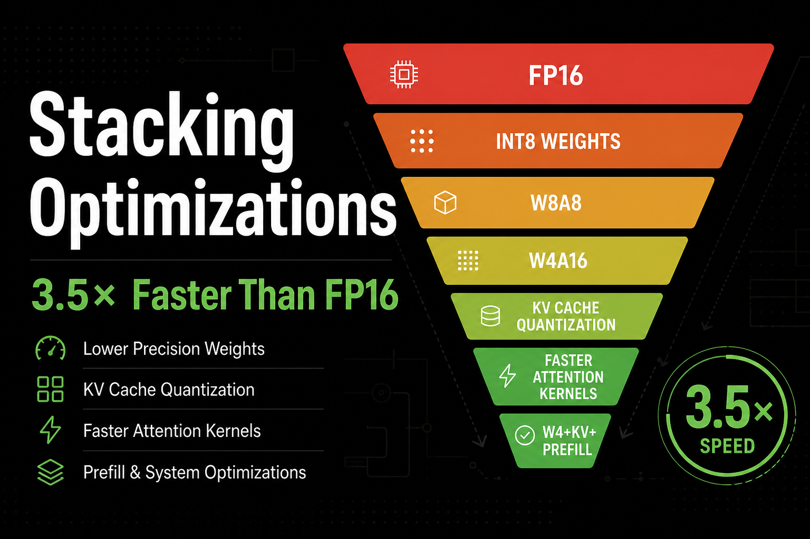
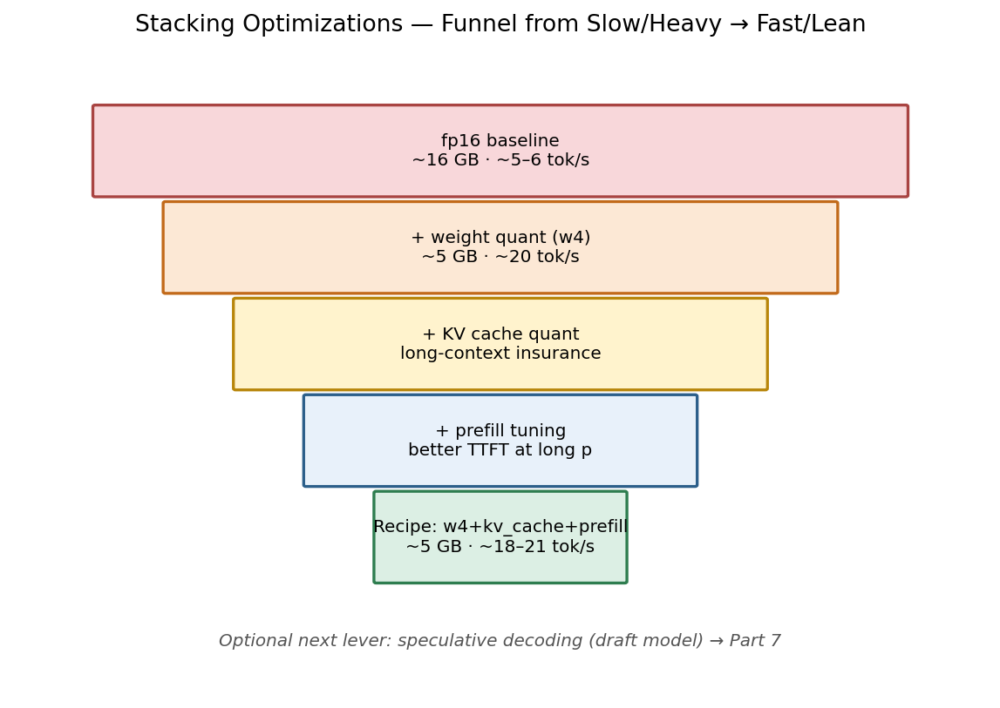
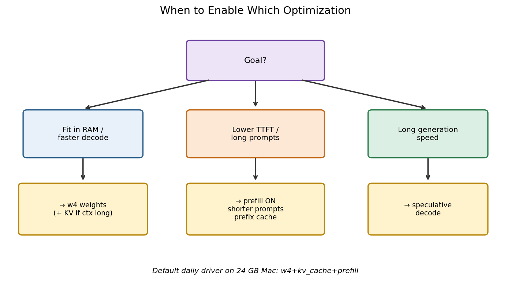
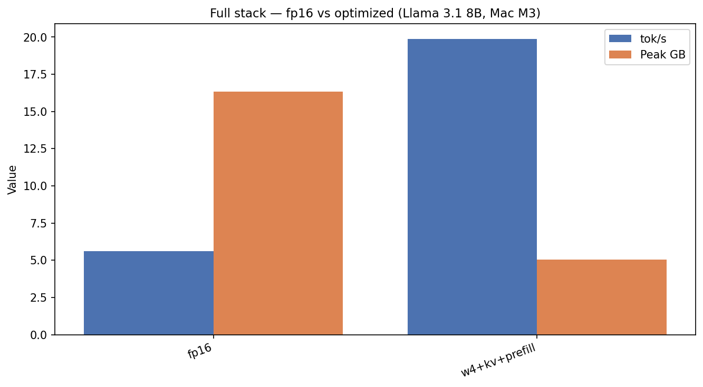
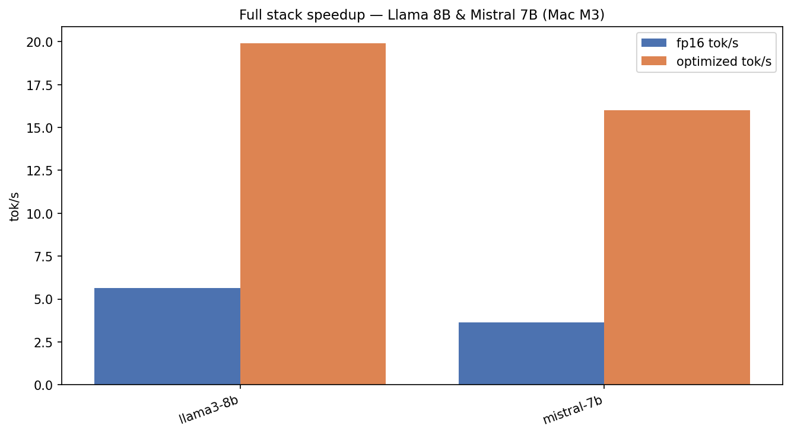
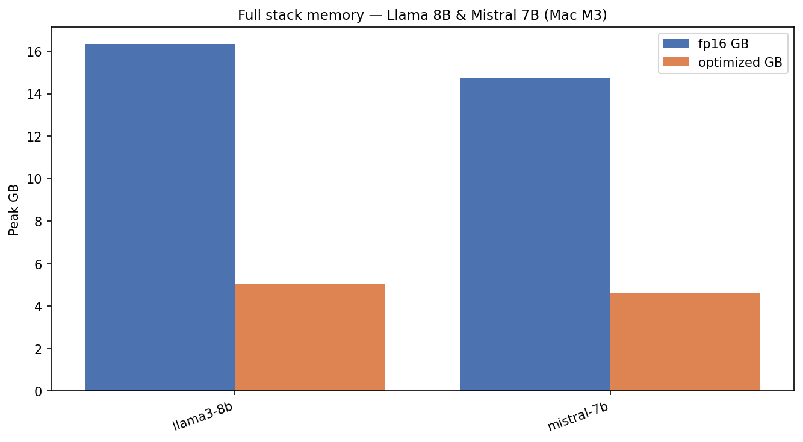
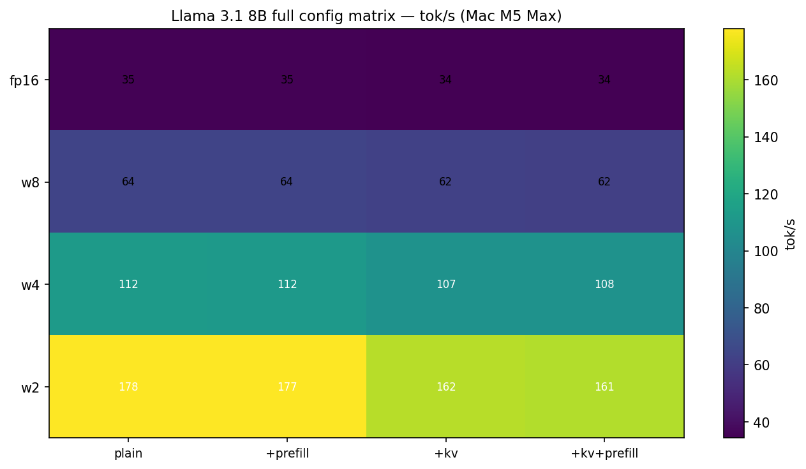
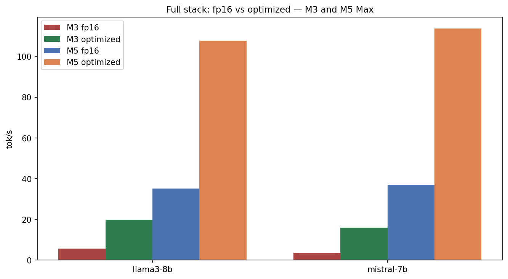

# Stacking Optimizations: 3.5× Faster Than FP16 on a 24 GB Mac

*Part 6 of 7 — Local LLMs on Apple Silicon*

Individual blog posts love clean A/B tables: *fp16 vs 4-bit*, *KV on vs KV off*, *prefill chunked vs not*. Production local inference does not look like that. You turn **several** knobs at once, and the interesting question is whether the wins multiply, plateau, or quietly cancel each other.

On a **Mac M3 (24 GB)** with Llama 3.1 8B, the answer is blunt:

| Recipe | Peak memory | Decode |
|--------|-------------|--------|
| **fp16** (naive default) | **16.3 GB** | **5.6 tok/s** |
| **w4 + KV quant + prefill** | **5.1 GB** | **19.9 tok/s** |

That is **~31% of the memory** and **~3.55× the decode throughput** — enough headroom to keep a browser, an IDE, and a fat RAG cache without thrashing into swap. Mistral 7B tells the same story: **3.6 → 16.0 tok/s** while memory falls from **14.8 → 4.6 GB**.

This article is the “put it all together” chapter: the optimization funnel, a decision tree for which lever matches which pain, deep M3 results, a full **16-config matrix on Mac M5 Max**, recipes for 16 / 24 / 64+ GB machines, limitations, and exact reproduce commands.

---

## Hook: why stacking is not optional on unified memory

Apple Silicon’s unified memory is a gift and a trap. There is no separate VRAM pool to “fill first.” Weights, KV cache, activations, the OS, Chrome, and your editor all compete for the same DRAM. An 8B model at fp16 already burns ~16 GB of that budget before you generate a single token. At that point you are not optimizing for elegance — you are optimizing so the laptop stays usable.

The series so far isolated three families of levers:

1. **Weight quantization** (Part 2) — fewer bits per parameter → less DRAM traffic per decode step  
2. **KV-cache quantization** (Part 3) — long generations / long contexts stop eating the rest of RAM  
3. **Prefill / TTFT tuning** (Part 4) — chunked prefill and related MLX settings for prompt-heavy work  

Parts 5 (model ladder) answered *which* model to load. This part answers *which stack* to load it with.

> **Fun fact #1:** A full article sweep on M3 — multiple presets × configs × trials — routinely takes **2–8 hours**. The harness isolates each run in a subprocess so one Metal OOM does not nuke the whole batch. That design decision alone saved more wall-clock than any clever plot script.

---

## The funnel: how stacking actually works

Think of the stack as a funnel that narrows memory pressure while opening decode bandwidth:



*Figure 1 — Workflow: each layer adds a lever — weight bits shrink the model footprint, KV quant insures long-context growth, prefill tunes time-to-first-token, and the daily recipe is the combination that survives on your RAM budget.*

Order matters for *debugging*, even if the final config string is just `w4+kv_cache+prefill`:

1. **Weights first.** If the model does not fit comfortably, nothing else matters. On 24 GB, fp16 8B is already uncomfortable; w4 is the default.  
2. **KV next when context grows.** Short chat turns barely stress the cache. RAG agents and long summaries do.  
3. **Prefill when TTFT hurts.** Decode tok/s can look great while the user stares at a spinner for 10–30 seconds on a stuffed prompt.  
4. **Only then** chase exotic wins (speculative decoding in Part 7, prefix cache in the bonus article).

The decision tree below is the practical companion to the funnel — start from the symptom, not from the paper.



*Figure 2 — Workflow: match the lever to the pain — RAM pressure → weight bits; long-context growth → KV quant; slow first token → prefill / chunking; long replies with spare RAM → speculative decoding.*

| Pain you feel | First lever | Why |
|---------------|-------------|-----|
| Activity Monitor red / swap thrash | Weight quant → **w4** | Dominates peak GB |
| Fine at chat, dies on PDF/RAG | **KV quant** + retrieve less | Cache grows with *T* |
| Spinner before first token | Prefill settings + shorter prompts | Prefill ~O(T²) attention work |
| Slow streaming after first token | Weight bits / smaller model / speculative | Decode is bandwidth-bound |
| Quality eval night | Temporarily **fp16 / w8** | Measure apples-to-apples |

---

## Results on Mac M3: Llama 3.1 8B — fp16 vs fully optimized

Default harness shape unless noted: **512 prompt tokens**, **128 generation tokens**, **3 trials**, MLX / mlx-lm, isolated subprocess per config.

| Config | Peak GB | TTFT (ms) | tok/s | vs fp16 |
|--------|---------|-----------|-------|---------|
| **fp16** | **16.33** | 2,689 | **5.6** | 1.00× |
| **w4 + kv_cache + prefill** | **5.06** | 2,746 | **19.9** | **3.55×** |



*Figure 3 — Results (Mac M3, Llama 3.1 8B): fully optimized stack delivers ~31% of fp16 peak memory and **3.55×** decode throughput.*

Two observations jump out:

- **Memory is the headline win for daily use.** Freeing ~11 GB is the difference between “LLM app + IDE” and “close everything else.”  
- **TTFT barely moves in this particular short-prompt regime.** Prefill’s value shows up when *prompt length* climbs (see Part 4 and the bonus context article), not always on a 512-token bench. Stacking is still correct — you buy insurance for the workloads you actually ship.

### Same stack, second model: Mistral 7B

| Config | Peak GB | TTFT (ms) | tok/s | Speedup |
|--------|---------|-----------|-------|---------|
| **fp16** | **14.77** | 4,350 | **3.6** | 1.00× |
| **w4 + kv_cache + prefill** | **4.62** | 3,954 | **16.0** | **4.40×** |



*Figure 4 — Results (Mac M3): Llama 8B and Mistral 7B both jump hard when moved from fp16 to the optimized stack — Llama **5.6 → 19.9** tok/s, Mistral **3.6 → 16.0** tok/s.*



*Figure 5 — Results (Mac M3): both models drop from the mid-teens GB peak into the ~4.6–5.1 GB band — roughly a second small model’s worth of headroom.*

**Cross-model takeaways on M3:**

| Model | Memory saved | Speed gained | Notes |
|-------|--------------|--------------|-------|
| Llama 3.1 8B | ~11.3 GB | **3.55×** | Best MLX ecosystem defaults |
| Mistral 7B | ~10.2 GB | **4.40×** | Even larger relative speedup from a slower fp16 baseline |

Mistral’s absolute optimized speed (~16 tok/s) trails Llama (~20 tok/s) on this machine, but the *relative* rescue from fp16 is larger. If someone only ever measured Mistral at fp16 on a 24 GB Mac, they might incorrectly conclude “7B models are unusable locally.” The stack — not the architecture — was the bottleneck.

> **Fun fact #2:** The ~11 GB you claw back from Llama fp16 → optimized is enough to hold **another** 7–8B w4 model, or a very fat quantized KV cache for long RAG. Unified memory makes “second model” a literal capacity question, not a PCIe scheduling question.

---

## The 16-config matrix (what “full stack” really explores)

Marketing likes one number. Engineering needs a grid. We sweep:

| Axis | Options |
|------|---------|
| Weight bits | fp16, w8, w4, w2 |
| KV quant | on / off |
| Prefill | on / off |

That is \(4 \times 2 \times 2 = 16\) configurations per model. On M5 Max we have the complete Llama 3.1 8B matrix; on M3 the article run focuses on the **headline contrast** (fp16 vs fully optimized) across Llama and Mistral, with earlier articles covering the individual axes in depth.

### Mac M5 Max — Llama 3.1 8B complete matrix

Numbers below are decode **tok/s** / **peak GB** (rounded). TTFT is ~150–190 ms across the board on this machine for the default short prompt — the interesting variance is throughput and memory.

| Config | tok/s | Peak GB | TTFT (ms) |
|--------|------:|--------:|----------:|
| fp16 | **35.1** | 16.46 | 189 |
| fp16 + prefill | 35.1 | 16.46 | 190 |
| fp16 + kv | 34.3 | 16.46 | 191 |
| fp16 + kv + prefill | 34.4 | 16.46 | 192 |
| w8 | **63.6** | 8.97 | 187 |
| w8 + prefill | 63.9 | 8.97 | 187 |
| w8 + kv | 62.0 | 8.97 | 188 |
| w8 + kv + prefill | 61.6 | 8.97 | 188 |
| w4 | **112.5** | 5.11 | 163 |
| w4 + prefill | 112.0 | 5.11 | 162 |
| w4 + kv | 107.3 | 5.11 | 166 |
| **w4 + kv + prefill (optimized)** | **~107** | **5.11** | **165** |
| w2 | **178.0** | 3.26 | 152 |
| w2 + prefill | 177.5 | 3.26 | 154 |
| w2 + kv | 162.3 | 3.26 | 157 |
| w2 + kv + prefill | 161.5 | 3.26 | 157 |



*Figure 6 — Results (Mac M5 Max, Llama 3.1 8B): the 16-config sweep — weight bits dominate the tok/s ladder; KV/prefill flags barely change short-prompt decode and slightly tax it when enabled.*

**How to read the matrix without lying to yourself:**

1. **Weight bits are the primary axis.** fp16 → w8 → w4 → w2 climbs roughly **35 → 64 → 112 → 178** tok/s. That is the story.  
2. **On short prompts, KV + prefill do not buy decode speed.** Optimized (~107) is slightly *under* plain w4 (112.5). That is expected: you pay a little for generality that matters when *T* is large.  
3. **“Optimized” is a product default, not a peak-benchmark default.** Ship `w4+kv_cache+prefill` for apps. Bench `w4` alone if you want max short-chat tok/s on a fat Mac.  
4. **w2 wins the leaderboard and loses the quality argument.** Use it for demos and extreme RAM, not as your silent production default without evals.

Mistral 7B on the same M5 Max machine echoes the headline: fp16 ~**37** tok/s at ~14.9 GB → optimized stack ~**114** tok/s at ~4.7 GB.

---

## M3 vs M5 Max: same stack, different planet



*Figure 7 — Results: Mac M3 vs Mac M5 Max on the full-stack contrast — absolute tok/s jumps by nearly an order of magnitude on M5, while the *relative* value of leaving fp16 stays huge on both.*

| Hardware | Model | fp16 tok/s | Optimized tok/s | fp16 GB | Opt GB |
|----------|-------|----------:|----------------:|--------:|-------:|
| **M3 (24 GB)** | Llama 8B | 5.6 | **19.9** | 16.3 | 5.1 |
| **M3 (24 GB)** | Mistral 7B | 3.6 | **16.0** | 14.8 | 4.6 |
| **M5 Max** | Llama 8B | ~35 | **~107** | 16.5 | 5.1 |
| **M5 Max** | Mistral 7B | ~37 | **~114** | 14.9 | 4.7 |

**Interpretation that survives Twitter screenshots:**

- **Relative stacking math is portable.** Leaving fp16 for a w4-centric stack is a multi× win on both chips.  
- **Absolute UX is not portable.** 20 tok/s on M3 is “usable chat.” 100+ tok/s on M5 Max is “UI becomes the bottleneck.”  
- **Memory geometry is portable.** ~5 GB for an 8B w4 stack is the planning number you can tattoo on your wrist for both machines.  
- **M5 makes “fp16 for quality nights” realistic.** 35 tok/s at 16 GB is annoying but interactive. On M3, fp16 8B is a last resort.

---

## Marginal returns: what each layer *actually* buys

A useful way to avoid cargo-cult stacking is to ask what each flag is *for*:

| Layer | Primary metric | When it shines | When it is mostly free insurance |
|-------|----------------|----------------|----------------------------------|
| **w8 / w4 / w2** | Peak GB + decode tok/s | Always on bandwidth-bound decode | — |
| **KV quant** | Peak GB at large *T* | Long gen, RAG, multi-turn | Short 128–512 token chats |
| **Prefill tuning** | TTFT / prompt tok/s | 1K–4K+ prompts | Tiny prompts already fast |
| **Model choice** | Quality / tok/s trade | Everything | — |

On the M5 matrix, enabling KV+prefill on top of w4 costs a few tok/s on the short harness. That is not a bug — it is a reminder that **your benchmark prompt length determines which axis looks “worth it.”** Always pair this article with the context/workload sweeps (bonus Part) before declaring a lever useless.

> **Fun fact #3:** Roofline intuition still wins arguments. Decode for dense transformers is usually **memory-bandwidth bound**: cutting bytes per weight (quantization) raises effective tok/s even when FLOPS headroom exists. That is why w4 is both a *fit* trick and a *speed* trick on Apple Silicon.

> **Fun fact #4:** The config string `w4+kv_cache+prefill` looks like three equal peers. Empirically, on short-prompt M5 Max, **weight bits explain almost the entire ladder**; the other two are workload-conditional. Treat the string as a *product preset*, not as proof that every substring is a 2× multiplier.

---

## Recommended recipes (steal these)

### Daily driver — 24 GB Mac (M3-class)

```text
Config:  w4+kv_cache+prefill
Models:  llama3-8b / mistral-7b / qwen-7b
Expect:  ~4.6–5.1 GB peak, ~16–21 tok/s (M3), interactive chat
Avoid:   fp16 8B as the always-on default
```

```bash
python scripts/run_benchmark.py \
  --preset llama3-8b \
  --config w4+kv_cache+prefill \
  --hardware "Mac M3"
```

### Quality / eval night — same 24 GB machine

```text
Config:  w8 (or fp16 if you close other apps)
Expect:  better fidelity, half (w8) or full (fp16) memory pain
Use for: offline evals, not the always-on assistant
```

### 16 GB Mac

```text
Stay at:  3B–7B @ w4, or 8B @ w4 with discipline
Skip:     fp16 8B entirely as a daily driver
Enable:   KV quant earlier — you have less slack for long RAG
```

### M5 Max / 64 GB+ workstation

```text
Chat default:     w4+kv_cache+prefill (~107 tok/s Llama 8B)
Short-chat peak:  plain w4 (~112 tok/s) if you do not need long-T insurance
Quality lane:     fp16 8B is actually usable (~35 tok/s)
Bigger models:    32B–70B @ w4/w8 become the interesting question (see Part 5)
```

### Situation cheat sheet

| Situation | Prefer | Skip / defer |
|-----------|--------|--------------|
| Short prompts only | w4 (± prefill) | Obsessing over KV quant |
| Max quality eval | fp16 / w8 | w2 |
| Tiny models (<3B) | Simple w4 | Heavy prefill tuning |
| 16 GB Mac | Small model @ w4 | fp16 8B+ |
| RAG / long summarize | w4+kv+prefill + retrieve less | Stuffing 20 chunks “just in case” |
| Demo day max tok/s | w2 or plain w4 | Pretending quality is unchanged |

---

## Limitations (read before you ship the screenshot)

1. **Short-prompt benches understate prefill and KV.** The headline 512/128 harness is great for decode comparisons and unfair to TTFT/KV levers.  
2. **Quality is not free at w2 (and not perfectly free at w4).** Throughput tables are not MMLU. Run your own eval suite for regulated domains.  
3. **“Optimized” ≠ “fastest row in the matrix.”** On M5 Max, plain w4 edges the full stack on short decode. Product defaults optimize for *range*, not for one chart.  
4. **Hardware variance is real.** M3 vs M5 Max absolute rates differ by ~5× on the same recipe. Never paste an M5 number into an M3 capacity plan.  
5. **Checkpoint / mlx-lm version drift.** Repos and quant recipes change; always record `model_repo`, `mlx_version`, and `mlx_lm_version` from the JSON (our runs used mlx 0.31.x-era stacks).  
6. **Stacking interacts with speculative decoding.** Draft models need RAM headroom — the ~5 GB optimized footprint is what *makes room* for Part 7’s draft+target pairs.

---

## How to reproduce

```bash
# Article 5 suite (uses the repo’s article runner)
./scripts/run_article.sh 5 "Mac M3"
./scripts/run_article.sh 5 "Mac M5 Max"

# Single headline contrast
python scripts/run_benchmark.py --preset llama3-8b --config fp16 --hardware "Mac M3"
python scripts/run_benchmark.py --preset llama3-8b --config w4+kv_cache+prefill --hardware "Mac M3"

# Regenerate Medium charts / workflow diagrams
python scripts/plot_medium_charts.py --hardware "Mac M3"
python scripts/plot_medium_charts.py --hardware "Mac M5 Max"
python scripts/plot_medium_diagrams.py
```

Inspect JSON under:

- `results/Mac_M3/article_05_full-stack/`
- `results/Mac_M5_Max/article_05_full-stack/llama3-8b/` (full 16-config matrix)

Key fields: `configuration`, `memory_gb`, `throughput_tps`, `ttft_ms`, `model_repo`, `optimizations`.

---

## What to read next

Part 7 adds **speculative decoding** — a small draft model that can boost tok/s **without** changing the target’s weight precision. Spoiler from real runs: it is a **~1.8×** win on Qwen-7B when acceptance is high (~74%), and it can **lose** on Llama when acceptance is mediocre and the draft is not cheap enough. Stacking taught us to free RAM; speculative decoding spends some of that RAM for speed.

Bonus article after that: context length, the RAG wall, and prefix KV caching — where TTFT (not decode tok/s) becomes the villain.

---

## References

1. Jacob et al., *Quantization and Training of Neural Networks for Efficient Integer-Arithmetic-Only Inference* (2018) — [arXiv:1712.05877](https://arxiv.org/abs/1712.05877)  
2. Frantar et al., *GPTQ: Accurate Post-Training Quantization for Generative Pre-trained Transformers* (2022) — [arXiv:2210.17323](https://arxiv.org/abs/2210.17323)  
3. Lin et al., *AWQ: Activation-aware Weight Quantization for LLM Compression and Acceleration* (2023) — [arXiv:2306.00978](https://arxiv.org/abs/2306.00978)  
4. Dettmers et al., *LLM.int8(): 8-bit Matrix Multiplication for Transformers at Scale* (2022) — [arXiv:2208.07339](https://arxiv.org/abs/2208.07339)  
5. Kwon et al., *Efficient Memory Management for Large Language Model Serving with PagedAttention* (2023) — [arXiv:2309.06180](https://arxiv.org/abs/2309.06180)  
6. Dao et al., *FlashAttention: Fast and Memory-Efficient Exact Attention with IO-Awareness* (2022) — [arXiv:2205.14135](https://arxiv.org/abs/2205.14135)  
7. Pope et al., *Efficiently Scaling Transformer Inference* (2022) — [arXiv:2211.05102](https://arxiv.org/abs/2211.05102)  
8. Ainslie et al., *GQA: Training Generalized Multi-Query Transformer Models from Multi-Head Checkpoints* (2023) — [arXiv:2305.13245](https://arxiv.org/abs/2305.13245)  
9. Williams et al., *Roofline: An Insightful Visual Performance Model for Multicore Architectures* (2009) — Communications of the ACM  
10. Apple Machine Learning Research / MLX — [github.com/ml-explore/mlx](https://github.com/ml-explore/mlx)  
11. mlx-lm — [github.com/ml-explore/mlx-lm](https://github.com/ml-explore/mlx-lm)  
12. Meta Llama 3.1 — [ai.meta.com/llama](https://ai.meta.com/llama/)  
13. Mistral 7B — [mistral.ai](https://mistral.ai/)  
14. LLM-Inference benchmark harness & raw JSON — [github.com/Chirumamilla1522/LLM-Inference](https://github.com/Chirumamilla1522/LLM-Inference)  

---

**← Previous:** [Part 5 — Model Size Ladder](04-model-size-ladder.md) · **Next →** [Part 7 — Speculative Decoding](06-speculative-decoding.md)

**Series:** [00 Intro](00-introduction.md) · [01 Weights](01-weight-quantization.md) · [02 KV](02-kv-cache-quantization.md) · [03 Prefill](03-prefill-and-ttft.md) · [04 Ladder](04-model-size-ladder.md) · **05 Stack** · [06 Speculative](06-speculative-decoding.md) · [07 Context & Cache](07-context-and-cache.md)

**Tags:** `LLM` `Optimization` `Performance` `MLX` `Apple Silicon` `Engineering` `Quantization`
