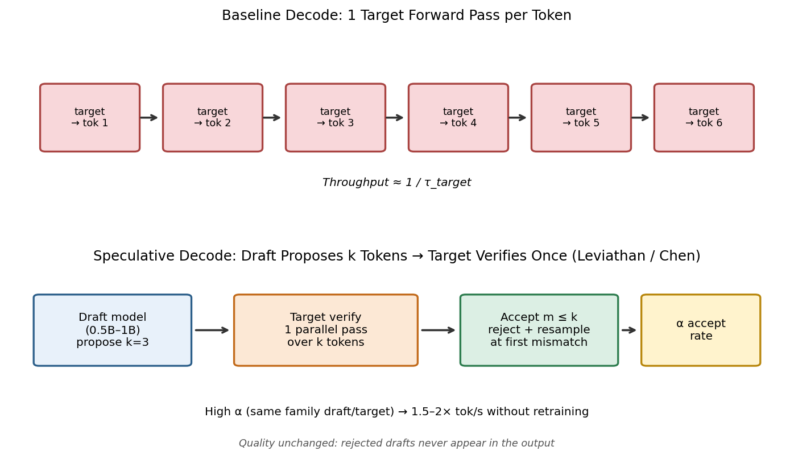
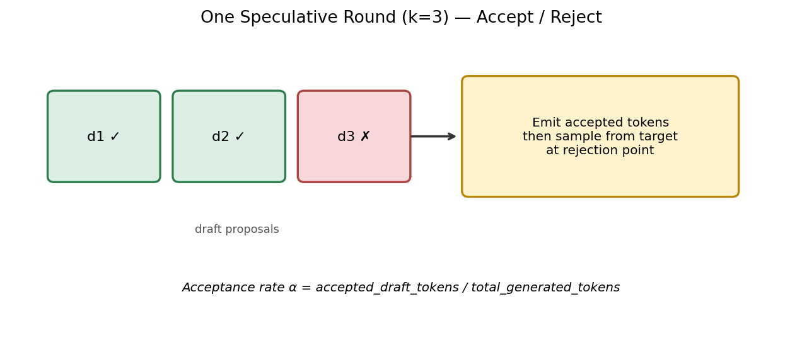
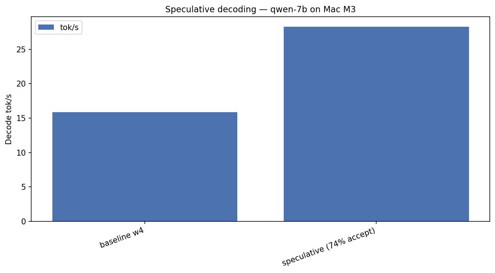
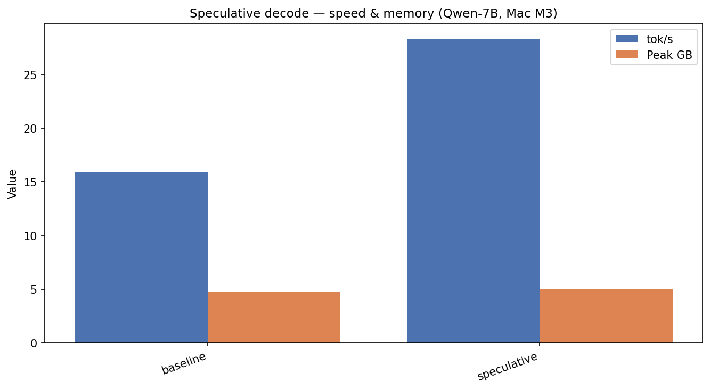
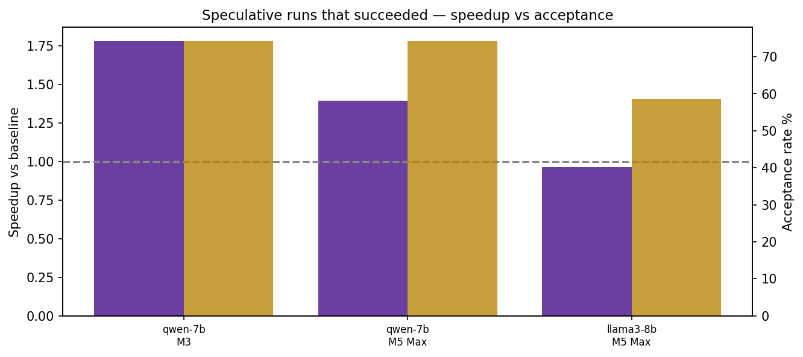

# Draft Models: Free Speed Without Retraining — Until Acceptance Drops

*Part 7 of 7 — Local LLMs on Apple Silicon*

Quantization shrinks weights. Prefill helps TTFT. KV quant insures long context. **Speculative decoding** is a different animal: a small **draft** model proposes several tokens; the large **target** verifies them in one parallel forward pass. When the draft is right, you emit multiple tokens per expensive target step — **without retraining** and **without changing the target’s output distribution** (under the usual rejection-sampling rules).

On a **Mac M3**, Qwen 2.5 7B at w4 went from **15.9 → 28.3 tok/s** (**1.78×**) with acceptance rate **α = 74.2%**, for only ~**0.3 GB** extra memory (draft resident alongside the target).

On a **Mac M5 Max**, the same Qwen pair climbed **122 → 170.3 tok/s** at the same **74.2%** acceptance. Llama 3.1 8B on that machine is the plot twist: baseline **113.5 → speculative 109.7** tok/s at **α = 58.6%** — **slightly slower**. Speculation is not a free +30% badge you slap on every preset.

This article walks the paper workflow, the accept/reject mechanics, deep M3/M5 results (including honest failures), recipes, limitations, and reproduce steps.

---

## Hook: why “another model in RAM” can still be faster

Naive intuition says loading two models must be slower. Speculative decoding bets on a different cost model:

- The **target** forward is expensive (big matmuls, big memory traffic).  
- The **draft** forward is cheap (0.5B–1B class).  
- If the draft’s next-*k* tokens match what the target would have produced, you skip *k−1* target forwards.

When acceptance is high, you amortize one fat verify across several accepted tokens. When acceptance is mediocre, you still pay draft cost + verify cost and may lose.

Part 6 freed ~11 GB by leaving fp16. That headroom is exactly what makes draft+target coexistence realistic on a 24 GB Mac.

> **Fun fact #1:** Google’s speculative decoding work on T5-XXL reported up to **~2–3×** wall-clock speedups with a draft roughly **~15× smaller** and acceptance often **>60%** — without changing the output distribution. The laptop version of that story is what we measure here with mlx-lm.

---

## How it works (Leviathan / Chen → practice)



*Figure 1 — Workflow: baseline decoding runs one target forward per token; speculative decoding lets a cheap draft propose k tokens, then the target verifies the block in one parallel pass.*

### The accept / reject round



*Figure 2 — Workflow: walk draft tokens left-to-right; accept the matching prefix; at the first mismatch, reject the remainder and resample from the target distribution (preserving exact sampling semantics).*

Speedup is roughly governed by three knobs:

| Knob | Meaning | In our harness |
|------|---------|----------------|
| **Acceptance rate α** | Fraction of draft tokens that survive verification | Reported as `draft_accept_rate` |
| **Draft cost** | How cheap proposals are | Qwen 0.5B or Llama 3.2 1B @ 4-bit |
| **Block size k** | Tokens proposed per round | **k = 3** (`num_draft_tokens`) |

Papers to know:

- **Leviathan et al. (2023)** — speculative decoding framing for transformers  
- **Chen et al. (2023)** — speculative sampling / accelerated decoding  
- **Medusa (Cai et al., 2024)** — multi-head drafts attached to the target (different systems tradeoff)  
- **Lookahead / EAGLE-style variants** — alternative draft mechanisms; same economic intuition

We stay close to the classic **external small draft model** path that mlx-lm exposes, because it needs no custom heads — only a compatible tokenizer and enough RAM.

### Exactness (the part people skip)

Done correctly, speculative decoding is not “approximate faster sampling.” Rejected tokens are resampled from the **target**. Accepted tokens are ones the target agrees with under the algorithm’s rules. Quality should match ordinary target decoding; you are buying wall-clock, not “close enough” logits.

### A simple cost model (why α and draft size dominate)

Ignore constants and pretend each target forward costs \(C_t\) and each draft forward costs \(C_d\), with \(C_d \ll C_t\). In baseline decoding, one output token ≈ one \(C_t\).

In speculative mode with block size \(k\), a round roughly costs:

\[
k \cdot C_d + C_t
\]

and yields on average something like \(1 + \alpha (k-1)\) accepted tokens in idealized analyses (exact formulas vary by algorithm variant and where rejection cuts the block). The win condition is intuitive:

- **Raise α** (better draft alignment)  
- **Lower \(C_d / C_t\)** (tinier draft, or a heavier target)  
- **Pick \(k\) sweet spots** — too large and you waste draft work on tokens that will be rejected after the first mismatch  

That is exactly why Qwen 0.5B → Qwen 7B at α=74% sings, while Llama 1B → Llama 8B at α=59% on an already-fast M5 Max baseline can flatline or lose.

### Where speculative decoding sits vs Part 6

| Lever | Changes weights? | Extra resident model? | Typical win condition |
|-------|------------------|------------------------|------------------------|
| Weight quant | Yes | No | Bandwidth-bound decode |
| KV quant | Cache only | No | Large *T* |
| Prefill tuning | No | No | Large prompts / TTFT |
| **Speculative** | No (target) | **Yes (draft)** | High α + cheap draft + long generations |

Speculation spends the RAM you freed in Part 6. If you are still at fp16 8B on a 24 GB box, you often cannot afford the draft without swapping — and swapping destroys the speedup you hoped to buy.

---

## Results: Qwen 7B on Mac M3 (the clean win)

| Mode | Draft | Peak GB | TTFT (ms) | tok/s | α |
|------|-------|---------|----------:|------:|---|
| Baseline w4 | — | **4.72** | 3,613 | **15.9** | — |
| Speculative w4 | Qwen 0.5B @ 4-bit | **5.00** | 2,856 | **28.3** | **74.2%** |



*Figure 3 — Results (Mac M3, Qwen 2.5 7B): speculative decoding reaches **28.3 tok/s** vs **15.9** baseline — **1.78×** — at **74.2%** draft acceptance.*



*Figure 4 — Results (Mac M3, Qwen 7B): large throughput gain for roughly **+0.28 GB** peak (draft weights resident with the target).*

Why this pairing works:

- **Same family** (Qwen 2.5 0.5B → 7B)  
- **Same tokenizer / vocab** (critical — see failures below)  
- **Tiny draft** relative to target  
- **High α** — 74% means most proposed tokens survive, so k=3 is not wishful thinking

### M3 failures: Llama and Mistral speculative runs

| Target | Baseline w4 tok/s | Speculative | What happened |
|--------|------------------:|-------------|---------------|
| Qwen 7B | 15.9 | **28.3** ✅ | Same-family draft, α=74.2% |
| Llama 3.1 8B | 18.8 | ❌ error | Draft vocab **151643** ≠ target vocab **128000** |
| Mistral 7B | 19.1 | ❌ error | Draft vocab **151643** ≠ target vocab **32768** |

On the M3 article sweep, the harness’s default draft wiring pointed at a **Qwen** draft for runs that needed Llama/Mistral tokenizers. Speculative decoding fails fast with a clear error rather than silently emitting garbage — good. The lesson is operational: **draft and target must share a tokenizer**, not merely “be small.”

**Capacity lesson:** budget **~5–6 GB** for a 7–8B w4 target + 0.5–1B w4 draft. The optimized stack from Part 6 is what makes that realistic on 24 GB.

---

## M3 vs M5 Max: when speculation scales — and when it backfires


*Figure 5 — Results: Qwen-7B baseline vs speculative on Mac M3 and Mac M5 Max — both chips see a clear win at α≈74%; absolute rates differ by nearly an order of magnitude.*

| Hardware | Model | Baseline tok/s | Spec tok/s | α | Verdict |
|----------|-------|---------------:|-----------:|---|---------|
| **M3** | Qwen 7B | 15.9 | **28.3** | 74.2% | **+78%** ✅ |
| **M5 Max** | Qwen 7B | 122.0 | **170.3** | 74.2% | **+40%** ✅ |
| **M5 Max** | Llama 8B | 113.5 | **109.7** | 58.6% | **−3%** ⚠️ |
| **M3** | Llama 8B | 18.8 | — | — | tokenizer mismatch ❌ |
| **M3 / M5** | Mistral 7B | 19.1 / ~ok baseline | — | — | M3 vocab mismatch; M5 **no 4-bit draft repo mapped** ❌ |

### The Llama-on-M5 plot twist (read this twice)

On M5 Max, Llama 3.1 8B *did* run with a proper same-family draft (**Llama 3.2 1B**). Acceptance landed at **58.6%** — not terrible, not great. Throughput went **113.5 → 109.7 tok/s**. Slightly **slower**.

Why that can happen even with “working” speculation:

1. **α too low for the draft tax.** At ~59% acceptance with k=3, you often verify blocks that partially collapse; draft forwards are not free.  
2. **Baseline is already very fast.** At 110+ tok/s, the relative room for amortization shrinks; overheads show up as red ink.  
3. **Draft is 1B, not 0.5B.** Llama’s paired draft is heavier than Qwen’s 0.5B buddy — more proposal cost per round.  
4. **Memory rose** from **5.11 → 5.98 GB** — expected, but a reminder you are paying RAM either way.



*Figure 6 — Results: speculative speedup versus draft acceptance — Qwen’s ~74% acceptance correlates with clear wins; Llama’s ~59% acceptance on M5 lands near break-even / slight regression.*

**Portable rule of thumb from these runs:**

- **α ≳ 70%** with a *tiny* same-family draft → strong candidate  
- **α ~ 55–60%** on an already-fast target → measure; do not assume a win  
- **Wrong tokenizer** → hard error (good)  
- **Missing draft mapping** → hard error (also good; fix `DRAFT_PRESET_BY_TARGET`)

> **Fun fact #2:** The *same* α (**74.2%**) appears for Qwen on M3 and M5 in our runs — acceptance is largely a **model-pair / prompt / sampling** property, while absolute tok/s is a **hardware** property. That split is why you can debug α on a smaller machine and still trust the qualitative go/no-go.

> **Fun fact #3:** Speculative decoding can improve **TTFT** in some setups (M3 Qwen: 3,613 → 2,856 ms) even though the algorithm’s reputation is about decode. Treat TTFT moves as workload-specific; do not market them as the primary claim.

---

## Practical tips (the checklist we wish we had day one)

| ✅ Do | ❌ Don’t |
|------|---------|
| Same family draft/target | Cross-architecture “whatever is small” |
| Same tokenizer / vocab size | Ignore vocab mismatch errors |
| Tiny draft (0.5B–1B) @ 4-bit | Draft nearly as large as target |
| Long generations (amortize verify) | Expect miracles on 20-token replies |
| Log `draft_accept_rate` every run | Ship speculative blind because a paper said 2× |
| Keep Part 6 memory headroom | Run draft+target on a machine already swapping |
| Prefer speculation when baseline < ~40 tok/s *or* α is excellent | Force it on 110+ tok/s baselines with mediocre α |

### Suggested defaults

```text
Best demo pair:   Qwen 7B target + Qwen 0.5B draft @ w4
k:                3 (start here; tune only after measuring α)
Memory budget:    ~5.0–6.0 GB combined on 7–8B class
Kill switch:      if α < ~0.60 on a fast Mac, A/B carefully
```

```bash
./scripts/run_article.sh 6 "Mac M3"
./scripts/run_article.sh 6 "Mac M5 Max"

python scripts/run_benchmark.py --preset qwen-7b --config w4 \
  --speculative --hardware "Mac M3"

python scripts/run_benchmark.py --preset qwen-7b --config w4 \
  --speculative --hardware "Mac M5 Max"
```

Inspect JSON fields:

- `benchmark_mode: "speculative"`
- `draft_model_repo`, `draft_preset`
- `num_draft_tokens`
- `draft_accept_rate`
- `throughput_tps`, `memory_gb`, `ttft_ms`
- `status` / `error` on failures

---

## Recipes by goal

### “I want the Medium headline speedup”

```text
Hardware:  M3 or M5 Max
Target:    qwen-7b @ w4
Draft:     qwen-0.5b @ w4
Expect:    M3 ~28 tok/s (from ~16); M5 ~170 tok/s (from ~122)
Watch:     α ≈ 74%
```

### “I run Llama daily on M5 Max”

```text
Measure first with Llama 3.2 1B draft
Our result: 113.5 → 109.7 tok/s at α=58.6%
Default advice: keep baseline w4; do not enable speculative for speed
Revisit if you change k, draft size, or sampling
```

### “Mistral speculative”

```text
M3: failed on vocab mismatch when draft was Qwen-tokenizer
M5: failed — no 4-bit draft repo mapped in DRAFT_PRESET_BY_TARGET
Fix path: wire a Mistral-family draft with matching tokenizer, then re-bench
Until then: do not claim a Mistral speculative number
```

### “Combine with the Part 6 stack?”

Speculative decoding is orthogonal to weight/KV/prefill in *concept*, but not free in *RAM*. On 24 GB:

1. Stay on **w4** target (required headroom)  
2. Add draft only after the target alone is stable  
3. Treat `w4+kv+prefill+speculative` as an integration test, not an assumed free multiply

### Tuning \(k\) without folklore

We fixed **\(k=3\)** for comparability. If you experiment:

| Direction | When it might help | Risk |
|-----------|--------------------|------|
| Raise \(k\) | Very high α, long answers, extremely cheap draft | More wasted draft tokens after early reject |
| Lower \(k\) | Mediocre α, heavier draft | Less amortization per verify |
| Keep \(k=3\) | Default until you have α histograms | — |

Always log acceptance **and** end-to-end tok/s. Optimizing α alone can hide a draft that is too expensive.

### Sampling settings matter more than people admit

Temperature, top-p, and constrained decoding change how often a small draft agrees with the target. A draft that looks brilliant on greedy/low-temperature factual prompts can look average on creative high-temperature chat. If you ship speculative decoding in a product, **measure α on your real traffic mix**, not only on the harness’s synthetic generation.

---

## Limitations

1. **Not all presets win.** Llama-on-M5 is an existence proof of a measured regression.  
2. **Tokenizer equality is non-negotiable.** Vocab mismatch is a hard stop.  
3. **Draft availability is ecosystem work.** Mistral’s M5 failure was configuration/mapping, not metaphysics.  
4. **α depends on prompt & sampling.** Our α is for the harness’s generation settings; chatty creative sampling can differ.  
5. **Short replies under-amortize.** Speculative economics love long token streams.  
6. **Two-model resident set.** Plan +0.3–1.0 GB depending on draft size.  
7. **Medusa / EAGLE not measured here.** Different engineering tradeoffs; do not conflate numbers.  
8. **Quality claims need the exact algorithm.** If a runtime cuts corners on rejection sampling, “same distribution” may not hold — verify against your stack’s docs.

---

## How to reproduce

```bash
# Full article 6 suite
./scripts/run_article.sh 6 "Mac M3"
./scripts/run_article.sh 6 "Mac M5 Max"

# Focused Qwen A/B
python scripts/run_benchmark.py --preset qwen-7b --config w4 --hardware "Mac M3"
python scripts/run_benchmark.py --preset qwen-7b --config w4 --speculative --hardware "Mac M3"

# Llama on M5 (the regression case)
python scripts/run_benchmark.py --preset llama3-8b --config w4 --hardware "Mac M5 Max"
python scripts/run_benchmark.py --preset llama3-8b --config w4 --speculative --hardware "Mac M5 Max"

# Plots
python scripts/plot_medium_charts.py --hardware "Mac M3"
python scripts/plot_medium_charts.py --hardware "Mac M5 Max"
python scripts/plot_medium_diagrams.py
```

Raw JSON:

- `results/Mac_M3/article_06_speculative-decoding/`
- `results/Mac_M5_Max/article_06_speculative-decoding/`

---

## Series wrap-up

1. **Unified memory** sets the hard ceiling  
2. **Weight quant** → multi× decode at w4  
3. **KV quant** → long-context insurance  
4. **Prefill** → TTFT at scale  
5. **Model ladder** → 0.5B–70B fit decisions  
6. **Full stack** → `w4+kv_cache+prefill` as the product preset  
7. **Speculative decode** → draft speedup when α cooperates  

**Bonus next:** [Context length, workloads, and prefix KV cache](07-context-and-cache.md) — where RAG turns TTFT into a 30-second wall on M3.

Repo: [LLM-Inference](https://github.com/Chirumamilla1522/LLM-Inference)

---

## References

1. Leviathan et al., *Fast Inference from Transformers via Speculative Decoding* (2023) — [arXiv:2211.08920](https://arxiv.org/abs/2211.08920)  
2. Chen et al., *Accelerating Large Language Model Decoding with Speculative Sampling* (2023) — [arXiv:2302.01318](https://arxiv.org/abs/2302.01318)  
3. Cai et al., *Medusa: Simple LLM Inference Acceleration Framework with Multiple Decoding Heads* (2024) — [arXiv:2401.10774](https://arxiv.org/abs/2401.10774)  
4. Li et al., *EAGLE: Speculative Sampling Requires Rethinking Feature Uncertainty* (2024) — [arXiv:2401.15077](https://arxiv.org/abs/2401.15077)  
5. Stern et al., *Blockwise Parallel Decoding for Deep Autoregressive Models* (2018) — [arXiv:1811.03115](https://arxiv.org/abs/1811.03115)  
6. Xia et al., *Speculative Decoding: Exploiting Speculative Execution for Accelerating Seq2seq Generation* (survey / related lines) — see community reviews citing Leviathan/Chen  
7. Miao et al., *SpecInfer: Accelerating Generative LLM Serving with Tree-based Speculative Inference and Verification* (2023) — [arXiv:2305.09781](https://arxiv.org/abs/2305.09781)  
8. mlx-lm speculative generation APIs — [github.com/ml-explore/mlx-lm](https://github.com/ml-explore/mlx-lm)  
9. Apple MLX — [github.com/ml-explore/mlx](https://github.com/ml-explore/mlx)  
10. Qwen2.5 Technical Report — Alibaba / Qwen team publications  
11. Llama 3 / 3.1 / 3.2 model cards — Meta  
12. LLM-Inference harness & JSON — [github.com/Chirumamilla1522/LLM-Inference](https://github.com/Chirumamilla1522/LLM-Inference)  

---

**← Previous:** [Part 6 — Full Optimization Stack](05-full-optimization-stack.md) · **Bonus →** [Context & Cache](07-context-and-cache.md)

**Series:** [00 Intro](00-introduction.md) · [01 Weights](01-weight-quantization.md) · [02 KV](02-kv-cache-quantization.md) · [03 Prefill](03-prefill-and-ttft.md) · [04 Ladder](04-model-size-ladder.md) · [05 Stack](05-full-optimization-stack.md) · **06 Speculative** · [07 Context & Cache](07-context-and-cache.md)

**Tags:** `LLM` `Speculative Decoding` `Inference` `Apple Silicon` `Performance` `MLX`
