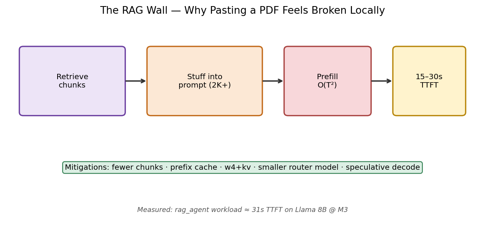
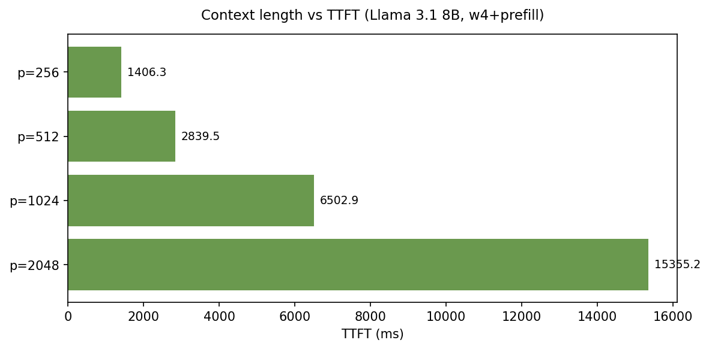
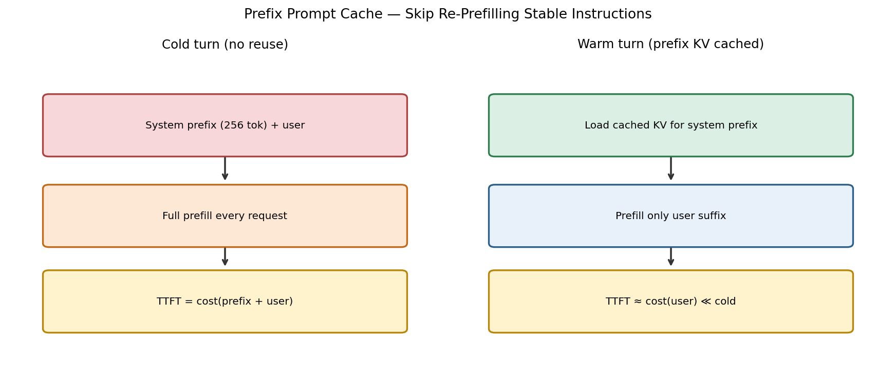
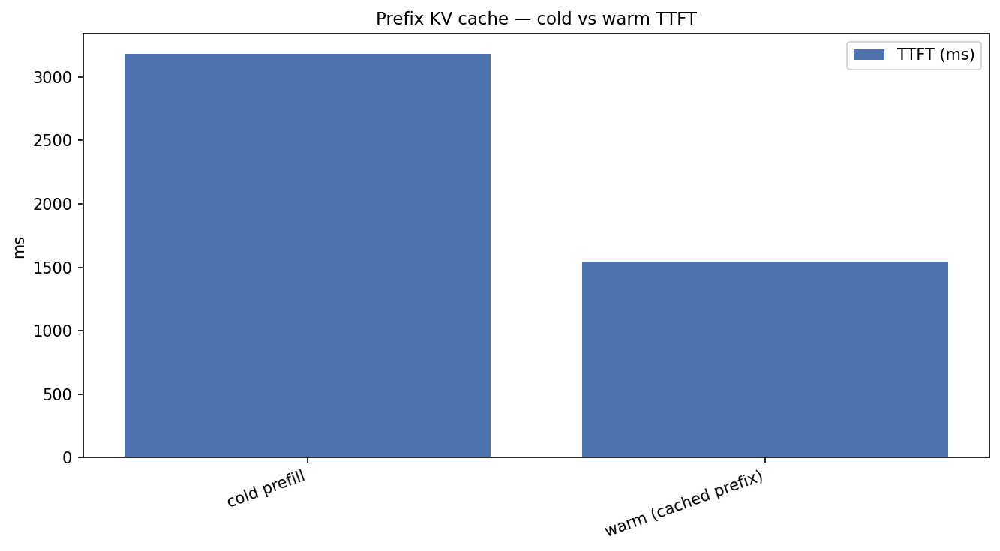
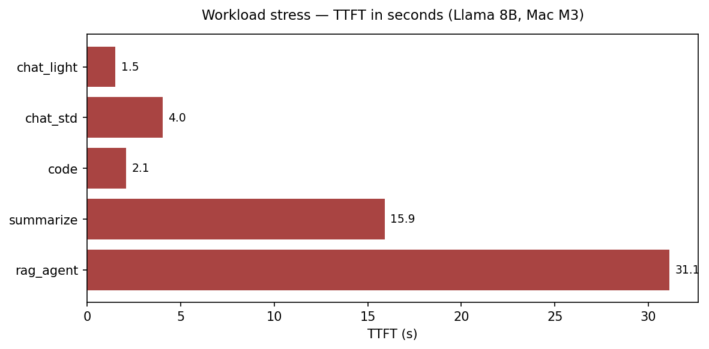
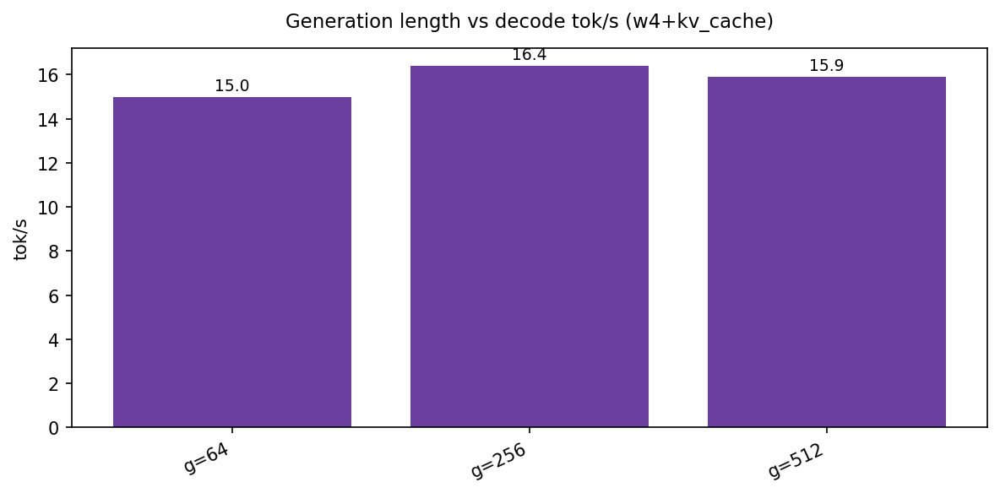

# The RAG Wall: Context Length, KV Growth, and Prefix Caching on Apple Silicon

*Bonus — Local LLMs on Apple Silicon*

Short prompts hide a lot of sins. A 128-token chat turn on Llama 3.1 8B @ w4 looks fine on a Mac M3: about **1.5 s** to first token and mid-teens tok/s. Paste a retrieval stack’s worth of chunks into the same model and three forces collide at once:

1. **Prefill** work grows roughly **super-linearly / ~quadratically** with context length *T* (attention over the prompt)  
2. **KV memory** grows **linearly** with *T* (and with generation length)  
3. **Decode tok/s** slowly decays as each step attends over a longer cache  

On M3 with Llama 3.1 8B, our `rag_agent` workload — **4096 prompt tokens**, medium generation — hit **TTFT ≈ 31.1 seconds**. That is not “a bit laggy.” That is an abandoned session. The same workload on **Mac M5 Max** lands near **1.5 s** TTFT — still the worst row in the matrix, but in a different usability universe.

This bonus article is the systems view after Parts 1–7: context sweeps, prefix KV cache cold/warm, generation-length effects, workload stress panels, M3 vs M5 analysis, mitigation recipes, limitations, and reproduce commands.

---

## Hook: interactive UX dies at prefill, not at “tok/s”

Product dashboards love decode throughput. Users feel **time-to-first-token**. A model that streams at 20 tok/s after a **15–30 s** blank stare loses to a smaller model that answers in 1 s — even if the smaller model’s tok/s chart looks worse.

Local RAG on laptops is where this mismatch becomes existential. Retrievers cheerfully return 10–20 chunks. Prompt templates wrap them in instructions. Suddenly you are prefilling 2K–4K tokens on a bandwidth- and memory-sensitive device.

> **Fun fact #1:** Cloud API pricing for long context partly reflects **super-linear prefill cost** and cache economics — you pay for attention over retrieved tokens unless a provider’s **prefix / prompt cache** absorbs repeated prefixes. The laptop version of that bill is paid in seconds of TTFT and gigabytes of KV.

---

## The RAG wall (workflow)



*Figure 1 — Workflow: retrieve → stuff 2K+ tokens into the prompt → pay O(T²)-ish prefill → watch TTFT climb into the tens of seconds on M3-class hardware.*

What “the wall” means operationally:

| Stage | What grows | User-visible failure |
|-------|------------|----------------------|
| Retrieve too much | Prompt tokens *T* | Slow first token |
| Prefill | Compute ~ f(T²) | App spinner / watchdog |
| KV build | Memory ~ f(T) | Swap / Jetsam / OOM |
| Decode | Attention over cache | tok/s fade on long answers |

Weight quantization (Part 2) and the full stack (Part 6) still matter — our long-context runs use **w4** recipes — but they do **not** repeal attention’s dependence on *T*.

---

## Results: prompt length vs TTFT (Mac M3, Llama 3.1 8B)

Config: **`w4+prefill`**, Llama 3.1 8B, varying prompt length.

| Prompt tokens | TTFT | Decode tok/s | Peak GB |
|--------------:|-----:|-------------:|--------:|
| 256 | **1.41 s** | 20.3 | 4.92 |
| 512 | **2.84 s** | 20.5 | 5.06 |
| 1024 | **6.50 s** | 14.9 | 5.24 |
| 2048 | **15.36 s** | 11.9 | 5.35 |



*Figure 2 — Results (Mac M3): TTFT climbs from ~1.4 s at 256 tokens to **~15.4 s at 2048** — the interactive cliff for stuffed prompts.*


*Figure 3 — Results (Mac M3): dual-axis view — TTFT explodes while decode tok/s slowly decays as context grows.*

Rough mental math from the table:

- 256 → 512 tokens: TTFT ~**2.0×**  
- 512 → 1024: TTFT ~**2.3×**  
- 1024 → 2048: TTFT ~**2.4×**  

That is much worse than linear in the regime that matters for RAG. Meanwhile decode falls from ~20 tok/s to ~12 tok/s — painful, but secondary to the multi-second (then multi-*ten*-second) wait before streaming starts.

Memory only inches from ~4.9 → 5.4 GB here because weights dominate at 8B w4; the **latency** wall arrives before the **capacity** wall on a 24 GB machine for these lengths. Push *T* higher, add larger models, or run multi-session KV, and capacity joins the fight (Part 3).

---

## Prefix KV cache: cold vs warm system prompts

Many apps resend a **fixed system prompt** (tool instructions, style, safety policy) on every turn, then append a variable user suffix. That repeated prefix is pure waste if you re-prefill it every time.

Split the prompt:

- **Prefix** — stable system / tool text → build KV once, **save**  
- **Suffix** — user turn / retrieved chunks → prefill only what is new (plus continue decoding)



*Figure 4 — Workflow: cold path prefills the full prompt every turn; warm path loads a cached KV for the system prefix and only processes the variable suffix.*

### Mac M3 measurements (Llama 3.1 8B, w4)

| Mode | TTFT |
|------|-----:|
| **Cold** (full prefill) | **3,180 ms** |
| **Warm** (prefix cache hit) | **1,547 ms** |

Warm is ~**51% faster** (~**2.06×** improvement on TTFT for this harness shape).



*Figure 5 — Results (Mac M3): cold vs warm prefix-cache TTFT — reusing system-prompt KV cuts first-token latency roughly in half in this test.*

MLX / mlx-lm surface this via prompt-cache save/load helpers (`save_prompt_cache` / `load_prompt_cache`). Harness flag: **`--prefix-cache`**. JSON fields: `prefix_cache_cold_ttft_ms`, `prefix_cache_warm_ttft_ms`.

### Mac M5 Max contrast

On M5 Max the same style of measurement shows cold **~166 ms** vs warm **~154 ms** — a small absolute delta because baseline prefill is already fast. Prefix cache still matters architecturally (multi-tenant servers, huge system prompts, tool schemas), but **M3 feels the win as UX; M5 often feels it as headroom.**

> **Fun fact #2:** Provider-side “prompt caching” products are the datacenter cousin of this idea. The laptop lesson is identical: **bytes you already attended over should not be attended over again** if the prefix is byte-stable.

---

## Workload stress matrix (Mac M3)

Config baseline for workloads: **`w4+kv_cache+prefill`** (the Part 6 product preset).

| Workload | Primary stress | Prompt | Gen | TTFT | tok/s | Peak GB |
|----------|----------------|-------:|----:|-----:|------:|--------:|
| chat_light | decode | 128 | 64 | **1.52 s** | 13.5 | 4.74 |
| complete_code | decode | 256 | 512 | 2.07 s | 17.3 | 4.92 |
| chat_standard | balanced | 512 | 128 | 4.03 s | 13.4 | 5.06 |
| random_baseline | balanced | 512 | 128 | 3.91 s | 14.0 | 5.06 |
| summarize_long | prefill | 2048 | 128 | **15.90 s** | 10.2 | 5.35 |
| **rag_agent** | memory / prefill | **4096** | 256 | **31.12 s** | 11.3 | 6.10 |



*Figure 6 — Results (Mac M3): workload TTFT panel — `rag_agent` (~31 s) and `summarize_long` (~16 s) dominate; light chat stays near ~1.5 s.*

**How to read this without false comfort:**

- **chat_light** is what demo GIFs show.  
- **summarize_long** is a single long document — already past casual interactive tolerance on M3.  
- **rag_agent** is “retrieve a pile + generate” — the wall. 31 s TTFT means you need **chunking, reranking, map-reduce, or a remote prefill tier** — not a pep talk about tok/s.

Decode rates across workloads stay in a band (~10–17 tok/s). The product crisis is **TTFT dispersion**, not decode dispersion.

---

## Generation length: the quieter decay

Holding prompt fixed (~512) and stretching generation under **`w4+kv_cache`**:

| Gen tokens | TTFT (ms) | tok/s | Peak GB |
|-----------:|----------:|------:|--------:|
| 64 | 3,737 | 15.0 | 5.06 |
| 256 | 3,768 | 16.4 | 5.06 |
| 512 | 3,616 | 15.9 | 5.06 |



*Figure 7 — Results (Mac M3): generation-length sweep under w4+kv_cache — decode throughput wobbles modestly as KV grows; this is a slow bleed, not the RAG cliff.*

Takeaway: **long answers matter**, especially without KV quant and at much larger *T*, but they are not what makes RAG feel broken on first paint. Prefill length is the villain of this article; generation length is the supporting antagonist.

---

## M3 vs M5 Max: same walls, different heights


*Figure 8 — Results: context-length panels on Mac M3 vs Mac M5 Max — both show rising TTFT with *T*, but M5 Max keeps even 2048-token prefills in the sub-second to ~0.6 s regime.*

### Context sweep comparison (Llama 3.1 8B, w4+prefill)

| Prompt | M3 TTFT | M5 TTFT | M3 tok/s | M5 tok/s |
|-------:|--------:|--------:|---------:|---------:|
| 256 | 1.41 s | **0.10 s** | 20.3 | 114.5 |
| 512 | 2.84 s | **0.16 s** | 20.5 | 114.5 |
| 1024 | 6.50 s | **0.29 s** | 14.9 | 111.0 |
| 2048 | 15.36 s | **0.62 s** | 11.9 | 109.4 |

### Workload TTFT comparison


*Figure 9 — Results: workload TTFT panels across Mac M3 and Mac M5 Max — `rag_agent` drops from ~31 s to ~1.5 s; relative ranking of workloads stays similar.*

| Workload | M3 TTFT | M5 TTFT | M5 tok/s (approx) |
|----------|--------:|--------:|------------------:|
| chat_light | 1.52 s | **0.07 s** | ~111 |
| chat_standard | 4.03 s | **0.17 s** | ~109 |
| complete_code | 2.07 s | **0.11 s** | ~108 |
| summarize_long | 15.90 s | **0.62 s** | ~107 |
| **rag_agent** | **31.12 s** | **1.51 s** | ~104 |

**Interpretation:**

- **M5 Max does not delete the RAG wall; it moves it.** 1.5 s for a 4K-token agent prompt is usable-ish; 31 s is not.  
- **Relative ordering is stable.** Light chat ≪ summarize ≪ rag_agent on both chips.  
- **Decode on M5 stays ~100+ tok/s** even on heavy workloads — streaming feels instant *after* first token.  
- **Prefix cache absolute savings shrink on M5** for moderate prefixes; still design for it if system prompts are huge or multi-user.

> **Fun fact #3:** A ~**20×** TTFT gap on `rag_agent` (31.1 s → 1.5 s) between M3 and M5 Max is larger than many model-swap gains. Hardware tier and retrieval discipline can dominate “which 7B checkpoint” arguments for RAG UX.

> **Fun fact #4:** Peak memory for `rag_agent` only rose to ~**6.1 GB** on M3 — still fine on 24 GB — while TTFT became unusable. **Latency fails before capacity** in this band; do not wait for OOM to notice your RAG design is wrong.

---

## Mitigation checklist (what actually moves TTFT)

| Lever | How | Fixes | Notes |
|-------|-----|-------|-------|
| **Retrieve less** | top-3 not top-20; rerank | TTFT | Highest ROI, model-agnostic |
| **Map-reduce / hierarchical summarize** | summarize chunks, then synthesize | TTFT + quality control | Extra calls, lower peak *T* |
| **Prefix cache** | `--prefix-cache` / mlx-lm save-load | Repeated system prompts | Needs byte-stable prefix |
| **KV quant** | `w4+kv_cache` | Long-*T* memory | Insurance as sessions grow |
| **Smaller router model** | 0.5B–1.5B for easy queries | TTFT on trivial turns | Escalate hard queries |
| **Speculative decode** | draft model (Part 7) | Long *answers* | Does not repeal 4K prefill |
| **Faster silicon** | M5-class | Everything | Budget; still retrieve less |
| **Chunk streaming UX** | show retrieval progress | Perceived latency | Does not cut compute |

### Anti-patterns

- Stuffing “maybe useful” chunks because context windows are advertised as 128K  
- Measuring only decode tok/s on 256-token prompts, then shipping RAG  
- Rebuilding the same 2K system+tool prefix every turn with no cache  
- Assuming w4 alone makes 4K prefill feel like chat  

---

## Recipes

### Local chat assistant (24 GB M3)

```text
Model:   llama3-8b @ w4+kv_cache+prefill
Context: keep turns short; summarize history
Cache:   prefix-cache for stable system prompt
Expect:  ~1.5–4 s TTFT on light/standard chat
```

### Local RAG on M3 (be strict)

```text
Retrieve:  rerank to ≤1–2K tokens of evidence when possible
Avoid:     naive 4K stuffed prompts (≈31 s TTFT in our rag_agent)
Pattern:   map-reduce over chunks OR narrower retrieval
Optional:  smaller model for draft answers / routing
```

### Local RAG on M5 Max

```text
Headroom:  4K prompts ~1.5 s TTFT in our harness — usable with good UX
Still do:  retrieve less; prefix-cache big tool schemas
Enjoy:     ~100+ tok/s streaming after first token
```

### Reproduce commands

```bash
./scripts/run_article.sh 7 "Mac M3"
./scripts/run_article.sh 7 "Mac M5 Max"

# Context length points
python scripts/run_benchmark.py --preset llama3-8b --config w4+prefill \
  --hardware "Mac M3"   # article runner varies prompt sizes via labels

# Prefix cache
python scripts/run_benchmark.py --preset llama3-8b --config w4 \
  --prefix-cache --hardware "Mac M3"

# Plots
python scripts/plot_medium_charts.py --hardware "Mac M3"
python scripts/plot_medium_charts.py --hardware "Mac M5 Max"
python scripts/plot_medium_diagrams.py
```

JSON directories:

- `results/Mac_M3/article_07_context-and-cache/llama3-8b/`
- `results/Mac_M5_Max/article_07_context-and-cache/llama3-8b/`

Look for `ctx_p*`, `gen_g*`, `prefix_cache`, `wl_*` run labels; fields `ttft_ms`, `throughput_tps`, `memory_gb`, `prompt_tokens`, `prefix_cache_*`.

---

## Limitations

1. **Harness prompts ≠ your production templates.** Absolute TTFT depends on tokenizer, template tokens, and true byte length.  
2. **Attention implementations change constants.** FlashAttention-style kernels and GQA change slope, not the qualitative wall.  
3. **Prefix cache requires identical prefixes.** One floating timestamp in the system prompt and you silently miss.  
4. **M5 numbers are not a license to stuff context.** They raise the ceiling; retrieval quality still wins.  
5. **We emphasize TTFT here.** End-to-end agent latency also includes retrieval, rerank, tool calls, and multi-step control flow.  
6. **Generation-length effects are mild in this window.** Much longer generations / larger models will stress KV harder (revisit Part 3).  
7. **Single-model study focus (Llama 3.1 8B).** Other families should rhyme, not clone, these exact milliseconds.

---

## How this bonus fits the series

Parts 1–7 optimized the engine: memory, weights, KV, prefill, model size, stacked presets, speculative drafts. This article answers the product question those wins cannot dodge alone:

> **What happens when the prompt stops being short?**

On M3, the honest answer is: **RAG will expose you.** On M5 Max, you get a second chance — still earned by retrieval discipline, caching, and workload-aware defaults.

---

## References

1. Dao et al., *FlashAttention: Fast and Memory-Efficient Exact Attention with IO-Awareness* (2022) — [arXiv:2205.14135](https://arxiv.org/abs/2205.14135)  
2. Dao, *FlashAttention-2: Faster Attention with Better Parallelism and Work Partitioning* (2023) — [arXiv:2307.08691](https://arxiv.org/abs/2307.08691)  
3. Ainslie et al., *GQA: Training Generalized Multi-Query Transformer Models from Multi-Head Checkpoints* (2023) — [arXiv:2305.13245](https://arxiv.org/abs/2305.13245)  
4. Shazeer, *Fast Transformer Decoding: One Write-Head is All You Need* (MQA, 2019) — [arXiv:1911.02150](https://arxiv.org/abs/1911.02150)  
5. Kwon et al., *Efficient Memory Management for Large Language Model Serving with PagedAttention* (2023) — [arXiv:2309.06180](https://arxiv.org/abs/2309.06180)  
6. Pope et al., *Efficiently Scaling Transformer Inference* (2022) — [arXiv:2211.05102](https://arxiv.org/abs/2211.05102)  
7. Vaswani et al., *Attention Is All You Need* (2017) — [arXiv:1706.03762](https://arxiv.org/abs/1706.03762)  
8. Lewis et al., *Retrieval-Augmented Generation for Knowledge-Intensive NLP Tasks* (2020) — [arXiv:2005.11401](https://arxiv.org/abs/2005.11401)  
9. Izacard & Grave, *Leveraging Passage Retrieval with Generative Models for Open Domain QA* (2021) — [arXiv:2007.01282](https://arxiv.org/abs/2007.01282)  
10. mlx-lm prompt cache APIs — [github.com/ml-explore/mlx-lm](https://github.com/ml-explore/mlx-lm)  
11. Apple MLX — [github.com/ml-explore/mlx](https://github.com/ml-explore/mlx)  
12. Meta Llama 3.1 model card — context length & instruct formatting notes  
13. LLM-Inference harness & raw JSON — [github.com/Chirumamilla1522/LLM-Inference](https://github.com/Chirumamilla1522/LLM-Inference)  

---

**← Series start:** [Part 1 — Introduction](00-introduction.md) · **← Previous:** [Part 7 — Speculative Decoding](06-speculative-decoding.md)

**Series:** [00 Intro](00-introduction.md) · [01 Weights](01-weight-quantization.md) · [02 KV](02-kv-cache-quantization.md) · [03 Prefill](03-prefill-and-ttft.md) · [04 Ladder](04-model-size-ladder.md) · [05 Stack](05-full-optimization-stack.md) · [06 Speculative](06-speculative-decoding.md) · **07 Context & Cache**

**Tags:** `LLM` `RAG` `Context Window` `KV Cache` `Caching` `Apple Silicon` `Latency` `MLX`
