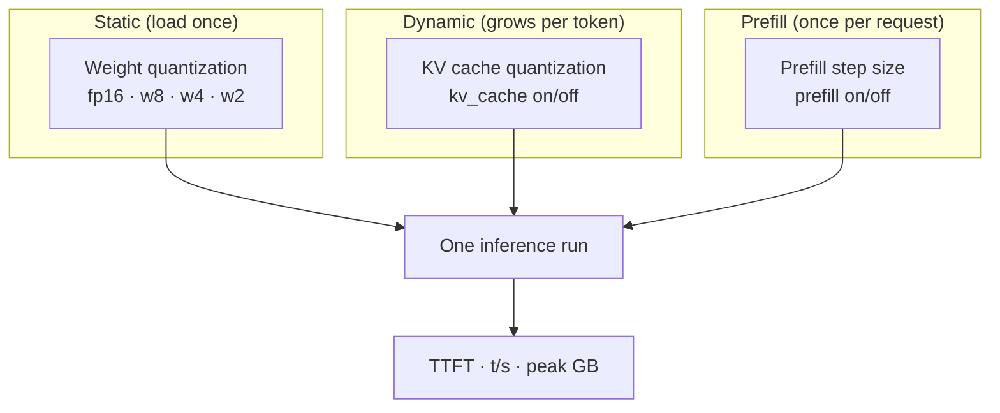
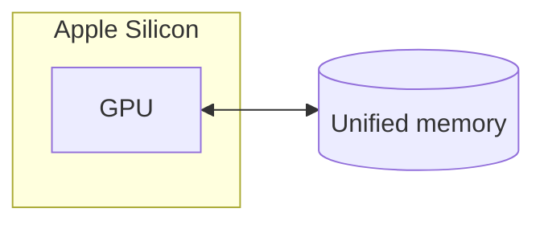
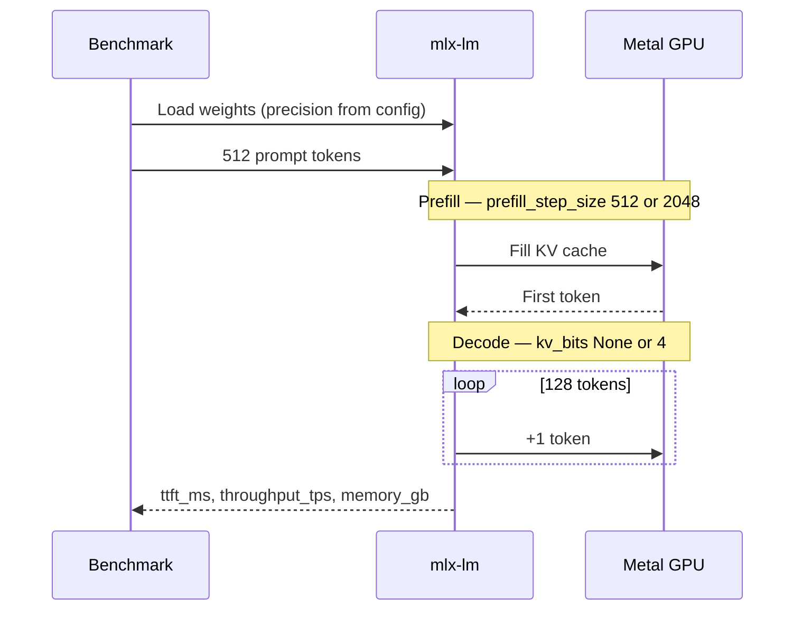
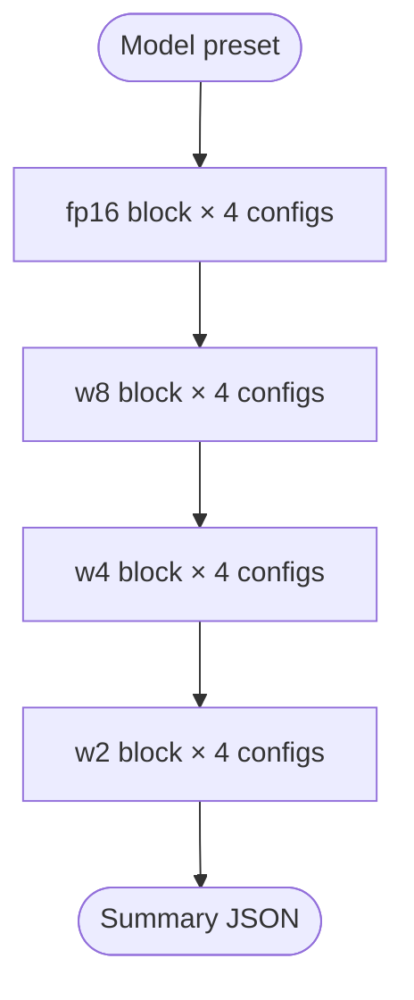
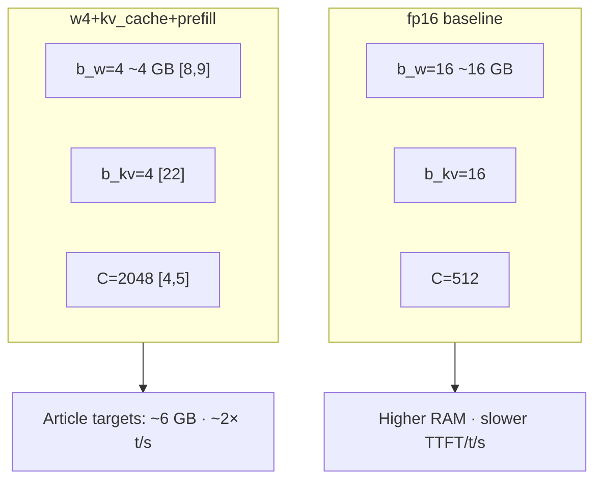
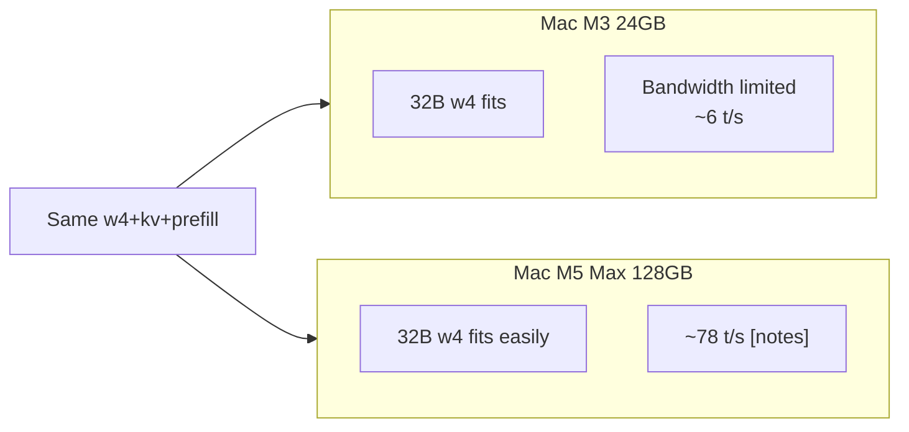

# All optimizations together

How **weight quantization**, **KV cache quantization**, and **prefill tuning** stack in local LLM inference—and how this repository benchmarks them as a system.

## Individual deep dives

| Technique | Document |
|-----------|----------|
| Weight precision (fp16, w8, w4, w2) | [weight-quantization.md](weight-quantization.md) |
| KV cache quantization | [kv-cache-quantization.md](kv-cache-quantization.md) |
| Prefill / Flash-style attention | [prefill-and-flash-attention.md](prefill-and-flash-attention.md) |

---

## The three layers



| Layer | What it shrinks or speeds up | When it applies |
|-------|---------------------------|-----------------|
| **Weights** | Checkpoint size, decode bandwidth | Load + every token |
| **KV cache** | Growing K/V memory | After prefill, each decode step |
| **Prefill** | Prompt processing time | Before first token |

None of these replace the others—they address different bottlenecks.

**Math vs code for each layer:** [math-and-implementation.md](math-and-implementation.md)

---

## Combined memory model (equations)

Peak unified memory can be estimated as:

$$
M_{\text{peak}} \approx \underbrace{\frac{N \cdot b_w}{8}}_{\text{weights}} + \underbrace{2 L H_{\text{kv}} T \cdot D \cdot \frac{b_{\text{kv}}}{8}}_{\text{KV cache}} + M_{\text{overhead}}
$$

where \(T = T_{\text{prompt}} + T_{\text{gen}}\) (flags `-p` and `-g`).

### Capstone config: `w4+kv_cache+prefill`

| Term | Article | Typical 8B value |
|------|---------|------------------|
| \(b_w = 4\) | [Weight quant](weight-quantization.md) | ~4 GB weights |
| \(b_{\text{kv}} = 4\) | [KV quant](kv-cache-quantization.md) | ~21 MB KV at \(T{=}640\) |
| Large \(C = 2048\) | [Prefill](prefill-and-flash-attention.md) | Lower TTFT at long \(T_{\text{prompt}}\) |

Compare to `fp16` baseline (\(b_w=16\), \(b_{\text{kv}}=16\), \(C=512\)):

$$
\frac{M_{\text{weights,fp16}}}{M_{\text{weights,w4}}} \approx \frac{16}{4} = 4\times \text{ smaller}
$$

Article [notes.md](../../notes.md) table (M3, Llama 8B): ~16.2 GB → ~5.8 GB, TTFT 145 ms → 85 ms, 22 → 48 t/s — consistent with weight bandwidth + capacity effects.

### Programming stack in one run

```python
config = OptimizationConfig(weight_bits=4, kv_cache=True, prefill=True)
# → repo w4, kv_bits=4, prefill_step_size=2048
stream_generate(model, tokenizer, prompt, kv_bits=4, prefill_step_size=2048, max_tokens=128)
```

---

## The problem on Apple Silicon



| Bottleneck | Symptom | Primary lever |
|------------|---------|---------------|
| **Capacity** | OOM, process killed | Weight quant (w4, w2) |
| **Bandwidth** | Low tokens/sec despite “fast GPU” | Weight quant + faster RAM class (M5 Max) |
| **Prefill compute / memory** | High TTFT on long prompts | Prefill / Flash-style kernels |

An **8B fp16** model needs ~16 GB for weights alone; **24 GB** Macs have little headroom. **32B** models need quantization and/or a workstation unless you accept very slow bandwidth-bound decode.

---

## Inference pipeline (both phases)



| Metric | Phase |
|--------|--------|
| **TTFT** | Prefill |
| **Throughput** | Decode |
| **Peak memory** | Whole run (weights + KV + overhead) |

---

## How configs combine

Three **independent axes** in code (`OptimizationConfig`):

```python
weight_bits: 16 | 8 | 4 | 2   # which HF repo
kv_cache: bool                 # kv_bits=4 or None
prefill: bool                  # step_size 2048 or 512
```

**Example labels:**

| Label | Weights | KV quant | Prefill opt |
|-------|---------|----------|-------------|
| `fp16` | fp16 | ✗ | ✗ |
| `w4` | 4-bit | ✗ | ✗ |
| `w4+kv_cache` | 4-bit | ✓ | ✗ |
| `fp16+kv_cache+prefill` | fp16 | ✓ | ✓ |
| `w4+kv_cache+prefill` | “Fully optimized” style | ✓ | ✓ |

Article row **“Optimized (4-bit)”** maps closest to **`w4+kv_cache`** or **`w4+kv_cache+prefill`** depending on how you define the stack.

---

## Benchmark sweep design

**Question:** *What does each lever do alone and in pairs, across every weight level?*

### Order (16 configs per model)

For each **`fp16` → `w8` → `w4` → `w2`**:

1. Weight only  
2. `+kv_cache`  
3. `+prefill`  
4. `+kv_cache+prefill`



### Model lineup (21 presets, smallest → largest)

Run `python scripts/list_models.py` for the full table with Hugging Face repos.

| Tier | Examples | Count |
|------|----------|-------|
| Tiny | `qwen-0.5b` | 1 |
| Very small | `llama-3.2-1b`, `qwen-1.5b`, `gemma-2-2b` | 3 |
| Small | `llama-3.2-3b`, `qwen-3b`, `phi-3-mini`, `phi-3.5-mini` | 4 |
| Medium | `qwen-7b`, `mistral-7b`, DeepSeek R1 7B/8B, `llama3-8b`, `gemma-9b` | 6 |
| Large | `mistral-nemo-12b`, `qwen-14b`, `mistral-small-22b`, `gemma-27b` | 4 |
| XL / XXL | `qwen-35b`, `llama-70b`, `qwen-72b` | 3 |

Presets with **min RAM &gt; 0** require `--include-large` on a 24GB Mac (skipped by default).

### Sweep size

| Machine | Models | Configs each | Total runs |
|---------|--------|--------------|------------|
| 24 GB M3 (default) | 14 small/medium | 16 | **224** |
| 64 GB+ (`--include-large`) | all 21 | 16 | **336** |

### How to read results

1. **Weight effect** — Compare `fp16` vs `w4` at same KV/prefill flags.  
2. **KV effect** — Compare `w4` vs `w4+kv_cache`.  
3. **Prefill effect** — Compare `w4` vs `w4+prefill`.  
4. **Full stack** — Compare `fp16` vs `w4+kv_cache+prefill`.

---

## Metrics

| Field | Meaning |
|-------|---------|
| `ttft_ms` | Time to first token |
| `throughput_tps` | Decode tokens per second |
| `memory_gb` | Peak unified memory via MLX |
| `weight_bits` | 16 / 8 / 4 / 2 |
| `optimizations` | `{ kv_cache, prefill }` flags |

Results path: `results/<hardware>/<preset>/<config-label>.json`

---

## Hardware: M3 vs M5 Max

| | Mac M3 | Mac M5 Max |
|--|--------|------------|
| RAM | 24 GB | 128 GB (article) |
| Bandwidth | ~100 GB/s class | up to ~614 GB/s |
| This repo | Skips qwen-35b by default | `--include-qwen` |

**Patterns from [notes.md](../../notes.md):**

| Scenario | Observation |
|----------|-------------|
| M3 + 8B fp16 | ~16 GB, slower TTFT/t/s |
| M3 + 8B optimized (4-bit + KV) | ~6 GB, ~2× throughput |
| M3 + 32B 4-bit | Fits but ~6 t/s (bandwidth) |
| M5 Max + 32B 4-bit | ~78 t/s (bandwidth headroom) |

Same optimizations; **hardware decides which config is viable**.

---

## Code map

| Concept | File |
|---------|------|
| Repos per bit width | `scripts/optimizations.py` → `DEFAULT_MODEL_REPOS` |
| Config + labels | `OptimizationConfig` |
| Sweep iterator | `iter_sweep_configs()` |
| Runner | `scripts/run_benchmark.py` |
| Memory skip | `config_fits_memory()`, `ESTIMATED_PEAK_GB` |

Example resolution:

```text
w4+kv_cache+prefill
  → repo: …-4bit
  → kv_bits: 4
  → prefill_step_size: 2048
```

---

## Figure — Capstone: baseline vs optimized stack



---

## Figure — M3 vs M5: same config, different bottleneck



Hardware bandwidth [19], [20]; measurements in [notes.md](../../notes.md).

---

## Suggested reading order

1. [Math & programming](math-and-implementation.md) — equations + figures  
2. [Weight quantization](weight-quantization.md) — largest static savings [8], [9]  
3. [KV cache quantization](kv-cache-quantization.md) — dynamic memory [11]  
4. [Prefill & Flash Attention](prefill-and-flash-attention.md) — TTFT [4], [5]  
5. [Benchmark workflow](../BENCHMARK_WORKFLOW.md) — run the sweep  

---

## References

Full numbered bibliography (papers, MLX, repo): **[REFERENCES.md](../REFERENCES.md)**.

Quick links: [1] Transformer · [4][5] FlashAttention · [8][9] quant · [11] GQA · [14] speculative · [21][22] MLX.

---

## Further reading

- [notes.md](../../notes.md) — article and results table  
- [ARTICLES_INDEX.md](../ARTICLES_INDEX.md) — 12-post series
