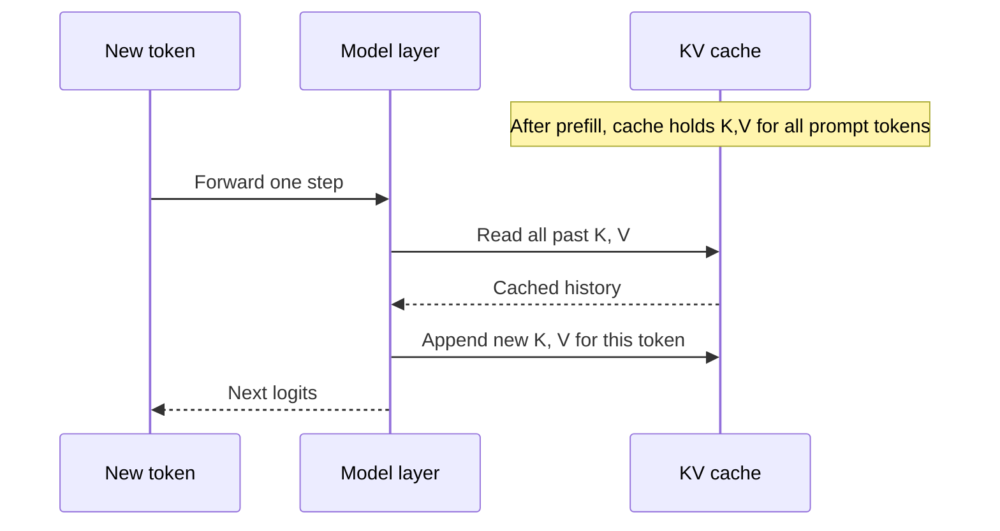
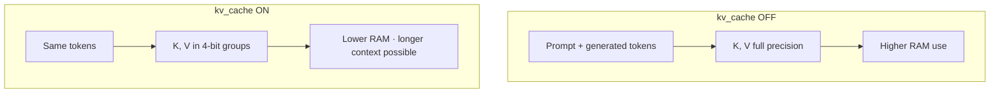
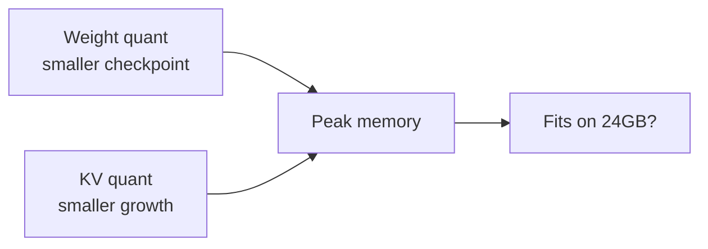

# KV cache quantization

**What it optimizes:** The **key** and **value** tensors stored during autoregressive generation (the cache that grows with each new token).

**Benchmark flag:** `kv_cache` (on/off, combined with any weight precision)

[← Weight quantization](weight-quantization.md) · [All optimizations](all-optimizations.md) · [Prefill →](prefill-and-flash-attention.md)

---

## The problem

After the prompt is processed (**prefill**), the model generates tokens one at a time. For each new token it must attend to **all previous tokens**. Recomputing keys and values for the full history every step would be wasteful.

Instead, transformers **cache** per-layer **K** and **V** tensors.

**KV cache quantization** stores those tensors at lower precision (we use **4-bit** in this repo) while weights may stay at fp16, 8-bit, or 4-bit independently.

---

## Math: cache size and attention

### Scaled dot-product attention (per layer)

For hidden states projected to queries, keys, values:

$$
\mathrm{Attention}(Q, K, V) = \mathrm{softmax}\left(\frac{Q K^\top}{\sqrt{d_h}}\right) V
$$

- \(Q \in \mathbb{R}^{T_q \times d_h}\), \(K, V \in \mathbb{R}^{T_k \times d_h}\)  
- \(T_q\) = query length (often 1 in decode), \(T_k\) = key length (grows with history)

During **decode**, each new token appends one row to \(K\) and \(V\) per layer → sequence length \(T\) increases by 1 per step.

### KV memory formula

$$
M_{\text{KV}} = 2 \cdot L \cdot H_{\text{kv}} \cdot T \cdot D \cdot \frac{b_{\text{kv}}}{8}
$$

| Symbol | Typical Llama 8B |
|--------|------------------|
| \(L\) | 32 layers |
| \(H_{\text{kv}}\) | 8 (GQA may use fewer KV heads than Q heads) |
| \(T\) | prompt + generated tokens |
| \(D\) | 128 head dim |
| \(b_{\text{kv}}\) | 16 (off) or 4 (on in repo) |

**Linear in \(T\):** Doubling generation length doubles KV RAM (weights unchanged).

### Worked example (Article 7 style)

Benchmark defaults: \(T = 512 + 128 = 640\), FP16 KV (\(b_{\text{kv}}=16\)):

$$
M_{\text{KV}} \approx 2 \times 32 \times 8 \times 640 \times 128 \times 2 \approx 84 \text{ MB}
$$

Enable **4-bit KV** (\(b_{\text{kv}}=4\), factor \(\frac{4}{16}=0.25\)):

$$
M_{\text{KV}} \approx 84 \times 0.25 \approx 21 \text{ MB}
$$

Long reply \(T = 512 + 1024 = 1536\), FP16 KV:

$$
M_{\text{KV}} \approx 2 \times 32 \times 8 \times 1536 \times 128 \times 2 \approx 201 \text{ MB}
$$

Same with 4-bit KV ≈ **50 MB** — why Article 2 + Article 7 matter for long `-g`.

### KV quant math (group-wise, same idea as weights)

Each cache entry group stores integer codes with scale \(s_{\text{kv}}\):

$$
\hat{v} = s_{\text{kv}} \cdot (q - z_{\text{kv}}), \quad q \in [0, 2^{b_{\text{kv}}} - 1]
$$

Attention uses \(\hat{K}, \hat{V}\) instead of full FP16—small error, large RAM savings when \(T\) is large.

---

## Programming: cache objects and `kv_bits`

### MLX control path

```python
# scripts/optimizations.py
KV_BITS = 4  # when OptimizationConfig.kv_cache is True

# scripts/run_benchmark.py
gen_kwargs = {"kv_bits": 4, "prefill_step_size": 512, "max_tokens": 128}
stream_generate(model, tokenizer, prompt, **gen_kwargs)
```

Inside `mlx_lm.generate`, `maybe_quantize_kv_cache` calls `cache.to_quantized(group_size=64, bits=kv_bits)` once cache entries are warm enough (`quantized_kv_start`, default 5000 tokens in mlx-lm CLI; benchmark runs are shorter so behavior depends on MLX version and path).

### Bit-level view

| `kv_cache` | Storage per K/V element | Implementation |
|------------|-------------------------|----------------|
| OFF | 2 bytes (FP16/BF16) | `KVCache` full precision |
| ON | ~0.5 bytes (4-bit groups) | `QuantizedKVCache` after `to_quantized` |

This is **runtime** quantization of the **growing** cache—unlike weights, which are pre-quantized at download time in our sweeps.

### Pseudocode: decode with cache append

```python
for token in range(max_tokens):
    k_new, v_new = project_kv(hidden)       # one token
    K_cache.append(k_new)                 # grows T
    V_cache.append(v_new)
    if kv_bits == 4 and cache.ready():
        K_cache, V_cache = quantize_groups(K_cache, V_cache, bits=4)
    logits = attention(q_new, K_cache, V_cache)
    hidden = sample(logits)
```

---

## How attention uses the cache



Without a cache, every decode step would re-run attention over the entire sequence from scratch—unusable for long chats.

---

## What KV quantization does

| Mode | Storage | Memory per cached element |
|------|---------|---------------------------|
| Full precision (off) | FP16/BF16 K and V | 2 bytes per value (typical) |
| Quantized (on) | 4-bit K and V groups | ~0.5 bytes per value (typical) |

MLX applies quantization to cache entries when they exceed a threshold during generation (`to_quantized` on cache objects when `kv_bits` is set).



---

## Why we need it

### 1. Longer context on fixed RAM

Weights are fixed size; the cache **grows** with `prompt_length + generated_length`. Quantizing KV is one of the few ways to stretch context without a smaller model.

### 2. Complements weight quantization

| Layer | What shrinks |
|-------|----------------|
| Weight quant | Static checkpoint size |
| KV quant | Dynamic growth during the session |

Article-style “fully optimized” setups often use **4-bit weights plus efficient KV handling**.

### 3. Decode-phase headroom

Even with 4-bit weights, a 512-token prompt and 128-token generation still allocate substantial cache. KV quant reduces peak memory during the benchmark run.

---

## When it helps most

| Scenario | Benefit |
|----------|---------|
| Long system prompts, RAG chunks | High |
| Multi-turn chat (long history) | High |
| Short prompt, few tokens out | Modest |
| Weight-only OOM | None—fix weights first |

Default benchmark: **512 prompt + 128 generation** tokens—enough to measure an effect without hour-long runs.

---

## How this repository implements it

In `scripts/optimizations.py`:

```python
KV_BITS = 4  # when kv_cache flag is True
```

`stream_generate` call (`scripts/run_benchmark.py`):

```python
# kv_cache OFF
gen_kwargs = {"prefill_step_size": ..., "max_tokens": ...}

# kv_cache ON
gen_kwargs = {..., "kv_bits": 4}
```

Config examples:

| Label | Weights | KV quant |
|-------|---------|----------|
| `fp16` | fp16 | off |
| `fp16+kv_cache` | fp16 | on |
| `w4+kv_cache` | 4-bit | on |
| `w4+kv_cache+prefill` | 4-bit | on + prefill tuning |

KV quant is **orthogonal** to weight level—you can enable it for any `fp16` / `w8` / `w4` / `w2` config.

---

## Interaction with other optimizations



- **Weight quant** lowers the floor (model load size).
- **KV quant** lowers the ceiling growth as tokens accumulate.
- **Prefill chunking** affects how fast the cache is *filled*, not its per-entry width.

---

## Tradeoffs

| Pros | Cons |
|------|------|
| Lower peak memory | Possible small quality loss on very long contexts |
| Enables longer sessions | Benefit smaller on short benchmarks |
| Works with any weight repo | Extra kernel path; behavior depends on MLX version |

---

## Code references

| Item | Location |
|------|----------|
| `KV_BITS` | `scripts/optimizations.py` |
| Flag | `OptimizationConfig.kv_cache` |
| MLX API | `kv_bits` argument to `stream_generate` / `generate_step` |

Underlying MLX behavior: `maybe_quantize_kv_cache` in `mlx_lm.generate` when `kv_bits` is not `None`.

---

## See also

- [Math vs programming overview](math-and-implementation.md)  
- [Weight quantization](weight-quantization.md)  
- [Prefill & Flash Attention](prefill-and-flash-attention.md)  
- [Article 7: context & cache](../articles/07-context-and-cache.md) — `-g` sweeps using this formula  
- [All optimizations together](all-optimizations.md)
