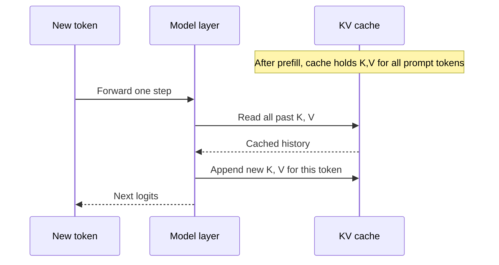
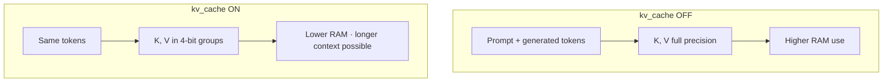
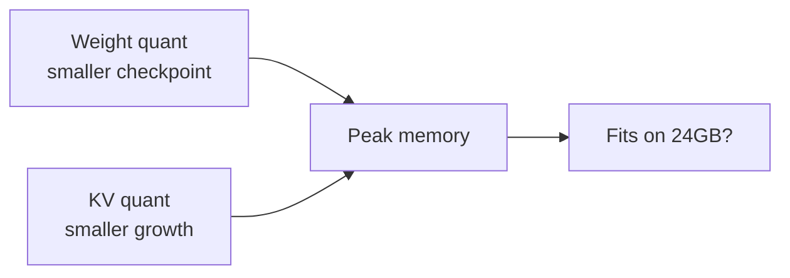

# KV cache quantization

**What it optimizes:** The **key** and **value** tensors stored during autoregressive generation (the cache that grows with each new token).

**Benchmark flag:** `kv_cache` (on/off, combined with any weight precision)

[← Weight quantization](weight-quantization.md) · [All optimizations](all-optimizations.md) · [Prefill →](prefill-and-flash-attention.md)

---

## The problem

After the prompt is processed (**prefill**), the model generates tokens one at a time. For each new token it must attend to **all previous tokens**. Recomputing keys and values for the full history every step would be wasteful.

Instead, transformers **cache** per-layer **K** and **V** tensors. Cache size grows with:

```text
layers × heads × sequence_length × head_dim × precision_bytes
```

For long prompts and long replies, the **KV cache** can exceed weight memory. On unified-memory Macs, that means pressure, swapping, or OOM.

**KV cache quantization** stores those tensors at lower precision (we use **4-bit** in this repo) while weights may stay at fp16, 8-bit, or 4-bit independently.

---

## How attention uses the cache



Without a cache, every decode step would re-run attention over the entire sequence from scratch—unusable for long chats.

---

## What KV quantization does

| Mode | Storage | Memory per cached element |
|------|---------|---------------------------|
| Full precision (off) | FP16/BF16 K and V | 2 bytes per value (typical) |
| Quantized (on) | 4-bit K and V groups | ~0.5 bytes per value (typical) |

MLX applies quantization to cache entries when they exceed a threshold during generation (`to_quantized` on cache objects when `kv_bits` is set).



---

## Why we need it

### 1. Longer context on fixed RAM

Weights are fixed size; the cache **grows** with `prompt_length + generated_length`. Quantizing KV is one of the few ways to stretch context without a smaller model.

### 2. Complements weight quantization

| Layer | What shrinks |
|-------|----------------|
| Weight quant | Static checkpoint size |
| KV quant | Dynamic growth during the session |

Article-style “fully optimized” setups often use **4-bit weights plus efficient KV handling**.

### 3. Decode-phase headroom

Even with 4-bit weights, a 512-token prompt and 128-token generation still allocate substantial cache. KV quant reduces peak memory during the benchmark run.

---

## When it helps most

| Scenario | Benefit |
|----------|---------|
| Long system prompts, RAG chunks | High |
| Multi-turn chat (long history) | High |
| Short prompt, few tokens out | Modest |
| Weight-only OOM | None—fix weights first |

Default benchmark: **512 prompt + 128 generation** tokens—enough to measure an effect without hour-long runs.

---

## How this repository implements it

In `scripts/optimizations.py`:

```python
KV_BITS = 4  # when kv_cache flag is True
```

`stream_generate` call (`scripts/run_benchmark.py`):

```python
# kv_cache OFF
gen_kwargs = {"prefill_step_size": ..., "max_tokens": ...}

# kv_cache ON
gen_kwargs = {..., "kv_bits": 4}
```

Config examples:

| Label | Weights | KV quant |
|-------|---------|----------|
| `fp16` | fp16 | off |
| `fp16+kv_cache` | fp16 | on |
| `w4+kv_cache` | 4-bit | on |
| `w4+kv_cache+prefill` | 4-bit | on + prefill tuning |

KV quant is **orthogonal** to weight level—you can enable it for any `fp16` / `w8` / `w4` / `w2` config.

---

## Interaction with other optimizations



- **Weight quant** lowers the floor (model load size).
- **KV quant** lowers the ceiling growth as tokens accumulate.
- **Prefill chunking** affects how fast the cache is *filled*, not its per-entry width.

---

## Tradeoffs

| Pros | Cons |
|------|------|
| Lower peak memory | Possible small quality loss on very long contexts |
| Enables longer sessions | Benefit smaller on short benchmarks |
| Works with any weight repo | Extra kernel path; behavior depends on MLX version |

---

## Code references

| Item | Location |
|------|----------|
| `KV_BITS` | `scripts/optimizations.py` |
| Flag | `OptimizationConfig.kv_cache` |
| MLX API | `kv_bits` argument to `stream_generate` / `generate_step` |

Underlying MLX behavior: `maybe_quantize_kv_cache` in `mlx_lm.generate` when `kv_bits` is not `None`.

---

## See also

- [Weight quantization](weight-quantization.md)
- [Prefill & Flash Attention](prefill-and-flash-attention.md)
- [All optimizations together](all-optimizations.md)
