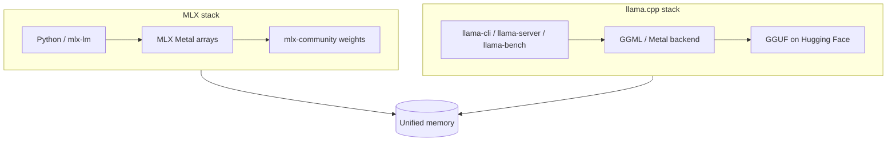
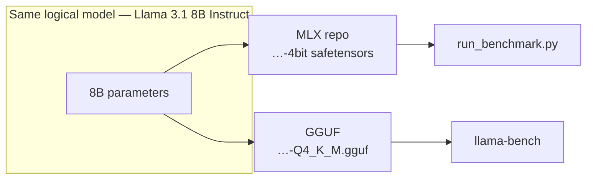
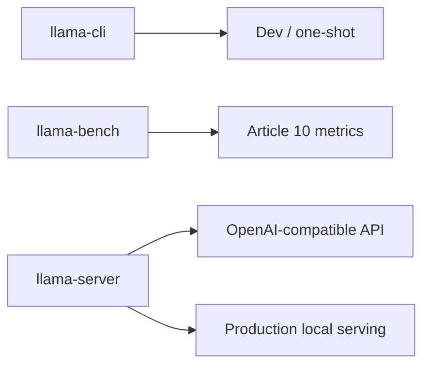
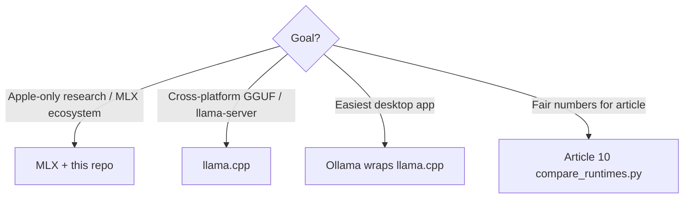

# llama.cpp vs MLX on Apple Silicon

**Article 10** — Compare two local inference engines on the same Mac, same model family, and matched quantization tier.

[← Runtimes article](../articles/10-runtimes.md) · [REFERENCES](../REFERENCES.md) · [All optimizations](all-optimizations.md)

---

## Executive summary

| | **MLX + mlx-lm** (this repo) | **llama.cpp** |
|---|------------------------------|---------------|
| **Primary home** | Apple Silicon, Metal-native [21] | Cross-platform (Metal on Mac) [25] |
| **Weight format** | HF `mlx-community` (MLX arrays) [23] | **GGUF** files [25] |
| **Serving** | Python `stream_generate`, `mlx_lm.server` [22] | `llama-server`, OpenAI-compatible API [25] |
| **Quant labels** | `fp16`, `w8`, `w4`, `w2` | `F16`, `Q8_0`, `Q4_K_M`, `Q2_K`, … |
| **This repo** | Full 16-config sweep + articles 0–7 | Article 10 compare script |

Neither is “always faster”—they differ in **kernels**, **weight layout**, and **API surface**. Benchmark both on *your* machine.

---

## Figure 1 — Stack comparison



---

## Figure 2 — Same model, different files



**Fair comparison rule:** match **tier** (4-bit class), not byte-identical files—GPTQ/MLX vs Q4_K_M GGUF use different quantizers [8], [9], [25].

---

## Math: what should match between runtimes

Use the same **prompt length** \(T_p\), **generation length** \(T_g\), and **quant tier**:

| Symbol | MLX flag | llama.cpp |
|--------|----------|-----------|
| Prompt tokens | `-p` | `-p` in llama-bench |
| Gen tokens | `-g` | `-n` in llama-bench |
| 4-bit weights | `w4` | `Q4_K_M` GGUF |
| Decode metric | `throughput_tps` | `tg` t/s in llama-bench |
| Prefill metric | `ttft_ms` | `pp` t/s (not identical to TTFT) |

**Decode throughput ratio** (Article 10 JSON):

$$
R_{\text{tps}} = \frac{\text{throughput\_tps}_{\text{MLX}}}{\text{tg\_tps}_{\text{llama.cpp}}}
$$

\(R_{\text{tps}} > 1\) → MLX faster on decode for that pair; \(< 1\) → llama.cpp faster.

---

## Programming comparison

| Feature | MLX (this repo) | llama.cpp |
|---------|-----------------|-----------|
| Weight quant | Separate HF repos per bit width | Single GGUF per quant variant |
| KV cache quant | `kv_bits=4` [22] | `-ctk` / type flags in server (version-dependent) |
| Flash attention | Internal Metal | `-fa` in bench/server [25] |
| Speculative decode | `draft_model` [22] | `--draft` / model spec [25] |
| OpenAI API server | `mlx_lm.server` | `llama-server` [25] |
| Ollama | — (separate app) | Uses llama.cpp **under the hood** |

### llama.cpp serving modes [25]



---

## Installation (macOS)

```bash
# Option A — Homebrew
brew install llama.cpp

# Option B — From source
git clone https://github.com/ggml-org/llama.cpp
cd llama.cpp && cmake -B build -DGGML_METAL=ON && cmake --build build -j
export PATH="$PWD/build/bin:$PATH"

# Verify
which llama-bench
llama-bench --help
```

Python deps for auto-download (optional):

```bash
pip install huggingface_hub
```

---

## Run comparison (this repo)

```bash
source .venv/bin/activate

# Preview matrix
python scripts/compare_runtimes.py --dry-run --hardware "Mac M3"

# MLX + llama.cpp for llama3-8b fp16 & w4, mistral-7b w4
./scripts/run_article.sh 10 "Mac M3"

# Or directly
python scripts/compare_runtimes.py --hardware "Mac M3" -n 3 -p 512 -g 128

# MLX only (no llama.cpp installed)
python scripts/compare_runtimes.py --hardware "Mac M3" --mlx-only
```

### Output

```text
results/Mac_M3/article_10_runtimes/
  llama3-8b/fp16_mlx.json
  llama3-8b/fp16_compare.json      # mlx + llamacpp + ratio
  llama3-8b/w4_compare.json
  mistral-7b/w4_compare.json
  article_summary.json
```

### Example `*_compare.json`

```json
{
  "model_preset": "llama3-8b",
  "configuration": "w4",
  "mlx": {
    "throughput_tps": 20.1,
    "ttft_ms": 2576,
    "memory_gb": 5.06,
    "model_repo": "mlx-community/Meta-Llama-3.1-8B-Instruct-4bit"
  },
  "llamacpp": {
    "quant_name": "Q4_K_M",
    "hf_file": "bartowski/Meta-Llama-3.1-8B-Instruct-GGUF/Meta-Llama-3.1-8B-Instruct-Q4_K_M.gguf",
    "tg_tps": 18.5,
    "pp_tps": 240.0
  },
  "comparison": {
    "throughput_ratio_mlx_over_llamacpp": 1.09
  }
}
```

---

## GGUF mapping (scripts)

Defined in `scripts/llamacpp_models.py`:

| Preset | MLX `w4` | GGUF (llama.cpp) |
|--------|----------|------------------|
| `llama3-8b` | `mlx-community/…-4bit` | `bartowski/…-Q4_K_M.gguf` |
| `mistral-7b` | `mlx-community/…-4bit` | `bartowski/…-Q4_K_M.gguf` |
| `qwen-7b` | `mlx-community/…-4bit` | `bartowski/…-Q4_K_M.gguf` |

Override paths by editing `LLAMACPP_GGUF` or downloading manually to `~/.cache/llama-cpp-models/`.

---

## Figure 3 — When to pick which



---

## Ollama (brief)

**Ollama** packages models and uses **llama.cpp** (GGUF) internally on many platforms. It is not a third separate engine for Article 10 benchmarks—cite it as **UX + distribution** on top of llama.cpp [25], not as an independent kernel stack.

---

## Limitations of cross-runtime benchmarks

1. **Different quantizers** — MLX 4-bit ≠ Q4_K_M bit-for-bit [8], [9].  
2. **Different APIs** — `ttft_ms` vs `pp_tps` are not identical prefill metrics.  
3. **Version sensitivity** — `llama-bench` output format changes between releases.  
4. **First-run download** — GGUF files are large; cache before timed runs.

---

## References

| ID | Source |
|----|--------|
| [8], [9] | GPTQ, AWQ — MLX weight quant context |
| [21], [22], [23] | MLX, mlx-lm, mlx-community |
| [25] | llama.cpp — [github.com/ggml-org/llama.cpp](https://github.com/ggml-org/llama.cpp) |
| [24] | This repo — `compare_runtimes.py` |

Full list: [REFERENCES.md](../REFERENCES.md).

---

## See also

- [Article 10 outline](../articles/10-runtimes.md)  
- [Math & programming overview](math-and-implementation.md)  
- [Benchmark workflow](../BENCHMARK_WORKFLOW.md)
