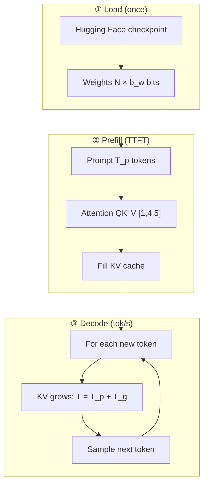
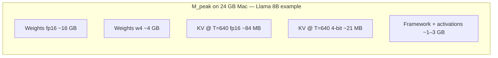
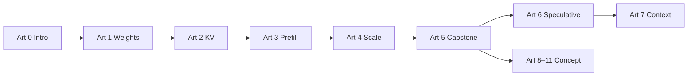

# Math vs programming optimizations

Every technique in this benchmark suite has two sides:

| Side | What it is | Typical artifacts |
|------|------------|-------------------|
| **Math / algorithmic** | Change the *computation* or *numerical representation* | Equations, complexity, error bounds |
| **Programming / systems** | Change *how* the math runs on hardware | Bit packing, kernels, memory layout, batching |

Articles in this repo should explain **both**: the formula (why it works) and the code path (what MLX actually does).

**References:** numbered citations [1]–[24] in [REFERENCES.md](../REFERENCES.md).

---

## Figure 1 — End-to-end inference pipeline



| Phase | Metric in JSON | Dominant optimization |
|-------|----------------|----------------------|
| ② Prefill | `ttft_ms` | Weight \(b_w\), prefill chunks, Flash-style kernels |
| ③ Decode | `throughput_tps` | Weight \(b_w\), KV \(b_{\text{kv}}\), speculative |
| Whole run | `memory_gb` | All terms in budget below |

---

## Figure 2 — Memory budget (stacked)



**Takeaway:** Weight precision sets the **floor**; KV precision sets **growth rate** as \(T\) increases [11, 13].

---

## Map: articles → math + code

| Article | Math focus | Programming focus |
|---------|------------|-------------------|
| [1 Weight quant](weight-quantization.md) | Affine quantization, memory scaling | Packed INT weights, dequant matmul |
| [2 KV cache quant](kv-cache-quantization.md) | Cache growth \(O(T)\), GQA head count | `kv_bits`, `to_quantized()` on cache |
| [3 Prefill / Flash](prefill-and-flash-attention.md) | Attention \(O(n^2)\), online softmax | `prefill_step_size`, Metal tiled kernels |
| [6 Speculative](speculative-decoding.md) | Acceptance probability, expected speedup | `draft_model`, `num_draft_tokens` |
| [7 Context / cache](articles/07-context-and-cache.md) | \(T\) in KV and TTFT | `-p`, `-g`, `save_prompt_cache` |

---

## Unified memory budget (all layers)

Peak RAM is dominated by three terms:

$$
M_{\text{peak}} \approx M_{\text{weights}} + M_{\text{KV}} + M_{\text{activations}}
$$

**Weights (static):**

$$
M_{\text{weights}} \approx \frac{N_{\text{params}} \cdot b_w}{8}
$$

where \(N_{\text{params}}\) is parameter count and \(b_w\) is bits per weight (16, 8, 4, or 2).

**KV cache (grows with sequence length \(T\)):**

$$
M_{\text{KV}} \approx 2 \cdot L \cdot H_{\text{kv}} \cdot T \cdot D \cdot \frac{b_{\text{kv}}}{8}
$$

- \(L\) = number of layers  
- \(H_{\text{kv}}\) = KV heads (equals query heads, or fewer with GQA)  
- \(D\) = head dimension  
- Factor \(2\) = separate K and V tensors  
- \(b_{\text{kv}}\) = 16 (full) or 4 (quantized in our benchmarks)

**Example (Llama-class 8B, \(L{=}32\), \(H_{\text{kv}}{=}8\), \(D{=}128\), \(T{=}640\) tokens, FP16 KV):**

$$
M_{\text{KV}} \approx 2 \times 32 \times 8 \times 640 \times 128 \times 2 \text{ bytes} \approx 84 \text{ MB}
$$

Same setup with **4-bit KV** (\(b_{\text{kv}}{=}4\)):

$$
M_{\text{KV}} \approx 2 \times 32 \times 8 \times 640 \times 128 \times 0.5 \text{ bytes} \approx 21 \text{ MB}
$$

Weights at 4-bit for 8B:

$$
M_{\text{weights}} \approx \frac{8 \times 10^9 \times 4}{8} \approx 4 \text{ GB}
$$

---

## Decode throughput (roofline intuition)

When decode is **memory-bandwidth bound**, tokens per second scales with bytes read per token:

$$
\text{tok/s} \approx \frac{B_{\text{mem}}}{B_{\text{token}}}
$$

where \(B_{\text{mem}}\) is sustained unified-memory bandwidth (GB/s) and \(B_{\text{token}}\) is bytes moved from RAM per generated token (mostly weights + KV updates).

**Example:** If each decode step reads ~5 GB of weights+activations at effective 100 GB/s:

$$
\text{tok/s} \approx \frac{100}{5} = 20 \text{ t/s}
$$

Halving weight bytes (\(b_w: 16 \to 4\)) roughly halves \(B_{\text{token}}\) for the weight-dominated part → **~2× tok/s** if bandwidth-bound (matches many M3 8B observations).

---

## Programming patterns used in MLX / this repo

| Pattern | Level | Example in repo |
|---------|-------|-----------------|
| **Separate checkpoints per bit width** | Load time | `fp16` vs `w4` HF repos |
| **Group-wise scales** | Storage | GPTQ/AWQ-style blocks in `mlx-community` |
| **Bit-packed integers** | Storage | 2× 4-bit values per byte |
| **Fused dequant matmul** | Kernel | Metal kernel in MLX, not Python loops |
| **Cache object quantization** | Runtime | `kv_bits=4` → `to_quantized()` |
| **Tiled attention** | Kernel | Flash-style inside MLX |
| **Chunked prefill loop** | Control flow | `prefill_step_size` 512 vs 2048 |
| **Subprocess isolation** | Reliability | `run_benchmark.py` sweep |

---

## Bitwise vs floating-point (quick reference)

| Operation | Math view | Programming view |
|-----------|-----------|------------------|
| Store weight \(x\) in 4 bits | \(q = \text{quantize}(x, s, z)\) [7] | `uint8` array + scale tensor per group |
| Matrix multiply | \(\hat{W} \approx s \cdot Q\) | Dequant fused into GEMM [21] |
| Store KV vector | Round FP16 → INT4 groups | `to_quantized()` on cache [22] |
| Attention scores | \(\mathrm{softmax}(QK^\top/\sqrt{d})\) [1] | Tiled softmax [4, 5] |

---

## Figure 3 — Optimization layers vs bottlenecks

```mermaid
quadrantChart
  title When each optimization matters most
  x Low implementation effort in this repo
  x High implementation effort
  y Solves capacity / OOM
  y Solves latency / bandwidth
  Weight w4: [0.25, 0.85]
  KV quant: [0.35, 0.55]
  Prefill 2048: [0.2, 0.35]
  Speculative: [0.75, 0.75]
```

---

## Figure 4 — Article series data flow



---

## References (key)

| Topic | Citations |
|-------|-----------|
| Transformer / attention | [1] |
| Flash Attention | [4], [5], [6] |
| Weight quant (GPTQ, AWQ) | [7], [8], [9] |
| GQA / KV memory | [11], [13] |
| Speculative decoding | [14], [15] |
| Roofline / bandwidth | [19] |
| MLX stack | [21], [22], [23], [24] |

Full list: [REFERENCES.md](../REFERENCES.md).

---

## See also

- [Weight quantization](weight-quantization.md) — affine quant equations + packing example  
- [KV cache quantization](kv-cache-quantization.md) — cache size formula + `kv_bits`  
- [Prefill & Flash Attention](prefill-and-flash-attention.md) — attention math + tiling  
- [Speculative decoding](speculative-decoding.md) — acceptance rate math  
- [All optimizations together](all-optimizations.md) — stacked configs and combined budget
