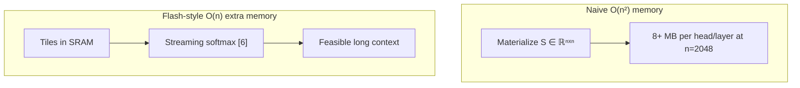
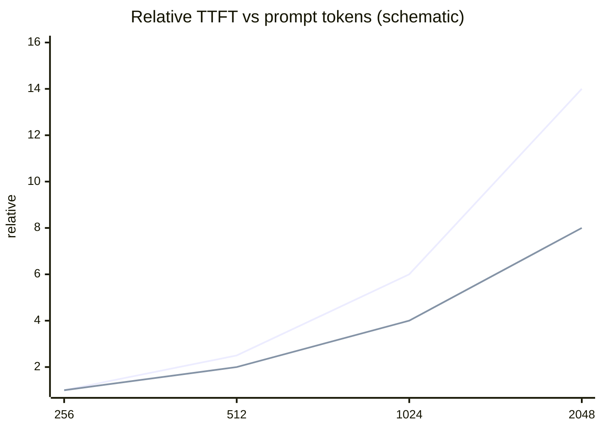
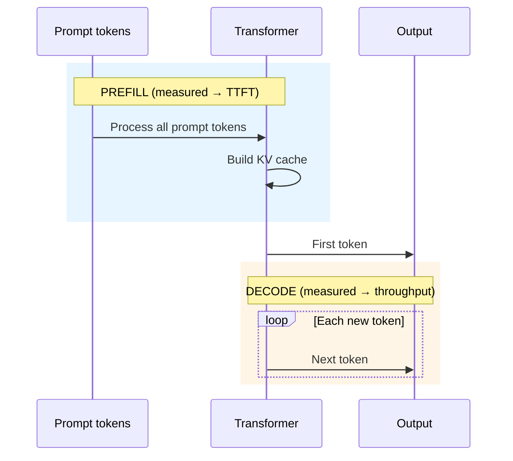
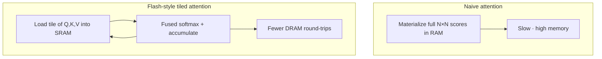
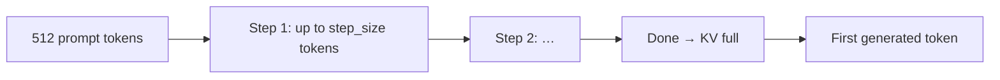

# Prefill optimization and Flash Attention

**What it optimizes:** The **prefill** phase—processing the input prompt before the first generated token (directly affects **TTFT**).

**Benchmark flag:** `prefill` (on/off, combined with any weight precision and optional KV quant)

[← KV cache](kv-cache-quantization.md) · [All optimizations](all-optimizations.md)

---

## The problem

LLM inference splits into two phases:

| Phase | Input | Parallelism | Dominant metric |
|-------|--------|-------------|-----------------|
| **Prefill** | Full prompt at once | High (all prompt tokens) | **TTFT** (time to first token) |
| **Decode** | One new token per step | Sequential | **Tokens/sec** |

**Standard attention** compares every token to every other token. Memory and compute scale roughly as **O(n²)** with sequence length **n** for naive materialization. Long prompts become slow and memory-hungry during prefill.

**Flash Attention** (Dao et al.) reformulates attention to compute in **tiles** that fit in fast GPU SRAM, reducing reads/writes to high-latency DRAM and avoiding huge intermediate matrices.

On Apple Silicon, **MLX** uses Metal kernels that implement these ideas internally—you do not toggle “Flash Attention” in our scripts. We benchmark a related, explicit knob: **`prefill_step_size`**. See FlashAttention [4], [5] and online softmax [6].

---

## Figure 1 — Prefill vs decode (user-visible phases)

```mermaid
gantt
    title Single request timeline
    dateFormat X
    axisFormat %s

    section Prefill
    Process prompt (TTFT)     :0, 3
    section Decode
    Token 1..128 (throughput)   :3, 10
```



---

## Figure 2 — Naive vs tiled attention memory



---

## Math: attention cost and Flash Attention

### Naive attention complexity

For sequence length \(n\), head dimension \(d_h\), and \(H\) heads:

**Compute (rough):** \(O(n^2 \cdot d_h \cdot H)\) for the \(QK^\top\) and softmax-weighted \(V\) products.

**Memory (naive materialization):** storing full score matrix \(S \in \mathbb{R}^{n \times n}\):

$$
M_{\text{scores}} = n^2 \cdot \text{bytes per element}
$$

Example \(n = 2048\), FP16:

$$
M_{\text{scores}} \approx 2048^2 \times 2 \approx 8 \text{ MB per head per layer}
$$

Multiply by 32 layers × 32 heads → **gigabytes** of intermediate state—unacceptable at long context.

### Flash Attention idea (online softmax)

Flash Attention never materializes full \(n \times n\) in HBM. It processes **blocks** (tiles) of \(Q\), \(K\), \(V\) in fast SRAM and maintains running softmax statistics \((m, \ell)\) per row:

For block contributions, with local max \(m_{ij}\) and sum \(\ell_{ij}\):

$$
m_i^{\text{new}} = \max(m_i^{\text{old}}, m_{ij})
$$

$$
\ell_i^{\text{new}} = e^{m_i^{\text{old}} - m_i^{\text{new}}} \ell_i^{\text{old}} + e^{m_{ij} - m_i^{\text{new}}} \ell_{ij}
$$

Output accumulators are updated consistently so the result matches standard attention up to floating-point order.

**Complexity:** Still \(O(n^2)\) in FLOPs, but **\(O(n)\)** extra memory for the algorithm (no full \(S\) matrix).

### TTFT and prompt length

Prefill processes \(n = T_{\text{prompt}}\) tokens in parallel. A simple model:

$$
\mathrm{TTFT} \approx \frac{\text{FLOPs}_{\text{prefill}}}{\text{GPU throughput}} + \frac{M_{\text{read}}}{B_{\text{mem}}}
$$

When bandwidth-bound, doubling \(n\) can push TTFT up **superlinearly** if attention dominates (\(n^2\) term). Flash-style kernels reduce the **constant** on memory traffic.

**Article 3 / 7:** compare `ttft_ms` at `-p 256` vs `1024` vs `2048` with `w4+prefill` ON vs OFF.

### `prefill_step_size` (math vs code)

Let prompt length be \(T\), chunk size \(C\) (`prefill_step_size`):

$$
\text{number of prefill chunks} = \left\lceil \frac{T}{C} \right\rceil
$$

| Flag | \(C\) | Chunks for \(T=512\) |
|------|-------|----------------------|
| OFF | 512 | \(\lceil 512/512 \rceil = 1\) |
| ON | 2048 | \(\lceil 512/2048 \rceil = 1\) |

For \(T = 2048\):

| Flag | Chunks |
|------|--------|
| OFF (512) | 4 |
| ON (2048) | 1 |

Fewer chunks → less loop overhead; larger tiles → better kernel efficiency. That is why **long prompts** show larger TTFT gains than our default 512-token benchmark.

### Figure 3 — Prefill chunks (`prefill_step_size`)


With `prefill` ON (\(C=2048\)): **one** chunk for \(T \le 2048\).

### Figure 4 — TTFT vs prompt length (conceptual)



Dashed curve = with Flash-style + large chunks; solid = baseline—steeper because of \(O(n^2)\) attention work [4].

---

## Programming: MLX kernels and chunk loop

### What you control in this repo

```python
# scripts/optimizations.py
PREFILL_BASELINE = 512    # prefill OFF
PREFILL_OPTIMIZED = 2048  # prefill ON
```

```python
stream_generate(
    model, tokenizer, prompt,
    prefill_step_size=params.prefill_step_size,  # 512 or 2048
    max_tokens=generation_tokens,
)
```

### Control flow (simplified from `generate_step`)

```python
prompt = remaining_prompt_tokens
while len(prompt) > 1:
    n = min(prefill_step_size, len(prompt) - 1)
    model.forward(prompt[:n], cache=prompt_cache)  # tiled attention inside
    prompt = prompt[n:]
# last token + first decode step
logits = model.forward(prompt[-1:], cache=prompt_cache)
```

Flash Attention runs **inside** `model.forward` on Metal; `prefill_step_size` only changes how many tokens enter each forward slice.

### Bitwise / low-level (what you do *not* write)

- Tile sizes, warp/wavefront layout, softmax numerics → MLX Metal shaders  
- You benchmark **latency outcome** (`ttft_ms`), not kernel source

---

## Prefill vs decode



Users perceive prefill as **latency** (“how long until it starts typing”). Decode feels like **speed** (“how fast it streams”).

---

## Flash Attention (conceptual)



**Why it matters on Mac:**

- Unified memory bandwidth is finite (~100 GB/s class on M3, much higher on M5 Max).
- Tiling keeps hot data in on-chip memory during prefill.
- Lower TTFT and better scaling on long prompts (documents, codebases, RAG).

---

## What this repo calls `prefill`

We expose **chunk size** for processing the prompt inside `mlx-lm`:

| `prefill` flag | `prefill_step_size` | Meaning |
|----------------|---------------------|---------|
| **OFF** | 512 | Smaller steps through the prompt (baseline in sweep) |
| **ON** | 2048 | Larger steps—fewer iterations, better amortization |

Defined in `scripts/optimizations.py`:

```python
PREFILL_BASELINE = 512
PREFILL_OPTIMIZED = 2048
```



Larger `prefill_step_size` can reduce overhead when the prompt is long enough to benefit. Our default prompt is **512 tokens**, so the effect may be modest but reproducible across runs.

---

## Why we need it

1. **Snappier UX** — Chat apps live or die on TTFT; prefill dominates it.
2. **Long-context workloads** — RAG, agents, and coding assistants send large prompts; efficient attention is critical.
3. **Independent of weight bits** — You can tune prefill while holding fp16 or 4-bit weights constant to isolate impact.

---

## Relationship to Flash Attention in MLX

| Topic | In MLX / this repo |
|-------|---------------------|
| Flash Attention kernels | Built into MLX Metal backend during attention ops |
| User-visible `prefill` flag | Maps to `prefill_step_size` only |
| Fair comparison | OFF vs ON at same weight and KV settings |

Do not conflate “prefill ON” in JSON results with a published FlashAttention-2 paper ablation—it is our **documented proxy** for prefill efficiency in `mlx-lm`.

---

## How this repository implements it

Config flag: `OptimizationConfig.prefill`

Example labels:

| Label | Prefill optimization |
|-------|----------------------|
| `fp16+prefill` | fp16 weights, step_size 2048 |
| `w4+kv_cache+prefill` | 4-bit weights + KV quant + step_size 2048 |

Passed to generation:

```python
stream_generate(..., prefill_step_size=params.prefill_step_size)
```

---

## Expected effects on metrics

| Metric | Prefill OFF → ON (typical) |
|--------|----------------------------|
| **TTFT** | Often decreases on long prompts |
| **Throughput** | Usually similar (decode unchanged) |
| **Peak memory** | Similar or slightly different during prefill |

Article example (M5 Max, Mistral, “optimized” stack): TTFT **75 ms → 40 ms** when combining multiple optimizations—not prefill alone.

---

## When to enable

| Use prefill ON when… | Keep baseline (512) when… |
|----------------------|---------------------------|
| Comparing full “optimized” stack | Isolating weight or KV effects only |
| Long prompts in production | Prompts are always very short |
| Writing article “best config” row | Debugging prefill-specific regressions |

---

## Code references

| Item | Location |
|------|----------|
| Constants | `PREFILL_BASELINE`, `PREFILL_OPTIMIZED` in `scripts/optimizations.py` |
| Flag | `OptimizationConfig.prefill` |
| API | `prefill_step_size` in `stream_generate` |

---

## References

| ID | Source |
|----|--------|
| [1] | Vaswani et al. — attention definition |
| [4], [5] | Dao et al. — FlashAttention 1 & 2 |
| [6] | Milakov & Gimelshein — online softmax |
| [21], [22] | MLX / mlx-lm — Metal kernels, `prefill_step_size` |

[REFERENCES.md](../REFERENCES.md)

---

## See also

- [Math vs programming overview](math-and-implementation.md)  
- [Weight quantization](weight-quantization.md)  
- [KV cache quantization](kv-cache-quantization.md)  
- [All optimizations together](all-optimizations.md)
