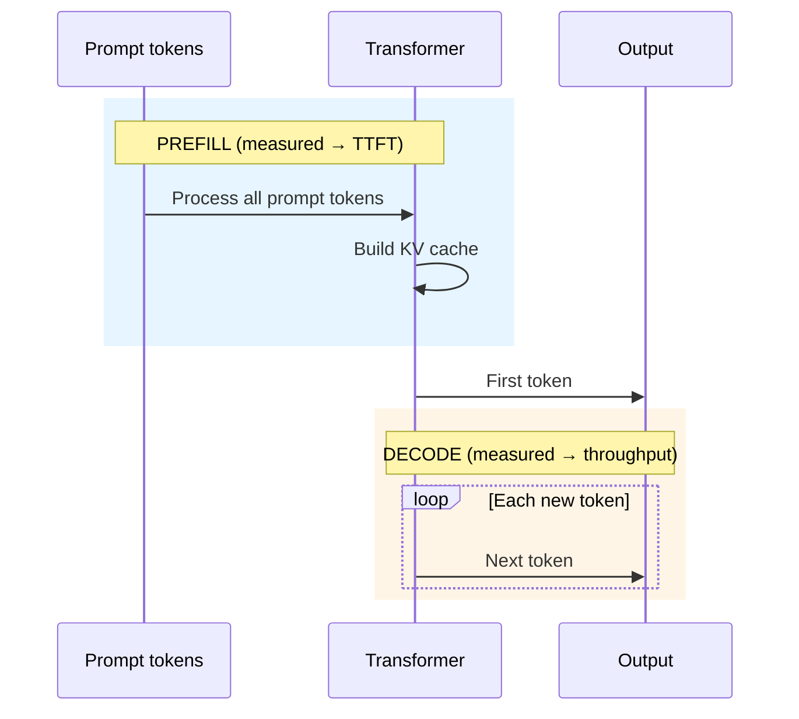
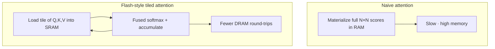
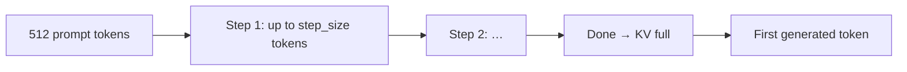

# Prefill optimization and Flash Attention

**What it optimizes:** The **prefill** phase—processing the input prompt before the first generated token (directly affects **TTFT**).

**Benchmark flag:** `prefill` (on/off, combined with any weight precision and optional KV quant)

[← KV cache](kv-cache-quantization.md) · [All optimizations](all-optimizations.md)

---

## The problem

LLM inference splits into two phases:

| Phase | Input | Parallelism | Dominant metric |
|-------|--------|-------------|-----------------|
| **Prefill** | Full prompt at once | High (all prompt tokens) | **TTFT** (time to first token) |
| **Decode** | One new token per step | Sequential | **Tokens/sec** |

**Standard attention** compares every token to every other token. Memory and compute scale roughly as **O(n²)** with sequence length **n** for naive materialization. Long prompts become slow and memory-hungry during prefill.

**Flash Attention** (Dao et al.) reformulates attention to compute in **tiles** that fit in fast GPU SRAM, reducing reads/writes to high-latency DRAM and avoiding huge intermediate matrices.

On Apple Silicon, **MLX** uses Metal kernels that implement these ideas internally—you do not toggle “Flash Attention” in our scripts. We benchmark a related, explicit knob: **`prefill_step_size`**.

---

## Prefill vs decode



Users perceive prefill as **latency** (“how long until it starts typing”). Decode feels like **speed** (“how fast it streams”).

---

## Flash Attention (conceptual)



**Why it matters on Mac:**

- Unified memory bandwidth is finite (~100 GB/s class on M3, much higher on M5 Max).
- Tiling keeps hot data in on-chip memory during prefill.
- Lower TTFT and better scaling on long prompts (documents, codebases, RAG).

---

## What this repo calls `prefill`

We expose **chunk size** for processing the prompt inside `mlx-lm`:

| `prefill` flag | `prefill_step_size` | Meaning |
|----------------|---------------------|---------|
| **OFF** | 512 | Smaller steps through the prompt (baseline in sweep) |
| **ON** | 2048 | Larger steps—fewer iterations, better amortization |

Defined in `scripts/optimizations.py`:

```python
PREFILL_BASELINE = 512
PREFILL_OPTIMIZED = 2048
```



Larger `prefill_step_size` can reduce overhead when the prompt is long enough to benefit. Our default prompt is **512 tokens**, so the effect may be modest but reproducible across runs.

---

## Why we need it

1. **Snappier UX** — Chat apps live or die on TTFT; prefill dominates it.
2. **Long-context workloads** — RAG, agents, and coding assistants send large prompts; efficient attention is critical.
3. **Independent of weight bits** — You can tune prefill while holding fp16 or 4-bit weights constant to isolate impact.

---

## Relationship to Flash Attention in MLX

| Topic | In MLX / this repo |
|-------|---------------------|
| Flash Attention kernels | Built into MLX Metal backend during attention ops |
| User-visible `prefill` flag | Maps to `prefill_step_size` only |
| Fair comparison | OFF vs ON at same weight and KV settings |

Do not conflate “prefill ON” in JSON results with a published FlashAttention-2 paper ablation—it is our **documented proxy** for prefill efficiency in `mlx-lm`.

---

## How this repository implements it

Config flag: `OptimizationConfig.prefill`

Example labels:

| Label | Prefill optimization |
|-------|----------------------|
| `fp16+prefill` | fp16 weights, step_size 2048 |
| `w4+kv_cache+prefill` | 4-bit weights + KV quant + step_size 2048 |

Passed to generation:

```python
stream_generate(..., prefill_step_size=params.prefill_step_size)
```

---

## Expected effects on metrics

| Metric | Prefill OFF → ON (typical) |
|--------|----------------------------|
| **TTFT** | Often decreases on long prompts |
| **Throughput** | Usually similar (decode unchanged) |
| **Peak memory** | Similar or slightly different during prefill |

Article example (M5 Max, Mistral, “optimized” stack): TTFT **75 ms → 40 ms** when combining multiple optimizations—not prefill alone.

---

## When to enable

| Use prefill ON when… | Keep baseline (512) when… |
|----------------------|---------------------------|
| Comparing full “optimized” stack | Isolating weight or KV effects only |
| Long prompts in production | Prompts are always very short |
| Writing article “best config” row | Debugging prefill-specific regressions |

---

## Code references

| Item | Location |
|------|----------|
| Constants | `PREFILL_BASELINE`, `PREFILL_OPTIMIZED` in `scripts/optimizations.py` |
| Flag | `OptimizationConfig.prefill` |
| API | `prefill_step_size` in `stream_generate` |

---

## See also

- [Weight quantization](weight-quantization.md)
- [KV cache quantization](kv-cache-quantization.md)
- [All optimizations together](all-optimizations.md)
