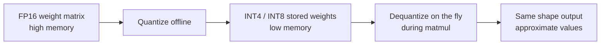

# Weight quantization

**What it optimizes:** Static model weights (the billions of parameters loaded before generation).

**Benchmark labels:** `fp16`, `w8`, `w4`, `w2`

[← All optimizations](all-optimizations.md) · [KV cache →](kv-cache-quantization.md)

---

## The problem

A transformer’s **weights** are the largest fixed cost in memory. For an 8B-parameter model:

| Precision | Bits per weight (approx.) | Weight memory (approx.) |
|-----------|---------------------------|-------------------------|
| FP16 / BF16 | 16 | ~16 GB |
| 8-bit | 8 | ~8–10 GB |
| 4-bit | 4 | ~5–6 GB |
| 2-bit | 2 | ~3–4 GB |

On a **24 GB Mac**, fp16 for an 8B model can consume most of unified memory before the KV cache or activations exist. Larger models (32B+) may not load at all at full precision.

Quantization answers: *“Can we store and compute with fewer bits per weight while keeping output quality acceptable?”*

---

## How it works

High-precision weights are floating-point numbers. **Quantization** maps them to a small set of integer levels plus a **scale** (and sometimes **zero-point**) per group of weights.



Common schemes in MLX Hugging Face repos:

- **Per-group affine quantization** — A block of weights shares one scale; good balance of size and accuracy.
- **Pre-quantized checkpoints** — `mlx-community` publishes separate repos per bit width; no runtime quant in our benchmarks.

---

## Why we need it (local inference on Apple Silicon)

### 1. Capacity — fit the model

Unified memory is shared by CPU, GPU, and everything else. Smaller weights leave room for:

- KV cache (grows with context)
- Framework buffers
- macOS and other apps

Without 4-bit weights, many laptops cannot run 8B models comfortably.

### 2. Bandwidth — faster decode

During **decode**, the GPU reads weights for every new token. If the machine is **memory-bandwidth bound**, halving weight size can nearly double effective throughput—fewer bytes from RAM per token.

### 3. Quality tradeoff

Lower bit width can reduce reasoning quality on hard tasks. The benchmark sweep lets you compare **speed and memory vs. precision** on your hardware, not assume one setting for all use cases.

```mermaid
quadrantChart
  title Weight precision tradeoff (conceptual)
  x Low memory use
  x High memory use
  y Lower quality risk
  y Higher quality risk
  w2: [0.2, 0.25]
  w4: [0.35, 0.55]
  w8: [0.55, 0.75]
  fp16: [0.9, 0.9]
```

---

## What changes in the inference pipeline

Weight quantization affects **both** phases, but differently:

| Phase | Effect of lower bit weights |
|-------|-----------------------------|
| **Prefill** | Less weight data to load per layer; can improve TTFT when bandwidth-bound |
| **Decode** | Smaller reads each step; often improves tokens/sec on Mac |

It does **not** reduce KV cache size—that is a separate optimization.

---

## How this repository implements it

We benchmark **four weight levels** as separate Hugging Face models (not runtime conversion):

| Label | `weight_bits` | Llama 3.1 8B example |
|-------|---------------|----------------------|
| `fp16` | 16 | `mlx-community/Meta-Llama-3.1-8B-Instruct-bf16` |
| `w8` | 8 | `mlx-community/Meta-Llama-3.1-8B-Instruct-8bit` |
| `w4` | 4 | `mlx-community/Meta-Llama-3.1-8B-Instruct-4bit` |
| `w2` | 2 | `mlx-community/Llama-3-8B-Instruct-262k-2bit` |

Mistral fp16 uses `mlx-community/Mistral-7B-Instruct-v0.3` (full-precision MLX build; no separate `*-bf16` repo).

Config resolution (`scripts/optimizations.py`):

```text
weight_bits=4  →  load MODEL_REPOS[preset][4]
```

---

## Expected impact (article targets)

From [notes.md](../../notes.md) on **Mac M3 + Llama 3 8B**:

| Config | Memory | TTFT | Throughput |
|--------|--------|------|------------|
| Native FP16 | ~16.2 GB | 145 ms | 22 t/s |
| Optimized 4-bit | ~5.8 GB | 85 ms | 48 t/s |

Roughly **64% less memory** and about **2× throughput** for this class of hardware when moving from fp16-class to 4-bit weights.

---

## When to use which level

| Situation | Suggested starting point |
|-----------|--------------------------|
| 24 GB Mac, 7B–8B chat | `w4` or `w8` |
| Maximum quality, enough RAM | `fp16` |
| Smallest footprint, experimentation | `w2` (if repo exists) |
| 32B model on laptop | `w4` only; fp16 needs workstation RAM |

---

## Limitations

- **Not all bit widths exist** for every model on `mlx-community` (e.g. Mistral 2-bit may be missing).
- **2-bit** can noticeably hurt quality on some tasks.
- Quantization is **offline** in our setup—changing bits requires a different download, not a CLI flag.

---

## Code references

| Item | Location |
|------|----------|
| Repo map | `scripts/optimizations.py` → `DEFAULT_MODEL_REPOS` |
| Sweep order | `fp16` → `w8` → `w4` → `w2` in `iter_sweep_configs()` |
| Overrides | `models.json` |

---

## See also

- [KV cache quantization](kv-cache-quantization.md) — shrinks *dynamic* memory during generation
- [All optimizations together](all-optimizations.md) — combining weight bits with runtime flags
