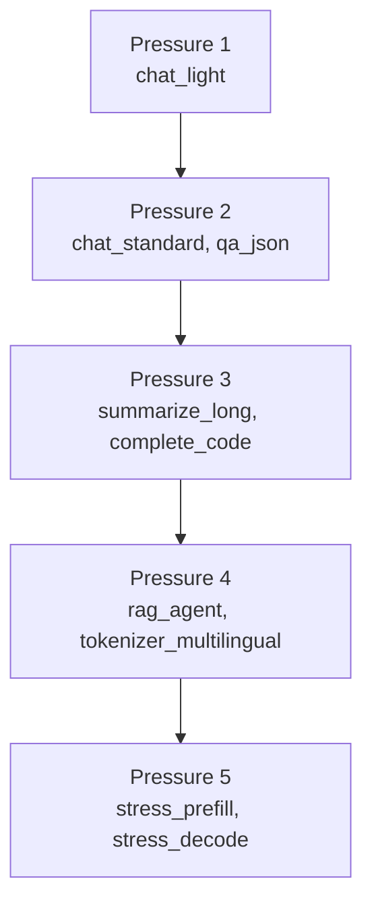

# Workload stress matrix

Benchmarks are not only **optimization configs** (fp16, w4, kv_cache, prefill) but also **what you ask the model to do** and **what the input looks like**. This matrix adds those dimensions so you can move from light chat to heavy RAG/agent stress in a controlled ladder.

[← Article 7](../articles/07-context-and-cache.md) · [Benchmark workflow](../BENCHMARK_WORKFLOW.md)

---

## Dimensions

| Dimension | Values | What it changes |
|-----------|--------|-----------------|
| **Task** | `chat`, `qa`, `summarize`, `complete`, `rag_agent`, `stress`, `baseline` | Prompt/gen length ratio (prefill vs decode emphasis) |
| **Data type** | `prose`, `json`, `code`, `repetitive`, `multilingual`, `random_ids`, `mixed` | Tokenizer / attention patterns |
| **Pressure** | `1` (light) → `5` (heavy) | Combined context + generation load |
| **Primary stress** | `prefill`, `decode`, `memory`, `balanced` | Which metric should dominate |
| **Modality** | `text` (today); `vision`, `audio` (reserved) | Future multimodal runs |

---

## Figure — Pressure ladder



---

## Profiles (runnable)

List live table:

```bash
python scripts/workloads.py
```

| ID | P | Task | Data | p | g | Stress |
|----|---|------|------|---|---|--------|
| `chat_light` | 1 | chat | prose | 128 | 64 | decode |
| `chat_standard` | 2 | chat | prose | 512 | 128 | balanced |
| `qa_json` | 2 | qa | json | 512 | 256 | balanced |
| `summarize_long` | 3 | summarize | prose | 2048 | 128 | prefill |
| `complete_code` | 3 | complete | code | 256 | 512 | decode |
| `rag_agent` | 4 | rag | mixed | 4096 | 256 | memory |
| `stress_prefill` | 5 | stress | repetitive | 4096 | 32 | prefill |
| `stress_decode` | 5 | stress | prose | 64 | 1024 | decode |
| `tokenizer_multilingual` | 4 | stress | multilingual | 1024 | 128 | prefill |
| `random_baseline` | 1 | baseline | random_ids | 512 | 128 | balanced |

Fixtures live in [`prompts/`](../../prompts/).

---

## Commands

```bash
# One profile
python scripts/run_benchmark.py \
  --preset llama3-8b --config w4+kv_cache+prefill \
  --workload summarize_long --hardware "Mac M3"

# Full ladder (9 profiles)
python scripts/run_benchmark.py \
  --preset llama3-8b --config w4+kv_cache+prefill \
  --workload-sweep --hardware "Mac M3" \
  --output-root results/Mac_M3/llama3-8b/workloads

# Article 7 includes wl_* runs for each profile in ARTICLE_07_WORKLOADS
./scripts/run_article.sh 7 "Mac M3"
```

Results include a `workload` object in JSON:

```json
{
  "workload": {
    "workload_id": "rag_agent",
    "workload_task": "rag_agent",
    "workload_data_type": "mixed",
    "workload_modality": "text",
    "workload_pressure": 4,
    "workload_primary_stress": "memory"
  }
}
```

---

## How to read results

| If you care about… | Compare workloads with… |
|--------------------|-------------------------|
| Interactive chat | `chat_light` vs `chat_standard` |
| RAG / agents | `rag_agent` vs `summarize_long` |
| Coding assistants | `complete_code` |
| TTFT at long context | `summarize_long`, `stress_prefill` |
| Sustained decode | `stress_decode`, `complete_code` |
| Optimizer A/B fairness | same `workload_id`, different `--config` |

**Important:** `random_baseline` (old default) is still useful for **config-only** comparisons; use **realistic workloads** when quoting numbers for a product story.

---

## Modalities (future)

| Modality | Status |
|----------|--------|
| `text` | Implemented via `mlx-lm` + `prompts/` |
| `vision` | Placeholder `vision_placeholder` — needs VLM preset |
| `audio` | Placeholder `audio_placeholder` — needs speech model |

When MLX multimodal models are added to `models.json`, extend `build_prompt_ids()` to load images/audio tensors per profile.

---

## See also

- [Context & cache article](../articles/07-context-and-cache.md)
- [Prefill & TTFT](prefill-and-flash-attention.md)
